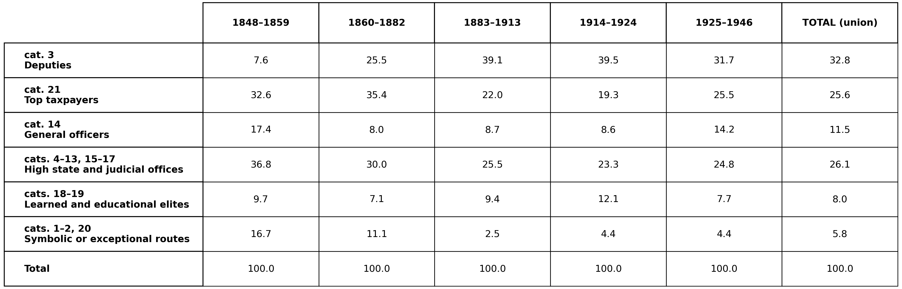
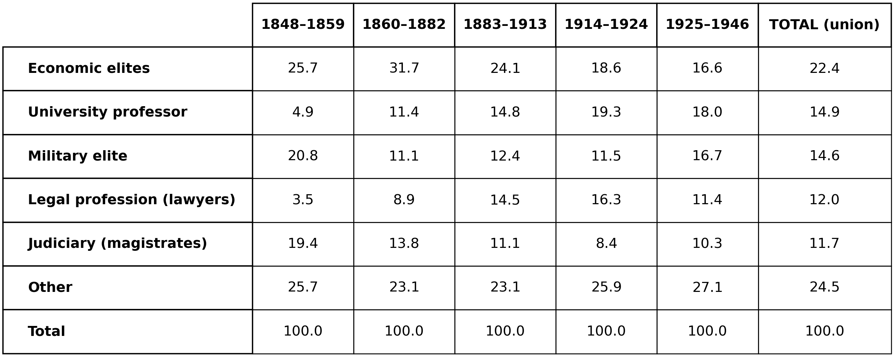
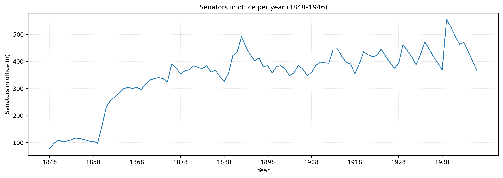
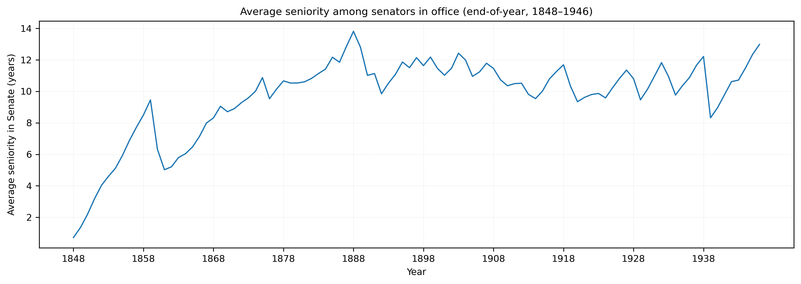
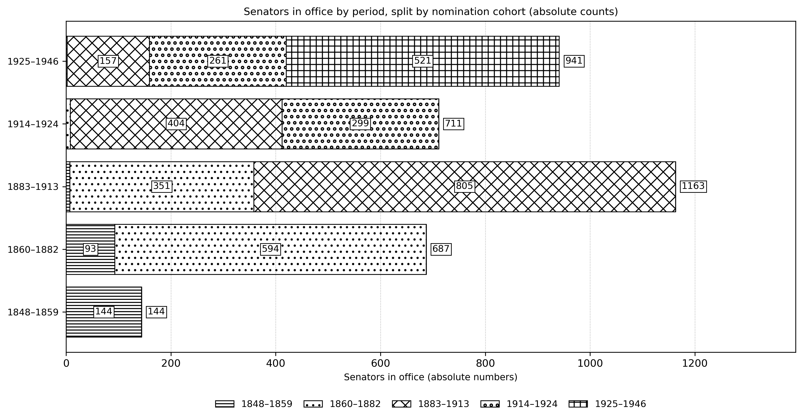
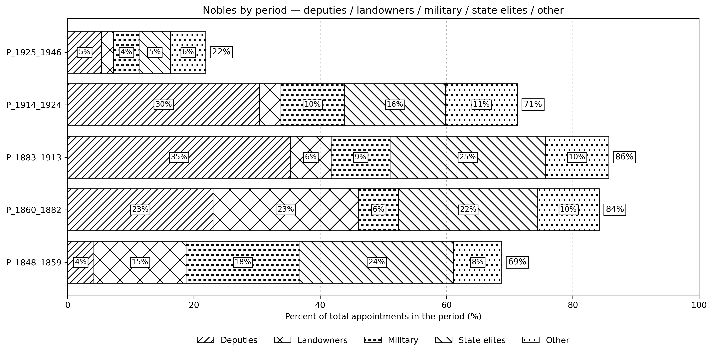
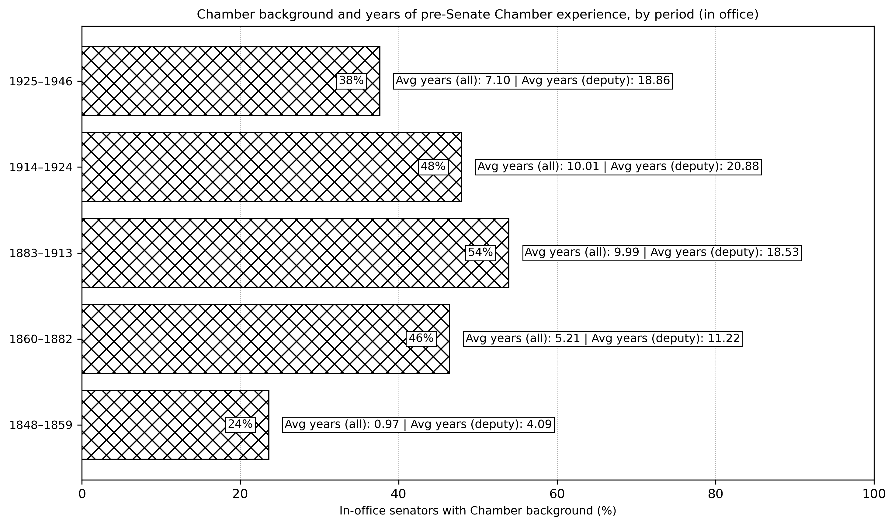
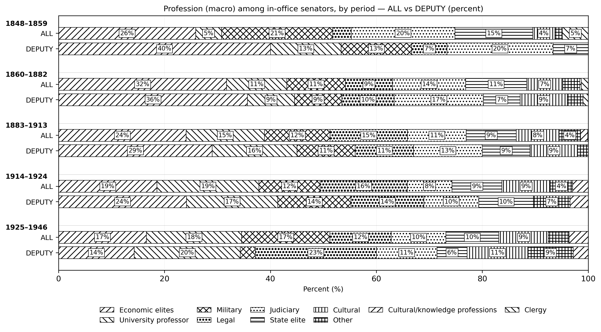

---
jupyter:
  jupytext:
    formats: ipynb,md
    text_representation:
      extension: .md
      format_name: markdown
      format_version: "1.3"
      jupytext_version: 1.19.1
  kernelspec:
    display_name: Python 3 (ipykernel)
    language: python
    name: python3
---

<!-- #region editable=true slideshow={"slide_type": ""} tags=["title"] -->

# Senatorial Worlds Between Absolutism and Democracy, 1848–1946

<!-- #endregion -->

<!-- #region editable=true slideshow={"slide_type": ""} tags=["contributor"] -->

### Goffredo Adinolfi [](https://orcid.org/0000-0002-8510-5076)

CIES/IUL

<!-- #endregion -->

<!-- #region tags=["copyright"] -->

[](https://creativecommons.org/licenses/by/4.0/)
©<AUTHOR or ORGANIZATION / FUNDER>. Published by De Gruyter in cooperation with the University of Luxembourg Centre for Contemporary and Digital History. This is an Open Access article distributed under the terms of the [Creative Commons Attribution License CC-BY](https://creativecommons.org/licenses/by/4.0/)

<!-- #endregion -->

```python tags=["cover"]
from IPython.display import Image, display

display(Image("./media/placeholder.png"))
```

<!-- #region tags=["disclaimer"] -->

(optional) This article was orginally published (...)

<!-- #endregion -->

<!-- #region tags=["keywords"] -->

Liberalism; Democratisation; Digital history; Risorgimento; Italian Senate

<!-- #endregion -->

<!-- #region editable=true slideshow={"slide_type": ""} tags=["abstract"] -->

The Italian Senate under the Statuto Albertino (1848–1946) presents a constitutional paradox: a chamber endowed with co-equal legislative authority yet never formally reformed, whose composition registered a century of profound political transformation through channels of recruitment that remained textually unchanged. Existing scholarship has approached the Senate primarily through legal-institutional or biographical lenses, without systematically reconstructing its evolving prosopographical profile across successive regime phases. This article adopts a hybrid digital history methodology, combining web scraping of approximately 2,300 biographical records from the senato.it platform with structured prosopographical analysis within a reproducible JupyterLab environment. We hypothesise that the Senate functioned as an apparatus for controlled elite reproduction, periodically recalibrated through strategic nomination waves that absorbed new social material while preserving older hierarchies of wealth, office, and distinction. The findings confirm that the parliamentary route, the aristocratic dimension, and the macro-professional composition of the chamber evolved unevenly across five periods, revealing a logic of managed inertia through which the constitutional form outlived the political orders that had created it.

<!-- #endregion -->

<!-- #region editable=true jp-MarkdownHeadingCollapsed=true slideshow={"slide_type": ""} -->

## Introduction

<!-- #endregion -->

<!-- #region citation-manager={"citations": {"pn8ju": [{"id": "22491602/IG8SG5S2", "source": "zotero"}], "vie9g": [{"id": "22491602/89ZI7QVF", "source": "zotero"}]}} -->

The Italian political system on the eve of its first great transformation had arisen from a document born of political calculation rather than constitutional conviction. The Statuto Albertino, promulgated on 4 March 1848, was not the concession of a monarch persuaded by liberal principle; it was the deliberate choice of a sovereign determined to retain the initiative in the face of the revolutionary turbulence sweeping across Europe. Carlo Alberto of Savoy confronted a stark alternative: grant a charter on his own terms, or risk being overtaken by pressures that might have compelled him to yield to a constituent assembly — an outcome that would have removed the crown altogether from the process of constitutional design <cite id="pn8ju"><a href="#zotero%7C22491602%2FIG8SG5S2">(Falco, 1945/1945)</a></cite>. The Statuto was, in this sense, a pre-emptive manoeuvre: a document whose minimalism was calibrated to concede as little as possible while foreclosing a more radical constitutional settlement. That it was octroyée — granted from above rather than negotiated from below — was at once its formal character and the precise expression of its political logic, with executive power remaining firmly within the orbit of the sovereign and the franchise confined to scarcely two per cent of the population. Yet from this deliberately spare foundation, initially issued for the Sardinian state and subsequently extended to the unified Kingdom of Italy, the constitutional architecture of the Italian state would emerge and endure — unreformed in its text, though substantially transformed in its practice — until the post-war break with the monarchy. From the outset, constitutional life developed along parliamentary lines, with the executive obliged through evolving conventions rather than formal design to secure and maintain the confidence of the Chambers, within an electoral framework so restricted that it rarely encompassed more than two per cent of the population in any given district <cite id="vie9g"><a href="#zotero%7C22491602%2F89ZI7QVF">(Dogliani, 1997)</a></cite>.

<!-- #endregion -->

<!-- #region citation-manager={"citations": {"7v8ke": [{"id": "22491602/89ZI7QVF", "source": "zotero"}], "ctnz7": [{"id": "22491602/89ZI7QVF", "source": "zotero"}], "gy87h": [{"id": "22491602/7X29JUNU", "source": "zotero"}], "ji75m": [{"id": "22491602/VXT6MXD7", "source": "zotero"}], "l861a": [{"id": "22491602/6GR79ZCI", "source": "zotero"}], "nq1xg": [{"id": "22491602/QNTGXQ7D", "source": "zotero"}], "p7r3m": [{"id": "22491602/VXT6MXD7", "source": "zotero"}]}} -->

When discussing "representative systems" as the cornerstone of nineteenth-century liberalism, the Italian example necessitates a rigorous consideration of institutional hybridity <cite id="gy87h"><a href="#zotero%7C22491602%2F7X29JUNU">(Mayer, 1981)</a></cite>. As Dogliani has observed, the Statutory regime defies a straightforward description as a modern system of political representation because it synthesises divergent constitutional principles—specifically a "descending" model of authority and an "ascending" model of consent—distributing them across various institutions <cite id="7v8ke"><a href="#zotero%7C22491602%2F89ZI7QVF">(Dogliani, 1997)</a></cite>. From this perspective, however, every institutional configuration persists as "representative" in a more foundational sense: not by embodying popular sovereignty, but through its capacity as a constitutive process to render specific social worlds present, selecting them and imbuing them with legitimacy <cite id="p7r3m"><a href="#zotero%7C22491602%2FVXT6MXD7">(Saward, 2010)</a></cite>. It is within this theoretical framework that the Senate functions as a privileged observatory for the "autonomisation of political power" <cite id="l861a"><a href="#zotero%7C22491602%2F6GR79ZCI">(Abélès, 1976)</a></cite>. While the Chamber, the Crown, and the Senate shared the overarching "grammar" of the regime, the Senate—characterised by royal appointment and lifelong tenure under Article 33—distinctly did not represent the "people" <cite id="nq1xg"><a href="#zotero%7C22491602%2FQNTGXQ7D">(Racioppi &#38; Brunelli, 1909)</a></cite>. Instead, it embodied a mode of institutional recognisability, manifesting a hierarchy of merits and notability that the Statuto defined as legitimately convertible into parliamentary authority. The concept of "organic representation" highlighted by Dogliani further clarifies this point: the analytical challenge lies in identifying who or what was made representable through the senatorial channel and determining the enduring consequences for the political culture of a regime seeking "cold" social stability <cite id="ctnz7"><a href="#zotero%7C22491602%2F89ZI7QVF">(Dogliani, 1997)</a></cite>. Applying the framework proposed by Saward <cite id="ji75m"><a href="#zotero%7C22491602%2FVXT6MXD7">(Saward, 2010)</a></cite>, the objective is to reconstruct which representative "claims" the Senate rendered plausible and the specific "audience" those claims presupposed: this audience was not a mass electorate but a particular constellation of observers, institutions, and social milieus for whom such a composition of careers, titles, and reputations appeared credible, intelligible, and acceptable as authority.

<!-- #endregion -->

<!-- #region editable=true slideshow={"slide_type": ""} -->

### Periodization

<!-- #endregion -->

<!-- #region citation-manager={"citations": {"1g3ry": [{"id": "22491602/4B85R5KL", "source": "zotero"}]}} editable=true slideshow={"slide_type": ""} -->

The periodisation of the Senate under the Statuto Albertino is constructed by integrating two distinct analytical logics: the primary ruptures in state formation and regime trajectory, and the definitive shifts in the history of political inclusion, specifically the sequential expansions of the franchise for the Chamber of Deputies—processes that fundamentally reshaped the representative foundations of the lower House while leaving the constitutional essence of the upper House stationary <cite id="1g3ry"><a href="#zotero%7C22491602%2F4B85R5KL">(Perticone, 1960)</a></cite>. This historical arc commences in 1848, when Carlo Alberto octroyed the Statute to the Kingdom of Sardinia—comprising Piedmont, Sardinia, Liguria, Nice, and Savoy—amidst acute revolutionary exigencies. This concession was granted defensively and with considerable reluctance, resulting in a text designed to safeguard monarchical predominance; yet, because the charter was bestowed rather than negotiated, it functioned as a portable juridical framework through which the Savoyard dynasty could position itself as the nucleus of an emergent Italian polity.

<!-- #endregion -->

<!-- #region citation-manager={"citations": {"g0mel": [{"id": "22491602/NGIIP2T7", "source": "zotero"}]}} -->

The first phase (1848–1859) defines the "Sardinian" Senate, an institution operating within a nascent constitutional monarchy already strained by the military failures of 1848–49 and early disputes regarding the legitimacy of the octroyed charter versus the potential for a constituent assembly<cite id="g0mel"><a href="#zotero%7C22491602%2FNGIIP2T7">(Candeloro, 1970)</a></cite>.

<!-- #endregion -->

<!-- #region citation-manager={"citations": {"1dkwf": [{"id": "22491602/7EP6S8VG", "source": "zotero"}]}} editable=true slideshow={"slide_type": ""} -->

A second phase begins in 1859, with the territorial enlargement that led to the proclamation of the Kingdom of Italy in 1861 <cite id="1dkwf"><a href="#zotero%7C22491602%2F7EP6S8VG">(Banti &#38; Ginsborg, 2007)</a></cite>. Here the Statute ceased to be merely the constitution of Piedmont-Sardinia and became the constitutional reference point of unification itself: annexations were routinely framed as accession to a monarchical and statutory order, confirmed through plebiscitary practices that presupposed the continuity of the Albertine framework. We extend this phase to 1882, not because 1882 marks a change in the Statute—there is none—but because Depretis’s electoral reform constitutes the first major widening of political participation, shifting the electoral body decisively beyond the tiny censitary nucleus of 1848 and introducing literacy-based criteria alongside property. This is the moment when the Chamber begins to acquire a broader social reach, while the Senate, rooted in Article 33, remains a life-appointed body recruited through fixed institutional and social channels.

<!-- #endregion -->

<!-- #region citation-manager={"citations": {"myscn": [{"id": "22491602/SI5NU84Z", "source": "zotero"}]}} editable=true slideshow={"slide_type": ""} -->

The third phase (1883–1913) encompasses the protracted liberal cycle that concluded with the enactment of near-universal male suffrage and the first subsequent elections in 1913 <cite id="myscn"><a href="#zotero%7C22491602%2FSI5NU84Z">(Adinolfi, 2025)</a></cite>. This era witnessed mass politics assuming durable organisational forms, even as parliamentary conduct remained governed by the fluid alignments and notabilary practices of liberal administration . Crucially, while the representative character of the Chamber was being transformed by progressive franchise extensions and the practical widening of eligibility, the Senate remained constitutionally insulated from these societal shifts (Mayer, 1981; Colombo, 2001). It preserved its identity as a chamber of notables and institutional elites, selected through royal appointment and vitalised tenure, while maintaining co-equal legislative authority with the increasingly democratised lower House.

<!-- #endregion -->

<!-- #region citation-manager={"citations": {"7xqpk": [{"id": "22491602/VPFYIBB3", "source": "zotero"}], "8c3pw": [{"id": "22491602/BLLBL64S", "source": "zotero"}]}} editable=true slideshow={"slide_type": ""} -->

A fourth phase (1914–1924) captures the impact of the First World War and the profound political rupture of 1919 <cite id="7xqpk"><a href="#zotero%7C22491602%2FVPFYIBB3">(Adinolfi, 2025a)</a></cite>. With mass parties—specifically the Socialists and Catholics—emerging as the decisive forces in the Chamber of Deputies following the 1919 electoral “earthquake”, and with the electoral reform introducing proportional representation <cite id="8c3pw"><a href="#zotero%7C22491602%2FBLLBL64S">(Noiret, 1987)</a></cite>, the liberal state confronted a definitive crisis of governability. The democratising impetus of the lower House collided with institutions whose recruitment logics and political culture remained anchored in the pre-mass era; the monarchy and the Senate continued to function according to selection mechanisms and expectations rooted in liberal-notabilary equilibria. This widening institutional mismatch between an ascending model of consent and a descending model of authority is fundamental to interpreting the political impasse from which Fascism emerged.

<!-- #endregion -->

<!-- #region citation-manager={"citations": {"4zv9s": [{"id": "22491602/T8EFVNPX", "source": "zotero"}]}} editable=true slideshow={"slide_type": ""} -->

The fifth phase (1925–1946) is treated as a solitary analytical period because the primary line of continuity is constitutional rather than regime-specific <cite id="4zv9s"><a href="#zotero%7C22491602%2FT8EFVNPX">(Musiedlak, 2003)</a></cite>. Although the Fascist regime disintegrated on 25 July 1943 and senatorial nominations effectively ceased thereafter, the institutional architecture of the Statuto Albertino did not collapse with it: the transition from Mussolini to the Badoglio government represented a rupture in the Fascist political order, but not an immediate severance of the Albertine constitutional order. For this reason, the survival of the Senate after 1943 remains analytically fundamental to the period, serving as evidence of the persistence of statutory legality and institutional continuity through regime breakdown and executive reconfiguration. Within this protracted arc, the asymmetry between the two Chambers reached its zenith; the Fascist constitutional metamorphosis culminated in 1939 with the abolition of the elective Chamber of Deputies and its replacement by the Camera dei Fasci e delle Corporazioni, whereas the Senate remained formally integrated within the Albertine framework and continued to be governed by the static gateways of appointment defined in Article 33. The question, therefore, is how the Senate’s sociological and institutional profile was reconfigured under the dictatorship despite the immutability of its constitutional foundations. The inclusion of the 1943–1946 interval within this phase follows the same logic. Although no further senatorial appointments were made after 1943, the Senate was not immediately abolished following 25 July. The Crown continued to appoint Senate Presidents—specifically Paolo Thaon di Revel in August 1943 and Pietro Tomasi Della Torretta in July 1944—so that, empirically, the closure of the period falls in June 1946, when the Senate’s functions finally ceased. That date marks the end of the Albertine constitutional order itself, rather than merely the end of Fascism.

<!-- #endregion -->

<!-- #region citation-manager={"citations": {"72lsl": [{"id": "22491602/7X29JUNU", "source": "zotero"}]}} editable=true slideshow={"slide_type": ""} -->

This periodisation underpins the central aim of the research: to reconstruct the profiles of senators from 1848 to 1946 across the major phases of Italian political history, and to show how a constitutionally unchanged upper chamber—formally endowed with co-equal legislative authority and a genuine veto power—both reflected and mediated a century marked by profound transformations in state formation, patterns of political participation, and regime structure, as well as by even deeper continuities <cite id="72lsl"><a href="#zotero%7C22491602%2F7X29JUNU">(Mayer, 1981)</a></cite>. More specifically, the study asks how Article 33 helped preserve monarchical predominance across successive transitions, how the 1939 corporative turn affected the Senate, and what role senatorial life tenure played in avoiding constituent solutions.

<!-- #endregion -->

<!-- #region editable=true slideshow={"slide_type": ""} -->

### The legislative process

<!-- #endregion -->

<!-- #region editable=true slideshow={"slide_type": ""} -->

Under the Statuto Albertino, the legislative process was framed in strictly constitutional terms as a function exercised by the Crown in conjunction with Parliament, yet its legal architecture remained decisively monarch-centred. Article 3 provided that legislative power would be exercised “collectively” by the King and the two Chambers—the Senate and the Chamber of Deputies—thus locating the monarch within the law-making authority itself. This arrangement was strengthened by Article 7, which reserved to the King alone the sanction and promulgation of statutes: parliamentary approval was therefore a necessary condition, but it did not, in itself, suffice to confer legal force. Even the right of legislative initiative, formally distributed by Article 10 between the King and each Chamber, did not diminish royal predominance; rather, it confirmed a constitutional configuration in which the executive and the legislature were institutionally interlocked through the person of the Crown.

<!-- #endregion -->

<!-- #region editable=true slideshow={"slide_type": ""} -->

Within this framework, the two Chambers were placed on a formally co-equal footing in the enactment of legislation. The only explicit procedural asymmetry concerned fiscal matters: bills imposing taxes, as well as those approving the budget and the state accounts, were to be introduced first in the Chamber of Deputies (Art. 10), reflecting the classic constitutional principle of no taxation without representation. Yet the representative character of the Chamber in 1848 was legally and socially circumscribed, given the stringent property-based suffrage then in force. In parallel, the Senate was constituted as a body of life members appointed by the King in an unlimited number and selected from enumerated categories (Art. 33), thereby institutionalising a non-elective second Chamber structurally dependent upon royal nomination. The resulting bicameralism was formally symmetrical but substantively anchored in monarchical prerogative and elite selection.

<!-- #endregion -->

<!-- #region editable=true slideshow={"slide_type": ""} -->

This legislative settlement coheres with the Statute’s broader allocation of executive authority. Article 5 attributed executive power to the King alone, as Head of State and supreme commander, entrusting him with war powers and treaty-making, subject only to the requirement of parliamentary assent for treaties entailing financial burdens or territorial changes. Taken together, these provisions delineate a constitutional order in which the locus of sovereignty was not popular, but dynastic and institutional: Parliament participated in legislation, yet within a legal system in which the Crown retained decisive constitutional levers over both the formation and the entry into force of the law.

<!-- #endregion -->

<!-- #region editable=true slideshow={"slide_type": ""} -->

### The Senate

<!-- #endregion -->

<!-- #region citation-manager={"citations": {"ppub9": [{"id": "22491602/MLQK2K3S", "source": "zotero"}]}} editable=true slideshow={"slide_type": ""} -->

The idea of reforming the Senate, like that of revising the Statuto itself, was in substance present from the very moment of the Statuto’s birth. It was already clear that the existence of a non-elective chamber which shared, in almost equal measure, the power to approve or reject legislation appeared increasingly anachronistic, even within a highly restricted liberal system. Yet here lay the paradox: although the need for reform was inherent in the constitutional order from the outset, the Statuto itself was never formally amended throughout its entire history. The problem, therefore, remained embedded within the system from beginning to end, as a constitutional structure founded on appointment rather than representation continued to sit uneasily beside even the limited principles of political modernity on which the regime claimed to rest <cite id="ppub9"><a href="#zotero%7C22491602%2FMLQK2K3S">(Lanciotti, 1993)</a></cite>.

<!-- #endregion -->

<!-- #region citation-manager={"citations": {"jlm6g": [{"id": "22491602/Y2K2M8ZC", "source": "zotero"}]}} editable=true slideshow={"slide_type": ""} -->

Article 33 of the Statuto Albertino configured the Senate not as a second “representative” chamber, but as an institutional mechanism for the integration and consolidation of the state’s governing elites within the constitutional order. Life appointment by the King, in an unlimited number, created a legislative body which—although endowed with powers broadly co-equal to those of the Chamber of Deputies—was structurally located within the orbit of the Crown and, by extension, of the executive. Its composition depended on sovereign nomination (ordinarily mediated by ministerial advice) rather than on any electoral mandate. The twenty-one eligibility categories should therefore be read less as a catalogue of individual “merits” than as a juridical–institutional taxonomy of social and professional positions deemed compatible with legislative authority in a system that privileged continuity, deference, and political reliability. In this sense, Article 33 provided a normative map of those groups entitled to participate stably in law-making, while minimising the unpredictability associated with widening participation and political conflict <cite id="jlm6g"><a href="#zotero%7C22491602%2FY2K2M8ZC">(Racioppi &#38; Brunelli, 1909a)</a></cite>.

<!-- #endregion -->

<!-- #region editable=true slideshow={"slide_type": ""} -->

The enumeration of categories makes this logic explicit. A first stratum included senior ecclesiastics (Category 1) and, more generally, figures capable of supplying symbolic legitimation and authoritative vocabularies for public power. A second—and far larger—stratum encompassed the administrative, judicial, and diplomatic backbone of the state (Categories 2–13, 15, 17): presidents and counsellors of the higher courts, procurators general, councillors of state, intendants general, ambassadors and senior envoys. Here the Senate appears as a chamber of institutional competence and bureaucratic continuity, suited to translating requirements of order, administration, and control into legislative form, and to ensuring that legality itself operates as a stabilising constitutional language. The military component (Category 14) further integrated organised coercive capacity into the legislative elite, reinforcing an understanding of constitutional order grounded in hierarchy, discipline, and loyalty.

<!-- #endregion -->

<!-- #region editable=true slideshow={"slide_type": ""} -->

Alongside these predominantly “closed” channels, the apparently more open categories functioned as highly selective valves of admission. Political professionalisation was rewarded through routes reserved to those already embedded within institutional careers: deputies after three legislatures or six years’ service (Category 3), ministers and secretaries of state (Categories 4–5), and the President of the Chamber of Deputies (Category 2). The clause concerning those who had “illustrated the Fatherland” through eminent services or merits (Category 20) introduced an elastic basis for discretionary co-optation, allowing the incorporation of prestigious or politically useful figures while sustaining a public narrative of national recognition. Most revealing, however, was Category 21, which tied senatorial appointment directly to wealth through a fiscal threshold (three thousand lire of direct taxation), thereby codifying an explicit connection between economic position—property or industry—and political eligibility.

<!-- #endregion -->

<!-- #region editable=true slideshow={"slide_type": ""} -->

What is constitutionally decisive is that, over the century of the Statute, this senatorial architecture remained substantially fixed while the representative basis of the Chamber of Deputies changed profoundly. The Statuto Albertino did not undergo a corresponding textual transformation: the Senate remained a life-appointed, non-elective body, yet it retained its full legislative authority, including an effective power of veto over measures passed by the elected Chamber within a bicameral system designed as broadly co-equal. In 1848, when the Deputies were elected on an extremely narrow censitary franchise—roughly a small fraction of the population—this arrangement produced less sociological dissonance: although differently constituted, the two Chambers were not sharply distant in their social profile. Successive extensions of the franchise, culminating in universal male suffrage in 1918, altered the meaning of representation in the lower House and widened eligibility in practice beyond any statutorily pre-defined social categories. The Senate, by contrast, was insulated from this democratising trajectory. As electoral reforms expanded the constituency and diversified the Deputies, the gap between the Chambers became structural: popular sovereignty—where it came to exist—could be expressed only through the Chamber of Deputies, while the Senate remained a restricted elite body capable of arresting legislative change.

<!-- #endregion -->

<!-- #region citation-manager={"citations": {"prg6k": []}} -->

Liberal Italy underwent a profound and in many respects irrepressible transformation, marked by the irreversible passage from the system of notables to that of mass parties. This change was not merely organisational; it reshaped the very conception of politics and its exercise. In this context, it is easy to see that the Senate, as a bastion of conservation, assumed a central role in the fracture between citizen and institution. With the advent of structured parties, politics was nationalised and institutionalised in radical fashion. The temporary "committee" of notables gave way to permanent organisations charged with educating the masses, bringing propaganda into the public squares and transforming the voter from a mere client into a citizen. By the close of the nineteenth century, the electoral contest ceased to be a collective ritual of confirmation of social hierarchies and became an ideological and programmatic clash on a national scale. It was a genuine revolution of the political marketplace: the individual prestige of the single candidate dissolved before the force of the symbol and the apparatus, rendering politics a modern, professional dimension rather than the elitist privilege of a few <cite id="prg6k"><a href="#zotero%7C22491602%2FBYHZ5NTR">(Noiret, 1997)</a></cite>.

<!-- #endregion -->

<!-- #region editable=true slideshow={"slide_type": ""} -->

This growing divergence operated within a constitutional settlement whose centre of gravity remained the Crown. The King was not a merely ceremonial figure but a constitutionally empowered actor: the Statute attributed executive power to the monarch, and it placed him within the legislative process through the exclusive prerogatives of sanction and promulgation. The combined effect was markedly conservative in constitutional terms. A progressively more representative Chamber confronted, on the one hand, a non-elective Senate endowed with co-equal legislative authority and, on the other, a Head of State who embodied the executive and possessed decisive constitutional levers. The Albertine system thus channelled and filtered the pressures generated by expanding participation through two stabilising devices: an upper chamber designed as a repository of the state’s institutional elite, and a monarchical executive positioned to shape the conditions under which legislation could acquire legal force.

<!-- #endregion -->

<!-- #region editable=true slideshow={"slide_type": ""} -->

### The Aim

<!-- #endregion -->

<!-- #region editable=true slideshow={"slide_type": ""} -->

Against this constitutional background, our paper aims to shift the analytical focus from elections and party competition—criteria that do not structure senatorial recruitment under the Statuto Albertino—to the legally defined channels of access established by Article 33. Since appointment to the Senate did not derive from an electoral mandate but from eligibility within one of the twenty-one categories, the key question becomes how the Senate’s anthropological and prosopographical profile evolved across successive political phases between 1848 and 1946.

<!-- #endregion -->

<!-- #region editable=true slideshow={"slide_type": ""} -->

In other words, we treat the Albertine Senate as a “Senate of mentalities”: a chamber whose composition was shaped by a restricted set of social and institutional trajectories—high office in the state apparatus, long parliamentary and ministerial careers, senior ecclesiastical status, military command, recognised eminence, or significant fiscal capacity—rather than by the representative dynamics of mass politics. In such a framework, party labels matter less than the underlying profiles through which individuals became appointable and, ultimately, appointed: their social location, professional formation, institutional embeddedness, and the types of capital—administrative, juridical, diplomatic, military, cultural, or economic—that the constitutional order treated as qualifying for legislative authority.

<!-- #endregion -->

<!-- #region editable=true slideshow={"slide_type": ""} -->

Our objective is therefore to reconstruct, systematically and comparatively, the changing profiles of senators across the full lifespan of the Statute, from the early Piedmontese constitutional monarchy to the liberal state of mass suffrage, through war, crisis, dictatorship, and the final collapse of the Albertine framework in 1946. By mapping the categories of appointment, the careers and social positions of those selected, and the internal balance among these recruitment channels over time, we aim to show how a formally unaltered upper chamber both reflected and mediated a century of profound political change—providing a distinctive lens on continuity, adaptation, and elite reconfiguration within Italy’s long constitutional transition.

<!-- #endregion -->

### Methodology

<!-- #region citation-manager={"citations": {"twvyb": []}} -->

The contemporary archival landscape has undergone a profound shift, defined by the widespread migration of primary records into digital environments. This transition creates a heuristic framework where the digital condition of the source material dictates the analytical response. In this study, the choice to employ a digital history methodology follows directly from the prior digitisation of the corpus. Such an environment invites the application of structured extraction and scalable forms of interrogation that extend the historian's reach far beyond traditional manual limits. As the archive expands into vast quantities of electronic data, historical practice undergoes a quiet yet essential transformation. The scale of enquiry now possible allows for a macroscopic view of historical phenomena, remaining firmly tethered to the rigour of source criticism. This methodological development signifies an evolution in the historian’s craft, where the digital archive exists as a coherent habitat for scholarly investigation. Engaging with the past in this manner acknowledges that the digital era provides the discipline with new foundations, requiring that computational tools encompass the entire research process to ensure the continued vitality of critical mediation <cite id="twvyb"><a href="#zotero%7C22491602%2FPA2W24YU">(Noiret &#38; Clavert, 2013)</a></cite>. The ability to navigate these fluid and interconnected data sets provides a deeper understanding of the complexities inherent in modern historical narratives, where the human intellect remains the central orchestrator of the computational layer.

<!-- #endregion -->

<!-- #region citation-manager={"citations": {"5gjwr": [{"id": "22491602/8D3T896F", "source": "zotero"}], "k9hsq": [{"id": "22491602/47LFMWGP", "source": "zotero"}], "kah6c": [{"id": "22491602/KB5WU6GU", "source": "zotero"}], "m74qq": [{"id": "22491602/CIPNZNNW", "source": "zotero"}]}} -->

This paper adopt a hybrid methodology operating across two complementary planes: modern digital history techniques and traditional historical-philological analysis In alignment with the view that ‘hybridity is the new normal’ in contemporary historiography <cite id="5gjwr"><a href="#zotero%7C22491602%2F8D3T896F">(Zaagsma, 2013)</a></cite>, each step of the research is documented by explicitly defining the analytical strategy and including the bespoke Python code used to execute it. This approach ensures that every transformation—from the initial web scraping to the subsequent definition of prosopographical variables—adheres to the digital history imperatives of transparency, critical mediation, and reproducibility. By ‘unboxing’ the algorithm in this manner, the research moves from an opaque ‘black box’ of automated procedures into a verifiable ‘white box’ workflow where the historian remains the final arbiter of meaning <cite id="k9hsq"><a href="#zotero%7C22491602%2F47LFMWGP">(Fickers &#38; Tatarinov, 2022)</a></cite>. The section on the transformation of raw primary sources into a structured database follows a workflow organised into four successive stages, applied at each step of the process, from the senator’s raw biographical entry to a database with clearly defined dimensions. To construct the primary source corpus, we adopt a vibe-coding methodology articulated through a four-stage workflow. The process begins with a heuristic analysis of the primary corpus, namely the digitised biographies of the Senators of the Kingdom of Italy available on the official senato.it platform, and proceeds with the formulation of a precise strategy for transforming these heterogeneous records into a structured database. In the third phase, the researcher translates historical intent into logical form by writing conductive prompts for GPT-5.2, which generates the Python scripts required for automated web scraping and variable construction. The final phase consists in a constant verification of the congruences between the original institutional records and the computational outputs, so that each step of the process remains historically grounded and methodologically controlled. to check congruences between the original institutional records and the computational outputs <cite id="m74qq"><a href="#zotero%7C22491602%2FCIPNZNNW">(Gensburger &#38; Clavert, 2024)</a></cite>. By positioning the human ‘Mind’ as the central authority orchestrating the ‘Computational’ layer, this project ensures that artificial intelligence serves as an interpretative aid rather than a passive replacement for scholarly rigour <cite id="kah6c"><a href="#zotero%7C22491602%2FKB5WU6GU">(Henriot, 2025)</a></cite>.

<!-- #endregion -->

<!-- #region citation-manager={"citations": {"0gfh8": [{"id": "22491602/KB5WU6GU", "source": "zotero"}], "rcsd9": [{"id": "22491602/47LFMWGP", "source": "zotero"}], "x2jld": [{"id": "22491602/UT5XS6SW", "source": "zotero"}]}} -->

Vibe coding may be defined as a prompt-first, exploratory approach in which the researcher no longer writes syntactic instructions directly, but expresses a logical intention in natural language, leaving the LLM to translate that intention into executable code. In this shift, the role of the historian changes from the material writer of code to a conductor who formulates aims and constraints, and acts as curator and editor of algorithmic outputs. Authorship, therefore, no longer rests primarily on syntactic knowledge, but on the ability to define clear objectives and precise limits <cite id="x2jld"><a href="#zotero%7C22491602%2FUT5XS6SW">(Osmani, 2025)</a></cite>. Ethically, this requires the historian not to remain a passive user, but to act as a critical supervisor, exercising what Henriot calls the “Mind operational domain” in order to coordinate machines and algorithms while preserving the integrity of the research process <cite id="0gfh8"><a href="#zotero%7C22491602%2FKB5WU6GU">(Henriot, 2025)</a></cite>. The workflow adopted here to guarantee transparency and reproducibility is based on the tools provided by JupyterLab and is organised on three levels: hermeneutic, computational, and narrative. Such environments make it possible to create documents that combine expository prose, executable code, and visual outputs within the same space. This responds to the need to make every stage of research transparent and reproducible. The hermeneutic level concerns the formulation of the historical question; the computational level concerns the extraction and analysis of data; and the narrative level concerns interpretative synthesis. This tripartite structure helps to overcome the algorithmic black box by documenting the decisions taken at each stage and ensuring that interpretative sovereignty remains in the hands of the scholar <cite id="rcsd9"><a href="#zotero%7C22491602%2F47LFMWGP">(Fickers &#38; Tatarinov, 2022)</a></cite>.

<!-- #endregion -->

<!-- #region citation-manager={"citations": {"5om6a": [{"id": "22491602/5CWUM4U9", "source": "zotero"}], "dmn2o": [{"id": "22491602/NFEFHWDP", "source": "zotero"}], "ngysi": [{"id": "22491602/6GR79ZCI", "source": "zotero"}]}} -->

Our working hypothesis posits that the Senate, defined by its lifelong (vitalizia) tenure under Article 33, functioned as a sophisticated apparatus for the contradictory reproduction of the Italian social formation, designed to impose a "cold" social stability upon a rapidly warming historical base. This structure, periodically recalibrated through strategic nomination "waves" (infornate) <cite id="5om6a"><a href="#zotero%7C22491602%2F5CWUM4U9">(Amato, 2018)</a></cite>, served the autonomisation of political power, generating institutional mentalities of notability and administrative legibility that acted as the ideological cement for the ruling elite. We contend that the Senate’s capacity to absorb a widening democratic grammar was not a linear evolution but an uneven process of managing internal discordances ; it allowed the state to appear "above" the civil society while simultaneously protecting the base of material dominance and the legal extraction of surplus labour (surtravail) <cite id="ngysi"><a href="#zotero%7C22491602%2F6GR79ZCI">(Abélès, 1976)</a></cite>. By utilising prosopography and periodised "in-office" composition, we propose to trace the dialectic tension between the stationary character of the royal institution—which emulated the immutability of "cold societies" —and the linear pressures of historical change between 1848 and 1924 <cite id="dmn2o"><a href="#zotero%7C22491602%2FNFEFHWDP">(Cammarano, 2011)</a></cite>. Ultimately, this method allows us to move beyond a mere legalistic description of the Statuto to produce a concrete history of inequalities , unmasking the political fetishism inherent in the transition of the subalpine monarchy into the Italian State.

<!-- #endregion -->

<!-- #region editable=true slideshow={"slide_type": ""} -->

### Prosopographical dimensions of analysis

<!-- #endregion -->

<!-- #region citation-manager={"citations": {"hutba": [{"id": "22491602/6GR79ZCI", "source": "zotero"}]}} editable=true slideshow={"slide_type": ""} -->

This prosopographical study of the Italian Senate, based on the Article 33 categories of the Statuto Albertino, functions as a detailed investigation into the contradictory reproduction of the Italian social formation. By systematically reconstructing the Senate’s composition across five historical phases, the research moves beyond traditional constitutional history to produce a concrete history of inequalities . The methodology, involving web scraping and longitudinal comparison of five analytical dimensions, allows us to observe how the Senate acted as a mechanism of "cold" social stability—an institution designed to maintain the permanence and continuity of the ruling elite while the material base of the nation was "heating up" through industrialisation and territorial expansion <cite id="hutba"><a href="#zotero%7C22491602%2F6GR79ZCI">(Abélès, 1976)</a></cite>.

<!-- #endregion -->

<!-- #region citation-manager={"citations": {"o0av4": [{"id": "22491602/NFEFHWDP", "source": "zotero"}]}} editable=true slideshow={"slide_type": ""} -->

The first dimension, the geography of origin, serves as a measure of the autonomisation of political power. In a state formed by successive annexations, the incorporation of local elites into a life-appointed body was not merely an administrative act but a strategy to create a "corporate group" that transcended individual deaths and local loyalties, ensuring the stationary character of the central state <cite id="o0av4"><a href="#zotero%7C22491602%2FNFEFHWDP">(Cammarano, 2011)</a></cite>.

<!-- #endregion -->

<!-- #region editable=true slideshow={"slide_type": ""} -->

The second dimension, the aristocracy, tracks the transition from a dominance based on landownership to one anchored in the state apparatus. From a Marxist perspective, this allows us to observe which segments of the elite were most effective at protecting the legal extraction of surplus labour as the mode of production shifted.

<!-- #endregion -->

<!-- #region editable=true slideshow={"slide_type": ""} -->

The third and fourth dimensions—recruitment channels and professional structure—reveal the technical and ideological cement of the state. By cross-referencing senatorial appointments with prior parliamentary service, we can test whether the Senate functioned as a "crowning chamber" designed to "cool" the more volatile democratic elements of the Chamber of Deputies, turning political careers into a vital, permanent attachment to the Crown.

<!-- #endregion -->

Finally, the dynamic indicators of age and political survival capture the Senate’s role in managing internal discordances. These indicators reveal how the institution attempted to remain an immutable structure even as Italy moved from the subalpine monarchy through mass politics to dictatorship. This prosopographical approach effectively unmasks the political fetishism inherent in the Statuto: it shows that while the constitutional rule of appointment remained "unchanged," the actual social profile of the Senate was a shifting map of class dominance. Ultimately, this analysis demonstrates that the Senate was not just a legislative body, but the primary site for the reproduction of the system, ensuring that the rapports of production remained stable across a century of profound historical change.

<!-- #region editable=true slideshow={"slide_type": ""} -->

### Structure of the paper

<!-- #endregion -->

<!-- #region editable=true slideshow={"slide_type": ""} -->

This article is organised in three parts. The first reconstructs the dataset and is presented on three levels. It opens with an overview of what the section will do and why: the sources used, the principles of record linkage, the cleaning and normalisation of biographical fields, and the operational rules that make appointments comparable across long time spans and discontinuous political phases. It then offers a concise account of the dataset update carried out in this step, highlighting what was added, corrected, or reclassified and what these changes imply for the reliability and interpretability of the corpus. Finally, the section provides the Python code that implements the procedure, so that the transformation from heterogeneous archival traces to a coherent prosopographical table remains fully transparent and reproducible. The aim is therefore not only to assemble a usable dataset, but to make explicit the assumptions that convert scattered records into an operational research object.

<!-- #endregion -->

<!-- #region editable=true slideshow={"slide_type": ""} -->

The second part moves from dataset to graphical representation and, like the first, is presented on three levels. It begins with a descriptive overview of the analytical aims and of the main design choices: the logic of periodisation, the inclusion rules that define membership “in office”, and the recoding decisions that shape comparability across decades and regime phases. It then provides a concise synthesis of what this step adds to the project—namely the set of new variables, derived indicators, and publication-ready visual outputs generated from the cleaned table—so that the reader can grasp, at a glance, what changes in the dataset-to-figure transition. Finally, it supplies the Python code that produces the charts and their underlying aggregates. Visualisations are treated here as analytical instruments rather than as illustrations placed after the argument: decisions about what counts as membership, how categories are defined, and how discontinuities are handled are discussed alongside the graphic form itself. In this sense, the charts carry an interpretive—an hermeneutic—layer: they do not ‘speak for themselves’, but are constructed through explicit and reproducible choices about classification, measurement, and comparability.

<!-- #endregion -->

<!-- #region editable=true slideshow={"slide_type": ""} -->

The third part develops the substantive analysis by reading the resulting evidence along a set of prosopographical dimensions that, taken together, illuminate the Senate’s changing social and political grammar. It begins with the geography of origin, as a measure of territorial integration and state-building capacity; it then turns to aristocratic presence, first as an overall weight and then through its internal profiles, in order to capture how older hierarchies persisted, adapted, or receded within a nominated chamber. From there the analysis considers the parliamentary channel of recruitment by isolating senators with a prior Chamber background and examining both their incidence and the temporal depth of their pre-Senate experience. Finally, it compares the professional composition of the Senate as a whole with that of the deputy-background subset, before closing with dynamic indicators—such as ageing, persistence across periods, and cross-period continuity—that clarify how individual careers and institutional time interacted. Together, these steps allow the article to connect method, representation, and interpretation within a single, reproducible prosopographical workflow.

<!-- #endregion -->

<!-- #region editable=true slideshow={"slide_type": ""} tags=["hermeneutics"] -->

## From senato.it to capta: a reproducible workflow

<!-- #endregion -->

<!-- #region editable=true slideshow={"slide_type": ""} tags=["hermeneutics"] -->

To pursue the article’s argument, a dedicated dataset will be assembled from the senato.it biographical pages, where the profiles of Italian senators from 1848 to the present have been published; for the purposes of this study, only those serving up to 1946 will be retained. This digital repository condenses an exceptional quantity of historically usable information—social origins, education, careers, institutional offices, honours, and modes of nomination—allowing a systematic reconstruction of the Senate’s prosopographic structure and, through it, of the long-term formation of institutional mentalities. The workflow will be implemented in Python, so that extraction, cleaning, and variable construction are carried out through a reproducible pipeline rather than through manual, non-repeatable interventions. Code development will be conducted with the assistance of ChatGPT (GPT-5.2) as a programming aide, while the analytical choices—definitions, recodings, and periodisations—remain under the author’s control. Each stage of the pipeline will be followed by explicit checks—row counts, missingness audits, range controls, and targeted spot-validation against the original web pages—to ensure that the code performs exactly the intended operations and that every transformation remains faithful to the material effectively downloaded and standardised.

<!-- #endregion -->

<!-- #region editable=true slideshow={"slide_type": ""} -->

### Two-Stage Prosopographical Web Scraping

<!-- #endregion -->

<!-- #region editable=true slideshow={"slide_type": ""} tags=["hermeneutics"] -->

This script constructs the Kingdom of Italy Senate dataset through a two-stage harvesting pipeline, with each stage producing a distinct artefact that captures a different degree of mediation between the online source and the analytical table. In Stage 1, the scraper targets the Senate’s “Nomine per anno” interface on senato.it by iterating over the site’s yearly index pages via a stable query pattern, where each Expand value corresponds to a specific nomination year in a predefined sequence. Each retrieved HTML page is downloaded with requests (custom user agent, explicit timeout) and parsed with BeautifulSoup; the extraction logic then walks the table rows and captures only those hyperlinks whose href contains OpenDocument (i.e., links to individual biography pages), using the surrounding <tr> cells to collect the associated metadata shown on the index (name, nomination category, birthplace). To reduce duplication introduced by repeated anchors or layout quirks, records are deduplicated on a composite key (year, name, category, birthplace), and birthplace strings are additionally normalised through a simple heuristic that infers the province from parentheses or comma-separated segments. The resulting “thin” register—one row per nomination, plus the biography URL as a persistent pointer back to the source—is saved as senatori_regno_1848_1943.xlsx.

<!-- #endregion -->

<!-- #region editable=true slideshow={"slide_type": ""} tags=["hermeneutics"] -->

In Stage 2, that register becomes a controlled crawl list: the script revisits each biography URL and parses the page text into labelled sections by detecting the Senate site’s internal header markers, then converts “label: value” sequences into structured fields, including multi-line values that spill onto subsequent lines. This second pass yields a richer prosopographical table, extracting civil-status and kinship fields, nobility markers, profession and career descriptors, and nomination-related metadata (such as proponente, relatore, nomina, convalida, giuramento), as well as longer narrative sections (honours, wartime service, parliamentary experience) concatenated into plain text for later coding. The workflow is deliberately designed for reproducibility and care: it implements polite rate limiting (sleep between requests), keeps console output minimal via two progress bars, performs a basic year-level QA check by comparing the expected record count printed on each index page with the number of biographies extracted, and supports interruption and resumption by skipping biographies already populated (using data_nascita_bio as a completion marker) while checkpointing the enriched dataset every 100 new biographies before writing the final output to senatori_regno_1848_1943_bio.xlsx.

<!-- #endregion -->

<!-- #region editable=true slideshow={"slide_type": ""} tags=["hermeneutics"] -->

DATABASE BUILD (scrape + biography enrichment)

Input (web source)

- Senate of the Kingdom portal: nominations-by-year index pages + individual biography pages.

Output files

- `senatori_regno_1848_1943.xlsx` (Stage 1: index-only dataset)
- `senatori_regno_1848_1943_bio.xlsx` (Stage 2: enriched dataset)

Stage 1 → columns created in `senatori_regno_1848_1943.xlsx`

- `anno_nomina`
- `nome_completo`
- `categoria`
- `luogo_nascita`
- `provincia`
- `link_biografia`

Stage 2 → new columns added in `senatori_regno_1848_1943_bio.xlsx` (appended to Stage 1)
Dati anagrafici

- `data_nascita_bio`
- `luogo_nascita_bio`
- `data_decesso`
- `luogo_decesso`
- `padre`
- `madre`
- `nobile_al_momento_nomina`
- `titoli_nobiliari`
- `nobilitato`
- `coniuge`
- `figli`
- `fratelli`
- `luogo_residenza`
- `indirizzo`
- `professione_bio`
- `carriera`

Nomina a senatore

- `proponente_nomina`
- `data_nomina`
- `categoria_nomina_testo`
- `relatore_nomina`
- `data_convalida`
- `presidente_comm_verifica_titoli`
- `data_giuramento`
- `annotazioni_nomina`

Other biography sections (stored as one string per section)

- `onorificenze`
- `servizi_bellici`
- `camera_dei_deputati`
- `camera_fasci_corporazioni`
- `alta_corte_sanzioni_fascismo`

Run design notes (parameters enforced by the code)

- Polite rate limiting: `SLEEP_SECONDS = 1.0`, `TIMEOUT_SECONDS = 30`.
- Resumable Stage 2: skip row if `data_nascita_bio` is already present.
- Checkpointing: write partial output every `SAVE_EVERY = 100` new biographies.
<!-- #endregion -->

```python editable=true slideshow={"slide_type": ""} tags=["hermeneutics"]
#!/usr/bin/env python3
# -*- coding: utf-8 -*-

"""
DESCRIPTION
This script performs the full DATABASE build in a single run, with two progress bars:

Stage 1:
- Scrape index pages (nominations by year)
- Save the result to:
  script/senatori_regno_1848_1943.xlsx

Stage 2:
- Enrich each record via biography pages
- Save the result to:
  script/senatori_regno_1848_1943_bio.xlsx

DESIGN
------
- polite rate limiting
- resumable Stage 2
- minimal console noise
- output folders created automatically

LIBRARIES USED
--------------
- re
- time
- urllib.parse.urljoin
- requests
- bs4.BeautifulSoup
- pandas
- tqdm.auto.tqdm
- pathlib.Path

INPUT
-----
- Senato del Regno website:
  https://www.senato.it/web/senregno.nsf/NominePerAnnoTutti

OUTPUT FILES
------------
- script/senatori_regno_1848_1943.xlsx
- script/senatori_regno_1848_1943_bio.xlsx

CHANGE REQUEST IMPLEMENTED
--------------------------
- All csv/xlsx files are placed in script/
- All png files would go in media/ if present
- All internal file paths are updated accordingly
"""

import re
import time
from urllib.parse import urljoin
from pathlib import Path

import requests
from bs4 import BeautifulSoup
import pandas as pd
from tqdm.auto import tqdm

# =========================
# CONFIG / INPUT / OUTPUT
# =========================
SCRIPT_DIR = Path("script")
MEDIA_DIR = Path("media")

BASE_URL = "https://www.senato.it/web/senregno.nsf/NominePerAnnoTutti"

OUT_XLSX_STAGE1 = SCRIPT_DIR / "senatori_regno_1848_1943.xlsx"
OUT_XLSX_STAGE2 = SCRIPT_DIR / "senatori_regno_1848_1943_bio.xlsx"

HEADERS = {"User-Agent": "Mozilla/5.0 (compatible; GoffredoScraper/1.0)"}
TIMEOUT_SECONDS = 30
SLEEP_SECONDS = 1.0
SAVE_EVERY = 100  # checkpoint frequency in Stage 2

YEARS_BY_EXPAND = [
    1848, 1849, 1850, 1852, 1853, 1854, 1855, 1856, 1857, 1858,
    1860, 1861, 1862, 1863, 1864, 1865, 1866, 1867, 1868, 1869,
    1870, 1871, 1872, 1873, 1874, 1875, 1876, 1877, 1878, 1879,
    1880, 1881, 1882, 1883, 1884, 1885, 1886, 1887, 1889, 1890,
    1891, 1892, 1894, 1896, 1898, 1899, 1900, 1901, 1902, 1903,
    1904, 1905, 1906, 1907, 1908, 1909, 1910, 1911, 1912, 1913,
    1914, 1915, 1916, 1917, 1918, 1919, 1920, 1921, 1922, 1923,
    1924, 1925, 1926, 1927, 1928, 1929, 1933, 1934, 1939, 1943
]
assert len(YEARS_BY_EXPAND) == 80

# =========================
# HELPERS
# =========================
def ensure_output_dirs():
    """
    Create output folders if they do not already exist.
    """
    SCRIPT_DIR.mkdir(parents=True, exist_ok=True)
    MEDIA_DIR.mkdir(parents=True, exist_ok=True)


# =========================
# HELPERS — STAGE 1
# =========================
def download_html(url: str) -> str | None:
    try:
        response = requests.get(url, headers=HEADERS, timeout=TIMEOUT_SECONDS)
        response.raise_for_status()
    except Exception:
        return None

    if not response.encoding or response.encoding.lower() in ("iso-8859-1", "windows-1252"):
        response.encoding = response.apparent_encoding or "latin-1"

    return response.text


def expected_count_from_page(soup: BeautifulSoup, year: int) -> int | None:
    text = soup.get_text(" ", strip=True)
    match = re.search(rf"{year}\s*\((\d+)\)", text)
    return int(match.group(1)) if match else None


def extract_province_heuristic(place: str) -> str:
    if not place:
        return ""

    place = place.strip()

    if "(" in place and ")" in place:
        try:
            inside = place.rsplit("(", 1)[1].split(")", 1)[0]
            return inside.strip()
        except Exception:
            pass

    if "," in place:
        after = place.split(",", 1)[1]
        after = after.split("-", 1)[0]
        after = after.split("(", 1)[0]
        return after.strip()

    return ""


def extract_senators_from_index_page(soup: BeautifulSoup, year: int) -> list[dict]:
    records = []
    seen = set()

    for anchor in soup.find_all("a", href=True):
        href = anchor["href"]
        if "OpenDocument" not in href:
            continue

        name = anchor.get_text(" ", strip=True)
        if not name:
            continue

        row = anchor.find_parent("tr")
        if row is None:
            continue

        cells = row.find_all("td")
        if not cells:
            continue

        idx_name = None
        for i, cell in enumerate(cells):
            if cell.find("a", href=href):
                idx_name = i
                break

        if idx_name is None:
            continue

        category = cells[idx_name + 1].get_text(" ", strip=True) if idx_name + 1 < len(cells) else ""
        birthplace = cells[idx_name + 2].get_text(" ", strip=True) if idx_name + 2 < len(cells) else ""

        if not birthplace:
            continue

        key = (year, name.strip(), category, birthplace)
        if key in seen:
            continue
        seen.add(key)

        records.append({
            "anno_nomina": year,
            "nome_completo": name.strip(),
            "categoria": category,
            "luogo_nascita": birthplace,
            "provincia": extract_province_heuristic(birthplace),
            "link_biografia": urljoin(BASE_URL, href),
        })

    return records


# =========================
# HELPERS — STAGE 2
# =========================
def parse_sections_from_text(text: str) -> dict[str, list[str]]:
    lines = text.splitlines()
    sections: dict[str, list[str]] = {}
    current = None

    for raw in lines:
        line = raw.strip()
        if not line:
            continue

        match = re.match(r"\.::\s*(.*?)\s*::\.", line)
        if match:
            current = match.group(1)
            sections[current] = []
        else:
            if current:
                sections[current].append(line)

    return sections


def parse_label_value_lines(lines: list[str]) -> dict[str, str]:
    fields: dict[str, str] = {}
    i, n = 0, len(lines)

    while i < n:
        line = lines[i].strip()
        if not line:
            i += 1
            continue

        if ":" in line:
            label, value = line.split(":", 1)
            label, value = label.strip(), value.strip()

            j = i + 1
            extra = []
            while j < n:
                nxt = lines[j].strip()
                if not nxt:
                    j += 1
                    continue
                if ":" in nxt:
                    break
                extra.append(nxt)
                j += 1

            if extra:
                value = (value + " " if value else "") + " ".join(extra)

            fields[label] = value
            i = j
        else:
            i += 1

    return fields


def parse_biography(url: str) -> dict[str, str]:
    html = download_html(url)
    if not html:
        return {}

    soup = BeautifulSoup(html, "html.parser")
    text = soup.get_text("\n", strip=True)
    sections = parse_sections_from_text(text)

    nomina_key = None
    for key in sections.keys():
        if key.strip().lower() in ("nomina a senatore", "nomima a senatore"):
            nomina_key = key
            break

    dati_anag = parse_label_value_lines(sections.get("Dati anagrafici", []))
    dati_nomina = parse_label_value_lines(sections.get(nomina_key, [])) if nomina_key else {}

    def join_section(sec_name: str) -> str:
        return " ".join(sections.get(sec_name, []))

    return {
        "data_nascita_bio": dati_anag.get("Data di nascita"),
        "luogo_nascita_bio": dati_anag.get("Luogo di nascita"),
        "data_decesso": dati_anag.get("Data del decesso"),
        "luogo_decesso": dati_anag.get("Luogo di decesso"),
        "padre": dati_anag.get("Padre"),
        "madre": dati_anag.get("Madre"),
        "nobile_al_momento_nomina": dati_anag.get("Nobile al momento della nomina"),
        "titoli_nobiliari": dati_anag.get("Titoli nobiliari"),
        "nobilitato": dati_anag.get("Nobilitato"),
        "coniuge": dati_anag.get("Coniuge"),
        "figli": dati_anag.get("Figli"),
        "fratelli": dati_anag.get("Fratelli"),
        "luogo_residenza": dati_anag.get("Luogo di residenza"),
        "indirizzo": dati_anag.get("Indirizzo"),
        "professione_bio": dati_anag.get("Professione"),
        "carriera": dati_anag.get("Carriera"),
        "proponente_nomina": dati_nomina.get("Proponente"),
        "data_nomina": dati_nomina.get("Nomina"),
        "categoria_nomina_testo": dati_nomina.get("Categoria"),
        "relatore_nomina": dati_nomina.get("Relatore"),
        "data_convalida": dati_nomina.get("Convalida"),
        "presidente_comm_verifica_titoli": dati_nomina.get("Presidente Commissione verifica titoli"),
        "data_giuramento": dati_nomina.get("Giuramento"),
        "annotazioni_nomina": dati_nomina.get("Annotazioni"),
        "onorificenze": join_section("Onorificenze"),
        "servizi_bellici": join_section("Servizi bellici"),
        "camera_dei_deputati": join_section("Camera dei deputati"),
        "camera_fasci_corporazioni": join_section("Camera dei fasci e delle corporazioni"),
        "alta_corte_sanzioni_fascismo": join_section("Alta Corte di Giustizia per le Sanzioni contro il Fascismo (ACGSF)"),
    }


# =========================
# MAIN
# =========================
def main():
    ensure_output_dirs()

    # =========================
    # RUN — STAGE 1
    # =========================
    all_rows = []
    qa_mismatches = []

    for expand in tqdm(range(1, 81), desc="Stage 1 — index pages", unit="page"):
        year = YEARS_BY_EXPAND[expand - 1]
        url = f"{BASE_URL}?OpenPage&Start=1&Count=1000&Expand={expand}"

        html = download_html(url)
        if not html:
            time.sleep(SLEEP_SECONDS)
            continue

        soup = BeautifulSoup(html, "html.parser")
        expected = expected_count_from_page(soup, year)
        rows = extract_senators_from_index_page(soup, year)

        if expected is not None and len(rows) != expected:
            qa_mismatches.append((year, expected, len(rows)))

        all_rows.extend(rows)
        time.sleep(SLEEP_SECONDS)

    if not all_rows:
        raise RuntimeError("Stage 1 produced an empty dataset. Page structure may have changed.")

    df = (
        pd.DataFrame(all_rows)
        .sort_values(["anno_nomina", "nome_completo"])
        .reset_index(drop=True)
    )
    df.to_excel(OUT_XLSX_STAGE1, index=False)

    if qa_mismatches:
        print(f"[QA] year mismatches: {len(qa_mismatches)} (showing up to 10)")
        for year, expected, got in qa_mismatches[:10]:
            print(f"  - {year}: expected {expected}, extracted {got}")

    print(f"Stage 1 saved: {OUT_XLSX_STAGE1}  |  records: {len(df)}")

    # =========================
    # RUN — STAGE 2
    # =========================
    resume_col = "data_nascita_bio"
    if resume_col not in df.columns:
        df[resume_col] = None

    updated_since_save = 0

    for idx in tqdm(range(len(df)), desc="Stage 2 — biographies", unit="bio"):
        url = df.at[idx, "link_biografia"]
        if not isinstance(url, str) or not url.strip():
            continue

        # resumable: skip if already filled
        if pd.notna(df.at[idx, resume_col]):
            continue

        info = parse_biography(url)
        if info:
            for key, value in info.items():
                if key not in df.columns:
                    df[key] = None
                df.at[idx, key] = value

            updated_since_save += 1

            if updated_since_save >= SAVE_EVERY:
                df.to_excel(OUT_XLSX_STAGE2, index=False)
                updated_since_save = 0

        time.sleep(SLEEP_SECONDS)

    df.to_excel(OUT_XLSX_STAGE2, index=False)

    print("\n=== BLOCK 1 COMPLETE ===")
    print(f"Saved: {OUT_XLSX_STAGE2}")
    print(f"Final records: {len(df)}")
    print(f"Years: {df['anno_nomina'].min()}–{df['anno_nomina'].max()}")


if __name__ == "__main__":
    main()
```

<!-- #region editable=true slideshow={"slide_type": ""} tags=["hermeneutics"] -->

### From Raw Biographies to Structured Variables

<!-- #endregion -->

<!-- #region editable=true slideshow={"slide_type": ""} tags=["hermeneutics"] -->

This script performs the curation and analytical normalisation stage of the pipeline: it takes the enriched prosopographical table produced by the biography crawler (senatori_regno_1848_1943_bio.xlsx) and converts it into a single, portable master file (senatori_regno_1848_1943_master_dataset.xlsx) in which interpretative categories are made explicit as derived variables. In practical terms, it reads key fields that are still partly heterogeneous—especially nobility indicators, nomination categories, and dates—and subjects them to a controlled series of transformations. First, it standardises nobility information by turning semi-structured textual signals into reproducible flags: nobile_nomina is set via regex-based detection of “Nobilitato” or a yes-like “Sì/Si” in the “nobile al momento della nomina” field; nobilitato_bin records whether the separate “nobilitato” field is non-empty; nobile_qualsiasi aggregates both into a single binary indicator; and titolo_nobiliare extracts a main title (Principe, Duca, Marchese, Conte, Barone, Nobile, Patrizio) by scanning across multiple nobility-related columns and selecting the first match. Second, it normalises all core dates (birth, death, nomination) by attempting multiple parsing conventions (day-first Italian format, then alternative month-first, then a more permissive day-first fallback), ensuring robustness against mixed data entry; from these parsed dates it derives life-course measures (eta_nomina, eta_decesso) as integer ages computed from day differences. Third, it operationalises parliamentary time as a set of explicit temporal overlaps: for each legislature (I–XXX, with start and end dates hard-coded), the script generates a binary column (LEG_I … LEG_XXX) indicating whether a senator’s tenure intersects that legislature (nomination before the legislature ends, and death missing or after the legislature begins), thereby turning a biographical timeline into a matrix suitable for cohort analysis and longitudinal visualisation. To keep the dataset interoperable across software and platforms, the parsed datetime objects are then written back as ISO strings (YYYY-MM-DD). Fourth, the script renders the constitutional nomination categories machine-readable: it parses the categoria_nomina_testo field to extract valid two-digit codes, stores them compactly in categoria_nomina_codici, and expands them into a full set of dummy variables—one column per category (01–21)—so that institutional pathways into the Senate can be analysed quantitatively without repeated text cleaning. Finally, it derives a coarse periodisation from the nomination year (anno_nomina) into a five-bin variable (period_id, 1848–1859; 1860–1882; 1883–1913; 1914–1924; 1925–1946), providing an explicit temporal scaffold for comparative aggregation. Although a separate analytical output (professioni_word_count.xlsx) is declared, it is not produced in this version of the script; the design choice here is to concentrate all derived variables into one master table, leaving subsequent counting, modelling, and visualisation as downstream steps that can be recomputed from a single, documented data product.

<!-- #endregion -->

<!-- #region editable=true slideshow={"slide_type": ""} -->

MASTER DATASET (bio → master)

Input

- `senatori_regno_1848_1943_bio.xlsx`

Output

- `senatori_regno_1848_1943_master_dataset.xlsx`

New columns created (and how)

Nobility flags and title (from `nobile_al_momento_nomina`, `nobilitato`, `titoli_nobiliari`)

- `nobile_nomina` (1 if `nobile_al_momento_nomina` contains “Sì/Si” or “Nobilitato”, else 0)
- `nobilitato_bin` (1 if `nobilitato` is non-empty, else 0)
- `nobile_qualsiasi` (1 if `nobile_nomina` == 1 OR `nobilitato_bin` == 1, else 0)
- `titolo_nobiliare` (first matched main title among {Principe, Duca, Marchese, Conte, Barone, Nobile, Patrizio} searched across `nobile_al_momento_nomina` + `titoli_nobiliari` + `nobilitato`; blank if none)

Dates and derived ages (from `data_nascita_bio`, `data_decesso`, `data_nomina`)

- `data_nascita_dt`, `data_decesso_dt`, `data_nomina_dt` (parsed dates, then stored as ISO strings “YYYY-MM-DD”; blank if missing)
- `eta_nomina` (floor((`data_nomina_dt` − `data_nascita_dt`) in days / 365))
- `eta_decesso` (floor((`data_decesso_dt` − `data_nascita_dt`) in days / 365))

Legislature presence (from `data_nomina_dt` + `data_decesso_dt`)

- `LEG_I` … `LEG_XXX` (1 if nomination is on/before the legislature end AND (death missing OR death on/after legislature start), else 0)

Nomination category extraction (from `categoria_nomina_testo`)

- `categoria_nomina_codici` (detected codes as a space-separated string, e.g. “03 12”; blank if none)
- `01_arcivescovi_vescovi_dello_stato` … `21_contribuenti_tremila_lire_imposizione_diretta`
  (one dummy per code: 1 if the code is present in `categoria_nomina_testo`, else 0)

Year and periodisation (from `data_nomina_dt`)

- `anno_nomina` (year extracted from `data_nomina_dt`; may be missing)
- `period_id` (period bucket computed from `anno_nomina`:
  1 = 1848–1859; 2 = 1860–1882; 3 = 1883–1913; 4 = 1914–1924; 5 = 1925–1946; None if outside)

<!-- #endregion -->

```python editable=true slideshow={"slide_type": ""}
#!/usr/bin/env python3
# -*- coding: utf-8 -*-

"""
DESCRIPTION
This script reads the biography-enriched Senate dataset and produces
one master dataset with derived variables.

It performs the following steps:

1. Noble-status variables
   - nobile_nomina
   - nobilitato_bin
   - nobile_qualsiasi
   - titolo_nobiliare

2. Date parsing and age variables
   - data_nascita_dt
   - data_decesso_dt
   - data_nomina_dt
   - eta_nomina
   - eta_decesso

3. Legislature in-office flags
   - LEG_I ... LEG_XXX

4. Art. 33 category parsing
   - categoria_nomina_codici
   - one dummy column for each category code

5. Nomination year and period variable
   - anno_nomina
   - period_id

LIBRARIES USED
--------------
- re
- pathlib
- pandas

INPUT FILE
----------
- script/senatori_regno_1848_1943_bio.xlsx

OUTPUT FILES
------------
- script/senatori_regno_1848_1943_master_dataset.xlsx

OPTIONAL ANALYTICAL OUTPUT
--------------------------
- script/professioni_word_count.xlsx
  This variable is kept here only as a declared path, exactly as in your original note.
  The present script does not write it.

CHANGE REQUEST IMPLEMENTED
--------------------------
- All csv/xlsx files are placed in script/
- All png files would go in media/ if present
- All internal file paths are updated accordingly
"""

import re
from pathlib import Path
import pandas as pd

# =========================
# CONFIG / INPUT / OUTPUT
# =========================
SCRIPT_DIR = Path("script")
MEDIA_DIR = Path("media")

IN_XLSX = SCRIPT_DIR / "senatori_regno_1848_1943_bio.xlsx"
OUT_MASTER = SCRIPT_DIR / "senatori_regno_1848_1943_master_dataset.xlsx"

# Optional: keep this only if you really want a separate analytical output file
OUT_PROF_COUNTS = SCRIPT_DIR / "professioni_word_count.xlsx"

LEGISLATURES = [
    ("I",   "1848-04-27", "1848-12-30"),
    ("II",  "1849-01-22", "1849-03-30"),
    ("III", "1849-07-22", "1849-11-20"),
    ("IV",  "1849-12-09", "1853-11-20"),
    ("V",   "1853-12-08", "1857-10-25"),
    ("VI",  "1857-11-15", "1860-01-21"),
    ("VII", "1860-03-25", "1860-12-17"),
    ("VIII", "1861-02-18", "1865-09-07"),
    ("IX",  "1865-11-18", "1867-02-13"),
    ("X",   "1867-03-22", "1870-11-02"),
    ("XI",  "1870-12-05", "1874-09-20"),
    ("XII", "1874-11-23", "1876-10-03"),
    ("XIII", "1876-11-20", "1880-05-02"),
    ("XIV", "1880-05-26", "1882-10-02"),
    ("XV",  "1882-11-22", "1886-04-27"),
    ("XVI", "1886-06-10", "1890-10-22"),
    ("XVII", "1890-12-10", "1892-09-27"),
    ("XVIII", "1892-11-23", "1895-05-08"),
    ("XIX", "1895-06-10", "1897-03-02"),
    ("XX",  "1897-04-05", "1900-05-17"),
    ("XXI", "1900-06-16", "1904-10-18"),
    ("XXII", "1904-11-30", "1909-02-08"),
    ("XXIII", "1909-03-24", "1913-09-29"),
    ("XXIV", "1913-11-27", "1919-09-29"),
    ("XXV", "1919-12-01", "1921-04-07"),
    ("XXVI", "1921-06-11", "1924-01-25"),
    ("XXVII", "1924-05-24", "1929-03-24"),
    ("XXVIII", "1929-03-24", "1934-04-28"),
    ("XXIX", "1934-04-28", "1939-03-23"),
    ("XXX", "1939-03-23", "1943-08-05"),
]

CATEGORIES = {
    "01": "01_arcivescovi_vescovi_dello_stato",
    "02": "02_presidente_camera_dei_deputati",
    "03": "03_deputati_tre_legislature_o_sei_anni",
    "04": "04_ministri_di_stato",
    "05": "05_ministri_segretari_di_stato",
    "06": "06_ambasciatori",
    "07": "07_inviati_straordinari_tre_anni",
    "08": "08_primi_presidenti_cassazione_camera_conti",
    "09": "09_primi_presidenti_magistrati_appello",
    "10": "10_avvocato_generale_e_procuratore_generale_cassazione",
    "11": "11_presidenti_classe_magistrati_appello",
    "12": "12_consiglieri_cassazione_camera_conti",
    "13": "13_avvocati_generali_fiscali_generali_appello",
    "14": "14_ufficiali_generali_terra_mare",
    "15": "15_consiglieri_di_stato",
    "16": "16_membri_consigli_divisione_tre_elezioni",
    "17": "17_intendenti_generali_sette_anni",
    "18": "18_membri_regia_accademia_scienze",
    "19": "19_membri_consiglio_superiore_istruzione_pubblica",
    "20": "20_meriti_eminenti_illustrata_patria",
    "21": "21_contribuenti_tremila_lire_imposizione_diretta",
}

# =========================
# HELPERS
# =========================
def ensure_output_dirs():
    """
    Create output folders if they do not already exist.
    """
    SCRIPT_DIR.mkdir(parents=True, exist_ok=True)
    MEDIA_DIR.mkdir(parents=True, exist_ok=True)


def flag_noble_at_nomination(val) -> int:
    if pd.isna(val):
        return 0
    txt = str(val)
    if re.search(r"\bNobilitato\b", txt, flags=re.IGNORECASE):
        return 1
    if re.search(r"\bS[iì]\b", txt, flags=re.IGNORECASE):
        return 1
    return 0


def flag_nobilitated(val) -> int:
    if pd.isna(val):
        return 0
    return 1 if str(val).strip() else 0


def extract_main_noble_title(*vals) -> str:
    titles = ["Principe", "Duca", "Marchese", "Conte", "Barone", "Nobile", "Patrizio"]
    txt = " ".join(str(v) for v in vals if pd.notna(v))
    for title in titles:
        if re.search(rf"\b{title}\b", txt, flags=re.IGNORECASE):
            return title
    return ""


def parse_date_series(series: pd.Series) -> pd.Series:
    s_str = series.astype("string")

    parsed = pd.to_datetime(s_str, format="%d/%m/%Y", errors="coerce")

    mask = parsed.isna() & s_str.notna()
    if mask.any():
        parsed.loc[mask] = pd.to_datetime(s_str[mask], format="%m/%d/%Y", errors="coerce")

    mask2 = parsed.isna() & s_str.notna()
    if mask2.any():
        parsed.loc[mask2] = pd.to_datetime(s_str[mask2], dayfirst=True, errors="coerce")

    return parsed


def parse_codes_from_text(text) -> set[str]:
    if pd.isna(text):
        return set()

    s = str(text).strip()
    if not s:
        return set()

    for sep in [",", ";", "/", "|"]:
        s = s.replace(sep, " ")
    s = " ".join(s.split())

    codes = set()
    for tok in s.split():
        if any(c.isalpha() for c in tok):
            break
        if tok.isdigit() and 1 <= len(tok) <= 2:
            code = tok.zfill(2)
            if code in CATEGORIES:
                codes.add(code)
        else:
            break

    return codes


def assign_period(year: int):
    if pd.isna(year):
        return None

    y = int(year)
    if 1848 <= y <= 1859:
        return 1
    if 1860 <= y <= 1882:
        return 2
    if 1883 <= y <= 1913:
        return 3
    if 1914 <= y <= 1924:
        return 4
    if 1925 <= y <= 1946:
        return 5
    return None

# =========================
# MAIN
# =========================
def main():
    ensure_output_dirs()

    if not IN_XLSX.is_file():
        raise FileNotFoundError(f"Input file not found: {IN_XLSX}")

    df = pd.read_excel(
        IN_XLSX,
        dtype={
            "data_nascita_bio": "string",
            "data_decesso": "string",
            "data_nomina": "string",
        },
    )

    # Step 3 — nobility variables
    df["nobile_nomina"] = df["nobile_al_momento_nomina"].apply(flag_noble_at_nomination)
    df["nobilitato_bin"] = df["nobilitato"].apply(flag_nobilitated)
    df["nobile_qualsiasi"] = ((df["nobile_nomina"] == 1) | (df["nobilitato_bin"] == 1)).astype(int)
    df["titolo_nobiliare"] = df.apply(
        lambda row: extract_main_noble_title(
            row.get("nobile_al_momento_nomina"),
            row.get("titoli_nobiliari"),
            row.get("nobilitato"),
        ),
        axis=1,
    )

    # Step 4 — dates and ages
    df["data_nascita_dt"] = parse_date_series(df["data_nascita_bio"])
    df["data_decesso_dt"] = parse_date_series(df["data_decesso"])
    df["data_nomina_dt"] = parse_date_series(df["data_nomina"])

    df["eta_nomina"] = ((df["data_nomina_dt"] - df["data_nascita_dt"]).dt.days // 365).astype("Int64")
    df["eta_decesso"] = ((df["data_decesso_dt"] - df["data_nascita_dt"]).dt.days // 365).astype("Int64")

    leg_parsed = [(code, pd.to_datetime(start), pd.to_datetime(end)) for code, start, end in LEGISLATURES]
    for code, start_dt, end_dt in leg_parsed:
        df[f"LEG_{code}"] = (
            df["data_nomina_dt"].notna()
            & (df["data_nomina_dt"] <= end_dt)
            & (df["data_decesso_dt"].isna() | (df["data_decesso_dt"] >= start_dt))
        ).astype(int)

    # Keep ISO strings for portability
    for col in ["data_nascita_dt", "data_decesso_dt", "data_nomina_dt"]:
        df[col] = df[col].dt.strftime("%Y-%m-%d").fillna("")

    # Step 5 — Art. 33 categories
    df["_cat_codes_set"] = df["categoria_nomina_testo"].apply(parse_codes_from_text)
    df["categoria_nomina_codici"] = df["_cat_codes_set"].apply(lambda s: " ".join(sorted(s)) if s else "")
    for code, col_name in CATEGORIES.items():
        df[col_name] = df["_cat_codes_set"].apply(lambda s, c=code: 1 if c in s else 0)
    df.drop(columns=["_cat_codes_set"], inplace=True)

    # Step 6 — nomination year and period
    nomination_year = pd.to_datetime(df["data_nomina_dt"], errors="coerce").dt.year
    df["anno_nomina"] = nomination_year
    df["period_id"] = df["anno_nomina"].apply(assign_period)

    # Save one master file
    df.to_excel(OUT_MASTER, index=False)

    print("Saved master dataset:", OUT_MASTER)
    print("Rows:", len(df), "Years:", int(df["anno_nomina"].min()), "-", int(df["anno_nomina"].max()))


if __name__ == "__main__":
    main()
```

<!-- #region editable=true slideshow={"slide_type": ""} tags=["hermeneutics"] -->

### From Raw Professions to Structured Variables

<!-- #endregion -->

<!-- #region editable=true slideshow={"slide_type": ""} tags=["hermeneutics"] -->

This script takes the existing master table (senatori_regno_1848_1943_master_dataset.xlsx) and produces an explicitly versioned, more analysis-ready iteration (senatori_regno_1848_1943_master_dataset_v2.xlsx). In other words, it performs the passage from a master dataset that is already structured but still largely “source-facing” (Italian labels, biographical free text, and heterogeneous place strings) to a second master that preserves the original fields while adding a layer of normalised, machine-actionable variables designed for comparison, counting, and modelling. The choice to write a new file rather than overwrite the original is part of the pipeline’s provenance logic: each transformation stage leaves a durable artefact that can be inspected, cited, and reproduced. A first block focuses on death dates. The script copies the original data_decesso into a cleaned string column (death_date_raw) and then parses it into a true datetime object (death_date_dt) using day-first conventions, coercing unparseable values to NaT. This produces a computationally reliable date field while retaining the original textual representation, and it provides a quick diagnostic at the end by reporting how many death dates remain missing or non-parsable.

<!-- #endregion -->

<!-- #region editable=true slideshow={"slide_type": ""} tags=["hermeneutics"] -->

The second block treats occupation as an analytical dimension rather than a biographical annotation. Starting from professione*bio, it creates an explicit working chain: profession_raw_it (trimmed Italian text), profession_norm_it (normalised Italian labels, where known noise such as “Si”/“Incerto” variants is folded back into a canonical form via NORMALIZATION_MAP), and profession_main_en (a controlled mapping from Italian labels to a set of English macro-categories). Records that do not match the declared codebook are assigned to a residual category (Other), making the classification rule explicit and reproducible. In parallel, the script derives a proxy indicator for state-linked careers (state_employment) by checking whether the normalised occupation contains any of a curated list of Italian keywords (e.g., prefect, magistracy, diplomacy, career military, university teaching). Finally, it expands the English macro-categories into a full set of binary dummy variables (prof*<category>), so that the occupation structure can be used directly in tabulations, plots, and regression-style analyses without repeated recoding.

<!-- #endregion -->

<!-- #region editable=true slideshow={"slide_type": ""} tags=["hermeneutics"] -->

A third block standardises birthplace information by separating and cleaning components that are often entangled in a single string. Using the original luogo_nascita together with the earlier heuristic provincia, the script creates explicit working columns (birthplace_raw, province_raw) and then reconstructs “complete” fields that minimise missingness (birth_province_complete, which falls back to the raw birthplace when the province field is empty, and birth_city_complete, extracted as the segment before the first comma). It then applies cleaning rules to reduce noise and improve comparability: birth_province_clean removes trailing fragments (such as “ - …”), deletes editorial insertions like “oggi”, normalises spacing and punctuation, and trims certain cross-border qualifiers; birth_city_clean removes parentheses and residual formatting. The outcome is a set of place variables that remain faithful to the source strings but are better suited to aggregation and geographic coding.

<!-- #endregion -->

<!-- #region editable=true slideshow={"slide_type": ""} tags=["hermeneutics"] -->

The script concludes by writing the enriched dataset to senatori_regno_1848_1943_master_dataset_v2.xlsx, keeping both the original columns and the newly derived analytical layer. A final, explicitly optional “Step 10” anticipates a future geographical codebook (e.g., province-to-macro-region mapping): if no mapping is provided, the script transparently skips the step without failing, signalling that geographic harmonisation is planned as a subsequent, separately documented intervention.

<!-- #endregion -->

<!-- #region editable=true slideshow={"slide_type": ""} tags=["hermeneutics"] -->

Input and output

- `_senatori_regno_1848_1943_master_dataset.xlsx_` → `_senatori_regno_1848_1943_master_dataset_v2.xlsx_`

New columns created in this step

Death date parsing (from `_data_decesso_`)

- `_death_date_raw_`: trimmed string version of `_data_decesso_` (blank/NA if missing).
- `_death_date_dt_`: `_death_date_raw_` parsed as datetime (day-first), NaT if not parseable.

Profession normalisation and recoding (from `_professione_bio_`)

- `_profession_raw_it_`: trimmed string version of `_professione_bio_`.
- `_profession_norm_it_`: normalised profession string using `NORMALIZATION_MAP` (e.g., “Magistrato Si” → “Magistrato”).
- `_profession_main_en_`: main English category mapped from `_profession_norm_it_` via `PROF_IT_TO_EN`; defaults to “Other” if not matched.
- `_state_employment_`: 1 if `_profession_norm_it_` contains at least one keyword in `STATE_KEYWORDS_IT` (case-insensitive), else 0.

Profession dummy columns (derived from `_profession_main_en_`)

- `_prof_landowner_`
- `_prof_university_professor_`
- `_prof_lawyer_`
- `_prof_magistrate_`
- `_prof_career_military_army_`
- `_prof_industrialist_farmer_`
- `_prof_prefect_`
- `_prof_industrialist_`
- `_prof_career_military_navy_`
- `_prof_diplomat_`
- `_prof_administrative_civil_servant_`
- `_prof_engineer_`
- `_prof_journalist_`
- `_prof_company_executive_`
- `_prof_doctor_`
- `_prof_banker_`
- `_prof_teacher_`
- `_prof_merchant_`
- `_prof_clergyman_`
- `_prof_writer_`
- `_prof_other_`
  Each dummy is 1 when `_profession_main_en_` equals that category, else 0.

Birthplace parsing and cleaning (from `_luogo_nascita_` and `_provincia_`)

- `_birthplace_raw_`: trimmed string version of `_luogo_nascita_`.
- `_province_raw_`: string version of `_provincia_` (kept even if empty).
- `_birth_province_complete_`: uses `_provincia_` when present; otherwise falls back to `_luogo_nascita_`.
- `_birth_city_complete_`: city extracted from `_luogo_nascita_` by taking the substring before the first comma.
- `_birth_province_clean_`: cleaned province string (drops “ - …”, removes “oggi”, trims punctuation/whitespace, and applies special handling for foreign markers such as “Francia”, “Savoia”, “Nizza Marittima”).
- `_birth_city_clean_`: cleaned city string (drops parenthetical parts like “(…)”, trims whitespace).

Console output and optional step

- Prints: saved filename, row count, and number of missing death dates in `_death_date_dt_` (NaT).
- Step 10 (geographical macro-region mapping) is skipped if `province_to_region_macro` is empty (no additional columns are created in that case).
<!-- #endregion -->

```python editable=true slideshow={"slide_type": ""}
#!/usr/bin/env python3
# -*- coding: utf-8 -*-

"""
DESCRIPTION
This script reads the master Senate dataset and produces an updated version
with additional variables for:

1. Death date parsing
2. Profession normalisation and English main categories
3. State-employment flag
4. Profession dummy variables
5. Birthplace parsing and cleaning

LIBRARIES USED
--------------
- re
- pathlib
- pandas

INPUT FILE
----------
- script/senatori_regno_1848_1943_master_dataset.xlsx

OUTPUT FILE
-----------
- script/senatori_regno_1848_1943_master_dataset_v2.xlsx

CHANGE REQUEST IMPLEMENTED
--------------------------
- All csv/xlsx files are placed in script/
- All png files would go in media/ if present
- All internal file paths are updated accordingly
"""

import re
from pathlib import Path
import pandas as pd

# ======================
# CONFIG / INPUT / OUTPUT
# ======================
SCRIPT_DIR = Path("script")
MEDIA_DIR = Path("media")

INPUT_FILE = SCRIPT_DIR / "senatori_regno_1848_1943_master_dataset.xlsx"
OUT_MASTER_UPDATED = SCRIPT_DIR / "senatori_regno_1848_1943_master_dataset_v2.xlsx"

# ----------------------
# Profession mapping: IT -> EN main categories
# ----------------------
PROF_IT_TO_EN = {
    "Possidente": "Landowner",
    "Docente universitario": "University professor",
    "Avvocato": "Lawyer",
    "Magistrato": "Magistrate",
    "Militare di carriera (Esercito)": "Career military (Army)",
    "Industriale-agricoltore": "Industrialist-farmer",
    "Prefetto": "Prefect",
    "Industriale": "Industrialist",
    "Militare di carriera (Marina)": "Career military (Navy)",
    "Diplomatico": "Diplomat",
    "Funzionario amministrativo": "Administrative civil servant",
    "Ingegnere": "Engineer",
    "Giornalista": "Journalist",
    "Amministratore d'azienda": "Company executive",
    "Medico": "Doctor",
    "Banchiere": "Banker",
    "Docente": "Teacher",
    "Commerciante": "Merchant",
    "Ecclesiastico": "Clergyman",
    "Scrittore": "Writer",
}

MAIN_PROFESSIONS_EN = sorted(set(PROF_IT_TO_EN.values()))
OTHER_EN = "Other"

NORMALIZATION_MAP = {
    "Militare di carriera (Esercito) Si": "Militare di carriera (Esercito)",
    "Magistrato Si": "Magistrato",
    "Prefetto Si": "Prefetto",
    "Diplomatico Si, Incerto": "Diplomatico",
    "Diplomatico Incerto": "Diplomatico",
    "Magistrato Incerto": "Magistrato",
}

STATE_KEYWORDS_IT = [
    "funzionario amministrativo",
    "prefetto",
    "magistrato",
    "docente universitario",
    "docente",
    "amministratore pubblico",
    "avvocato erariale",
    "bibliotecario",
    "notaio",
    "diplomatico",
    "militare di carriera",
]

# Optional Step 10 mapping (leave empty to skip without error)
province_to_region_macro = {}

# ======================
# HELPERS
# ======================
def ensure_output_dirs():
    """
    Create output folders if they do not already exist.
    """
    SCRIPT_DIR.mkdir(parents=True, exist_ok=True)
    MEDIA_DIR.mkdir(parents=True, exist_ok=True)


# ======================
# Helpers — professions
# ======================
def normalise_profession_raw(prof):
    if pd.isna(prof):
        return None
    s = str(prof).strip()
    return NORMALIZATION_MAP.get(s, s)


def profession_main_en(prof_norm_it):
    if prof_norm_it is None:
        return OTHER_EN
    return PROF_IT_TO_EN.get(prof_norm_it, OTHER_EN)


def is_state_employment(prof_norm_it):
    if pd.isna(prof_norm_it) or prof_norm_it is None:
        return 0
    s = str(prof_norm_it).lower()
    return 1 if any(keyword in s for keyword in STATE_KEYWORDS_IT) else 0


# ======================
# Helpers — birthplace parsing/cleaning
# ======================
def province_complete(birthplace_raw, province_raw):
    birthplace_raw = str(birthplace_raw).strip() if pd.notna(birthplace_raw) else None
    province_raw = str(province_raw).strip() if pd.notna(province_raw) else ""
    return province_raw if province_raw else birthplace_raw


def city_complete(birthplace_raw):
    if pd.isna(birthplace_raw):
        return None
    s = str(birthplace_raw).strip()
    return s.split(",", 1)[0].strip() if "," in s else s


def clean_province(val):
    if pd.isna(val):
        return val

    s = str(val).strip()

    if " - " in s:
        s = s.split(" - ")[0].strip()

    lower = s.lower()
    if "," in s and any(keyword in lower for keyword in ["francia", "savoia", "nizza marittima"]):
        s = s.split(",")[0].strip()

    s = re.sub(r"\boggi\b", "", s, flags=re.IGNORECASE)
    s = re.sub(r"\s+", " ", s).strip(" ,;-")

    return s if s else None


def clean_city(val):
    if pd.isna(val):
        return val

    s = str(val)
    if "(" in s:
        s = s.split("(", 1)[0]

    s = s.strip()
    return s if s else None


# ======================
# MAIN
# ======================
def main():
    ensure_output_dirs()

    if not INPUT_FILE.is_file():
        raise FileNotFoundError(f"Input file not found: {INPUT_FILE}")

    df = pd.read_excel(INPUT_FILE)

    # ---- death date ----
    df["death_date_raw"] = (
        df["data_decesso"].astype("string").str.strip()
        if "data_decesso" in df.columns
        else pd.NA
    )
    df["death_date_dt"] = pd.to_datetime(df["death_date_raw"], dayfirst=True, errors="coerce")

    # ---- professions ----
    if "professione_bio" not in df.columns:
        raise ValueError("Missing column 'professione_bio'.")

    df["profession_raw_it"] = df["professione_bio"].astype("string").str.strip()
    df["profession_norm_it"] = df["profession_raw_it"].apply(normalise_profession_raw)

    df["profession_main_en"] = df["profession_norm_it"].apply(profession_main_en)
    df["state_employment"] = df["profession_norm_it"].apply(is_state_employment)

    # dummies: prof_<category>
    for cat in MAIN_PROFESSIONS_EN + [OTHER_EN]:
        col = "prof_" + re.sub(r"[^a-zA-Z0-9]+", "_", cat).strip("_").lower()
        df[col] = (df["profession_main_en"] == cat).astype(int)

    # ---- birthplace parsing/cleaning ----
    if "luogo_nascita" not in df.columns or "provincia" not in df.columns:
        raise ValueError("Missing 'luogo_nascita' and/or 'provincia'.")

    df["birthplace_raw"] = df["luogo_nascita"].astype("string").str.strip()
    df["province_raw"] = df["provincia"].astype("string")

    df["birth_province_complete"] = df.apply(
        lambda row: province_complete(row["birthplace_raw"], row["province_raw"]),
        axis=1
    )
    df["birth_city_complete"] = df["birthplace_raw"].apply(city_complete)

    df["birth_province_clean"] = df["birth_province_complete"].apply(clean_province)
    df["birth_city_clean"] = df["birth_city_complete"].apply(clean_city)

    # ---- save ----
    df.to_excel(OUT_MASTER_UPDATED, index=False)

    print("Saved updated master dataset:", OUT_MASTER_UPDATED)
    print("Rows:", len(df))
    print("Death date missing (NaT):", int(df["death_date_dt"].isna().sum()))

    # ---- Step 10 optional skip ----
    if not province_to_region_macro:
        print("Skipping Step 10 (geographical codebook): mapping not provided.")
        return


if __name__ == "__main__":
    main()
```

<!-- #region editable=true slideshow={"slide_type": ""} tags=["hermeneutics"] -->

### Linking Birth Provinces to Macro-Regions

<!-- #endregion -->

<!-- #region editable=true slideshow={"slide_type": ""} tags=["hermeneutics"] -->

This step applies the geographical codebook as a dedicated enrichment layer, turning the master table into a geographically interpretable dataset without altering the underlying prosopographical records. It reads the v2 master file (senatori_regno_1848_1943_master_dataset_v2.xlsx) alongside a separate lookup table (geographical_codebook_step_10.xlsx), which functions as a controlled vocabulary linking provincial strings to higher-level geographical classifications (notably regione and macroregione). Because historical birthplace strings can circulate in more than one cleaned form, the script selects the most appropriate join key available in the master—preferring provincia_compl if it exists, otherwise falling back to birth_province_clean—and then performs a left join against the codebook’s canonical key (provincia_compl). In practical terms, this keeps every senator record in place while appending the regional and macro-regional attributes wherever a match is found, leaving unmatched cases as missing values to preserve transparency rather than forcing uncertain assignments. After the merge, the duplicated key column from the codebook is removed to avoid ambiguity in column naming, and the enriched table is written out as senatori_regno_1848_1943_master_dataset_final.xlsx. A final diagnostic prints the number of missing macroregione values, which serves as a quick quality signal for the coverage of the codebook and the cleanliness of the master’s provincial key.

<!-- #endregion -->

<!-- #region editable=true slideshow={"slide_type": ""} tags=["hermeneutics"] -->

New output dataset

- `senatori_regno_1848_1943_master_dataset_final.xlsx`

New columns added in this step (appended from `geographical_codebook_step_10.xlsx`)

- `macroregione` (and any other codebook columns present in the file)

Columns used only to merge (not “new analysis columns”)

- Master key used: `provincia_compl` (if present) otherwise `birth_province_clean`
- Codebook key used: `provincia_compl` (dropped after merge)
<!-- #endregion -->

```python editable=true slideshow={"slide_type": ""}
#!/usr/bin/env python3
# -*- coding: utf-8 -*-

"""
DESCRIPTION
This script merges the master Senate dataset with the geographical codebook
and produces the final master dataset.

It:
1. reads the updated master dataset
2. reads the geographical codebook
3. chooses the merge key in the master dataset
4. merges the codebook onto the master dataset
5. optionally removes the duplicated codebook key
6. saves the final output file

LIBRARIES USED
--------------
- pandas
- pathlib

INPUT FILES
-----------
- script/senatori_regno_1848_1943_master_dataset_v2.xlsx
- script/geographical_codebook_step_10.xlsx

OUTPUT FILE
-----------
- script/senatori_regno_1848_1943_master_dataset_final.xlsx

CHANGE REQUEST IMPLEMENTED
--------------------------
- All csv/xlsx files are placed in script/
- All png files would go in media/ if present
- All internal file paths are updated accordingly
"""

from pathlib import Path
import pandas as pd

# ======================
# CONFIG / INPUT / OUTPUT
# ======================
SCRIPT_DIR = Path("script")
MEDIA_DIR = Path("media")

MASTER_IN = SCRIPT_DIR / "senatori_regno_1848_1943_master_dataset_v2.xlsx"
CODEBOOK = SCRIPT_DIR / "geographical_codebook_step_10.xlsx"
MASTER_OUT = SCRIPT_DIR / "senatori_regno_1848_1943_master_dataset_final.xlsx"

# ======================
# HELPERS
# ======================
def ensure_output_dirs():
    """
    Create output folders if they do not already exist.
    """
    SCRIPT_DIR.mkdir(parents=True, exist_ok=True)
    MEDIA_DIR.mkdir(parents=True, exist_ok=True)

# ======================
# MAIN
# ======================
def main():
    ensure_output_dirs()

    if not MASTER_IN.is_file():
        raise FileNotFoundError(f"Input file not found: {MASTER_IN}")
    if not CODEBOOK.is_file():
        raise FileNotFoundError(f"Codebook file not found: {CODEBOOK}")

    df = pd.read_excel(MASTER_IN)
    cb = pd.read_excel(CODEBOOK)

    # Choose the key in the master dataset
    key_master = "provincia_compl" if "provincia_compl" in df.columns else "birth_province_clean"

    df = df.merge(cb, left_on=key_master, right_on="provincia_compl", how="left")

    # Optional: remove duplicated key from the codebook
    df = df.drop(columns=["provincia_compl"], errors="ignore")

    df.to_excel(MASTER_OUT, index=False)

    print("Saved:", MASTER_OUT)
    print("Missing macroregione:", int(df["macroregione"].isna().sum()))


if __name__ == "__main__":
    main()
```

<!-- #region editable=true slideshow={"slide_type": ""} tags=["hermeneutics"] -->

### Five-area geographical recode (Regno di Sardegna, North east, Centre, South, Abroad)

<!-- #endregion -->

<!-- #region editable=true slideshow={"slide_type": ""} tags=["hermeneutics"] -->

This script adds a final, explicitly interpretative geographical layer by collapsing the codebook’s regione and macroregione fields into a single five-class variable (macro_area_v2) tailored to the project’s historical logic. Starting from the geographically enriched master table (senatori_regno_1848_1943_master_dataset_final.xlsx), it first normalises regione and macroregione into robust uppercase, accent-free strings (using Unicode decomposition) so that spelling variants and diacritics do not break the classification. It then introduces a diagnostic column, sardinia_state_lands, which flags senators whose region of birth belongs to the core territories of the pre-unification Savoyard state—Piemonte, Liguria, Sardegna—and also captures Nizza/Savoia through permissive substring matching (so that forms such as “Nizza Marittima”, “Alta Savoia”, or “Savoia (Francia)” are consistently recognised). The substantive recode is performed in macro_area_v2: first, any case marked as foreign (ESTERO in either regione or macroregione) is assigned to Estero; second, the Savoyard lands detected at the level of regione override all other logic and are grouped as Regno di Sardegna; third, Sicilia is force-classified as Sud to align the islands with the southern macro-area in the study’s analytical scheme. All remaining observations inherit their classification from macroregione, with one deliberate simplification: Nord-Ovest is collapsed into Nord-Est so that the “North” appears as a single residual category alongside the historically specific Sardinian-state group. The script writes the resulting dataset to senatori_regno_1848_1943_master_dataset_final_v2.xlsx, prints a frequency distribution of macro_area_v2, reports the number of UNKNOWN cases (i.e., macro-regional labels that do not match the expected codebook vocabulary), and also prints the distribution of sardinia_state_lands as a transparency check on the Savoyard-territory override.

<!-- #endregion -->

```python editable=true slideshow={"slide_type": ""}
#!/usr/bin/env python3
# -*- coding: utf-8 -*-

"""
DESCRIPTION
This script builds the variable macro_area_v2 starting from 'regione'
and 'macroregione', applying only these rules:

1. Regno di Sardegna =
   Piemonte, Liguria, Sardegna, Nizza/Savoia
   with robust string matching

2. Sicilia is forced into Sud

3. Everything else follows macroregione,
   with Nord-Ovest collapsed into Nord-Est

FINAL OUTPUT CATEGORIES
-----------------------
- Regno di Sardegna
- Nord-Est
- Centro
- Sud
- Estero

It also creates a diagnostic column:
- sardinia_state_lands

LIBRARIES USED
--------------
- unicodedata
- pathlib
- pandas

INPUT FILE
----------
- script/senatori_regno_1848_1943_master_dataset_final.xlsx

OUTPUT FILE
-----------
- script/senatori_regno_1848_1943_master_dataset_final_v2.xlsx

CHANGE REQUEST IMPLEMENTED
--------------------------
- All csv/xlsx files are placed in script/
- All png files would go in media/ if present
- All internal file paths are updated accordingly
"""

import unicodedata
from pathlib import Path
import pandas as pd

# ======================
# CONFIG / INPUT / OUTPUT
# ======================
SCRIPT_DIR = Path("script")
MEDIA_DIR = Path("media")

INPUT_FILE = SCRIPT_DIR / "senatori_regno_1848_1943_master_dataset_final.xlsx"
OUTPUT_FILE = SCRIPT_DIR / "senatori_regno_1848_1943_master_dataset_final_v2.xlsx"

COL_REGION = "regione"
COL_MACRO = "macroregione"

# ======================
# HELPERS
# ======================
def ensure_output_dirs():
    """
    Create output folders if they do not already exist.
    """
    SCRIPT_DIR.mkdir(parents=True, exist_ok=True)
    MEDIA_DIR.mkdir(parents=True, exist_ok=True)


def norm(s):
    if pd.isna(s):
        return ""
    x = str(s).strip()
    x = unicodedata.normalize("NFKD", x)
    x = "".join(c for c in x if not unicodedata.combining(c))
    return x.upper()


def is_nizza_or_savoia(region_u: str) -> bool:
    """
    Catch variants such as:
    NIZZA, NIZZA MARITTIMA, ALTA SAVOIA, SAVOIA (FRANCIA), etc.
    """
    return ("NIZZA" in region_u) or ("SAVOIA" in region_u)


# Terre sabaude (exact matches)
SARDINIA_LANDS_EXACT = {
    "PIEMONTE",
    "LIGURIA",
    "SARDEGNA",
    "NIZZA",
    "SAVOIA",
    "NIZZA MARITTIMA",
}


def map_macro(macro_u: str) -> str:
    """
    Collapse macroregione into the 4 residual classes.
    Regno di Sardegna is handled earlier.
    Nord-Ovest is collapsed into Nord-Est.
    """
    if macro_u in ("ESTERO",):
        return "Estero"
    if macro_u in ("NORD-EST", "NORD EST"):
        return "Nord-Est"
    if macro_u in ("NORD-OVEST", "NORD OVEST"):
        return "Nord-Est"
    if macro_u in ("CENTRO",):
        return "Centro"
    if macro_u in ("SUD",):
        return "Sud"
    if macro_u in ("ISOLE",):
        return "Sud"
    return "UNKNOWN"

# ======================
# MAIN
# ======================
def main():
    ensure_output_dirs()

    if not INPUT_FILE.is_file():
        raise FileNotFoundError(f"Input file not found: {INPUT_FILE}")

    df = pd.read_excel(INPUT_FILE)

    if COL_REGION not in df.columns:
        raise ValueError(f"Missing column '{COL_REGION}' in input dataset.")
    if COL_MACRO not in df.columns:
        raise ValueError(f"Missing column '{COL_MACRO}' in input dataset.")

    df["_region_u"] = df[COL_REGION].apply(norm)
    df["_macro_u"] = df[COL_MACRO].apply(norm)

    # 1) sardinia_state_lands (diagnostic column)
    def sardinia_state_lands(region_u: str):
        if region_u in SARDINIA_LANDS_EXACT:
            return region_u
        if is_nizza_or_savoia(region_u):
            return "NIZZA/SAVOIA"
        return pd.NA

    df["sardinia_state_lands"] = df["_region_u"].apply(sardinia_state_lands)

    # 2) macro_area_v2
    def build_macro_area_v2(row) -> str:
        reg = row["_region_u"]
        mac = row["_macro_u"]

        # Estero
        if reg == "ESTERO" or mac == "ESTERO":
            return "Estero"

        # Regno di Sardegna override
        if (reg in SARDINIA_LANDS_EXACT) or is_nizza_or_savoia(reg):
            return "Regno di Sardegna"

        # Sicilia forced into Sud
        if reg == "SICILIA":
            return "Sud"

        # Everything else follows macroregione
        return map_macro(mac)

    df["macro_area_v2"] = df.apply(build_macro_area_v2, axis=1)

    # Clean temp cols
    df.drop(columns=["_region_u", "_macro_u"], inplace=True, errors="ignore")

    df.to_excel(OUTPUT_FILE, index=False)

    print("Saved:", OUTPUT_FILE)
    print("macro_area_v2 distribution:")
    print(df["macro_area_v2"].value_counts(dropna=False))
    print("\nUNKNOWN count:", int((df["macro_area_v2"] == "UNKNOWN").sum()))
    print("\nsardinia_state_lands (non-null):")
    print(df["sardinia_state_lands"].value_counts(dropna=False))


if __name__ == "__main__":
    main()
```

<!-- #region editable=true slideshow={"slide_type": ""} tags=["hermeneutics"] -->

### V2→V3: Period-Presence Flags (1848–1946): Marking Senators “In Office” Across the Five Periods

<!-- #endregion -->

<!-- #region editable=true slideshow={"slide_type": ""} tags=["hermeneutics"] -->

This script adds a final temporal “presence” layer to the geographically recoded master table by translating nomination and death information into five period-membership markers that are immediately usable for aggregation and visual inspection. It takes as input senatori_regno_1848_1943_master_dataset_final_v2.xlsx—the dataset already enriched with regione, macroregione, and the interpretative macro_area_v2—and produces senatori_regno_1848_1943_master_dataset_final_v3.xlsx, preserving all existing columns while appending five new period columns (P_1848_1859, P_1860_1882, P_1883_1913, P_1914_1924, P_1925_1946) encoded as a simple “X / blank” convention.

<!-- #endregion -->

<!-- #region editable=true slideshow={"slide_type": ""} -->

We had to make an explicit periodisation choice, because our prosopographic analyses require a small number of comparable temporal “windows”. The five periods were therefore defined by major institutional turning points rather than by short-lived cabinets. We begin with 1848–1859, the Kingdom of Sardinia phase, ending in 1859 because the enlargement process is already underway from that point; we could have used 1861 (the proclamation of the Kingdom of Italy), but 1859–1861 would have produced a structurally distorted interval, given that most of the peninsula had already been incorporated while Veneto and Rome/Lazio were still outside. We then isolate 1860–1882 as the last phase of the very restricted suffrage (only around 2% of the population voting), even though it contains important political events such as Rome’s incorporation in 1870 and the advent of the Sinistra storica. The third period, 1883–1913, is closed with the move towards quasi-universal male suffrage associated with the Giolittian reforms; here too, a stricter “political” segmentation (Crispi versus Giolitti) would have been possible, but it would have privileged cabinet cycles over institutional thresholds. The fourth period, 1914–1924, covers the wartime and immediate post-war transition up to the eve of the decisive authoritarian break. Finally, 1925–1946 is defined by the consolidation of fascist rule and its institutional consequences, and it runs to 1946 because the Senate is formally dissolved only then: although the regime collapses in 1943, the Albertine constitutional framework is not yet definitively closed at that point.

<!-- #endregion -->

<!-- #region editable=true slideshow={"slide_type": ""} tags=["hermeneutics"] -->

Technically, the script first locates the relevant nomination and death date fields robustly (it will use data_nomina_dt if present, otherwise fall back to similarly named columns, and it prefers death_date_dt for death). It then parses both nomination and death through a two-pass procedure: ISO YYYY-MM-DD is attempted first to avoid ambiguity, with a secondary day-first parsing used only for residual cases. From the parsed nomination date it derives a nomination_year and constructs an explicit death_dt_used field designed to operationalise your missing-death rule. Where the death date is missing but the nomination year is 1929 or later, death_dt_used is set to 1946-12-31, effectively treating these cases as present through the end of the Kingdom-era frame; conversely, where death is missing and nomination precedes 1929, the script excludes the record from all periods by setting death_dt_used to the day before nomination, ensuring that it cannot overlap any period interval.

<!-- #endregion -->

<!-- #region editable=true slideshow={"slide_type": ""} tags=["hermeneutics"] -->

Period membership is then computed as a straightforward overlap condition between individual senatorial “life-in-office” bounds and each period window: a senator is marked present if the nomination date falls on or before the period end, and the (rule-adjusted) death date falls on or after the period start. Each period column stores the result as “X” when the overlap holds and an empty string otherwise, keeping the dataset human-readable in spreadsheet form while remaining trivially convertible to binary counts. The output is saved as senatori_regno_1848_1943_master_dataset_final_v3.xlsx, and the script prints a compact diagnostic summary (rows, missing parsed nomination, missing original death, how many cases were kept via the late-missing rule, how many were excluded via the early-missing rule, and counts of “X” per period), providing a transparent audit trail for this final recoding step.

<!-- #endregion -->

<!-- #region editable=true slideshow={"slide_type": ""} tags=["hermeneutics"] -->

New output dataset

- `senatori_regno_1848_1943_master_dataset_final_v3.xlsx`

New columns added in this step

- `nomination_dt` (parsed datetime built from the first available nomination date column: `data_nomina_dt` / `data_nomina` / `nomination_date_dt` / `nomination_date`)
- `death_dt` (parsed datetime built from the first available death date column: `death_date_dt` / `data_decesso_dt` / `data_decesso` / `death_date_raw`)
- `nomination_year` (year extracted from `nomination_dt`)
- `death_dt_used` (adjusted death date applying the “missing death” rule: if death missing and `nomination_year >= 1929` → set to `1946-12-31`; if death missing and `nomination_year < 1929` → set to `nomination_dt - 1 day` so the record is excluded from all periods)

New period-presence columns added (values: `"X"` / blank)

- `P_1848_1859`
- `P_1860_1882`
- `P_1883_1913`
- `P_1914_1924`
- `P_1925_1946`
<!-- #endregion -->

```python editable=true slideshow={"slide_type": ""}
#!/usr/bin/env python3
# -*- coding: utf-8 -*-

"""
DESCRIPTION
This script adds 5 period-presence columns (X / blank) for each senator.

A senator is counted in a period if:
    nomination_dt <= period_end
AND death_dt_used >= period_start

MISSING DEATH DATE RULE
-----------------------
- if death_dt is missing AND nomination_year >= 1929:
  assume present until 1946-12-31
- else, if death_dt is missing AND nomination_year < 1929:
  exclude from all periods

INPUT FILE
----------
- script/senatori_regno_1848_1943_master_dataset_final_v2.xlsx

OUTPUT FILE
-----------
- script/senatori_regno_1848_1943_master_dataset_final_v3.xlsx

PERIOD COLUMNS ADDED
--------------------
- P_1848_1859
- P_1860_1882
- P_1883_1913
- P_1914_1924
- P_1925_1946

LIBRARIES USED
--------------
- pandas
- pathlib

CHANGE REQUEST IMPLEMENTED
--------------------------
- All csv/xlsx files are placed in script/
- All png files would go in media/ if present
- All internal file paths are updated accordingly
"""

import pandas as pd
from pathlib import Path

# ======================
# CONFIG / INPUT / OUTPUT
# ======================
SCRIPT_DIR = Path("script")
MEDIA_DIR = Path("media")

INPUT_FILE = SCRIPT_DIR / "senatori_regno_1848_1943_master_dataset_final_v2.xlsx"
OUTPUT_FILE = SCRIPT_DIR / "senatori_regno_1848_1943_master_dataset_final_v3.xlsx"

# 5 periods
PERIODS = [
    ("P_1848_1859", 1848, 1859),
    ("P_1860_1882", 1860, 1882),
    ("P_1883_1913", 1883, 1913),
    ("P_1914_1924", 1914, 1924),
    ("P_1925_1946", 1925, 1946),
]

# ======================
# HELPERS
# ======================
def ensure_output_dirs():
    """
    Create output folders if they do not already exist.
    """
    SCRIPT_DIR.mkdir(parents=True, exist_ok=True)
    MEDIA_DIR.mkdir(parents=True, exist_ok=True)


def pick_first_existing(df, candidates):
    for c in candidates:
        if c in df.columns:
            return c
    return None


def parse_date_col(series):
    """
    Two-pass parsing:
    1) ISO YYYY-MM-DD
    2) fallback dayfirst=True for European dates / timestamps
    """
    s = series.astype("string").str.strip()
    dt = pd.to_datetime(s, format="%Y-%m-%d", errors="coerce")
    mask = dt.isna() & s.notna() & (s != "")
    if mask.any():
        dt.loc[mask] = pd.to_datetime(s[mask], dayfirst=True, errors="coerce")
    return dt

# ======================
# MAIN
# ======================
def main():
    ensure_output_dirs()

    if not INPUT_FILE.is_file():
        raise FileNotFoundError(f"Input file not found: {INPUT_FILE}")

    df = pd.read_excel(INPUT_FILE)

    # locate columns robustly
    col_nomina = pick_first_existing(
        df,
        ["data_nomina_dt", "data_nomina", "nomination_date_dt", "nomination_date"]
    )
    col_morte = pick_first_existing(
        df,
        ["death_date_dt", "data_decesso_dt", "data_decesso", "death_date_raw"]
    )

    if col_nomina is None:
        raise ValueError("Nomination date column missing (expected 'data_nomina_dt' or similar).")
    if col_morte is None:
        raise ValueError("Death date column missing (expected 'death_date_dt'/'data_decesso' or similar).")

    # parse dates
    df["nomination_dt"] = parse_date_col(df[col_nomina])
    df["death_dt"] = parse_date_col(df[col_morte])
    df["nomination_year"] = df["nomination_dt"].dt.year

    # build death_dt_used applying the requested rule
    death_used = df["death_dt"].copy()

    late_missing = (
        death_used.isna()
        & df["nomination_year"].notna()
        & (df["nomination_year"] >= 1929)
    )
    death_used.loc[late_missing] = pd.Timestamp("1946-12-31")

    early_missing = (
        death_used.isna()
        & df["nomination_year"].notna()
        & (df["nomination_year"] < 1929)
    )
    death_used.loc[early_missing] = (
        df.loc[early_missing, "nomination_dt"] - pd.Timedelta(days=1)
    )

    df["death_dt_used"] = death_used

    # add 5 presence columns as X / blank
    for col, y_start, y_end in PERIODS:
        start = pd.Timestamp(year=y_start, month=1, day=1)
        end = pd.Timestamp(year=y_end, month=12, day=31)

        in_period = (
            df["nomination_dt"].notna()
            & (df["nomination_dt"] <= end)
            & df["death_dt_used"].notna()
            & (df["death_dt_used"] >= start)
        )

        df[col] = in_period.map(lambda v: "X" if v else "")

    # save
    df.to_excel(OUTPUT_FILE, index=False)

    # diagnostics
    print("Saved:", OUTPUT_FILE)
    print("Rows:", len(df))
    print("Missing nomination_dt:", int(df["nomination_dt"].isna().sum()))
    print("Missing death_dt (original):", int(df["death_dt"].isna().sum()))
    print("Late missing death (kept until 1946):", int(late_missing.sum()))
    print("Early missing death (excluded):", int(early_missing.sum()))
    print("\nPresence counts by period:")
    for col, _, _ in PERIODS:
        print(col, ":", int((df[col] == "X").sum()))


if __name__ == "__main__":
    main()
```

<!-- #region editable=true slideshow={"slide_type": ""} tags=["hermeneutics"] -->

### V3→V4: Nobility extraction and standardisation (nobile_al_momento_nomina → noble_flag_new/title/detail)

<!-- #endregion -->

<!-- #region editable=true slideshow={"slide_type": ""} tags=["hermeneutics"] -->

From senatori_regno_1848_1943_master_dataset_final_v3.xlsx, this step derives a minimal but explicit nobility indicator and links it to the paper’s periodisation in a way that can be audited and reproduced. The raw input used for classification is the free-text field nobile_al_momento_nomina, which is parsed into three new columns: noble_flag_new (a binary Yes/No label), noble_title_new (the first recognised title, when present), and noble_detail_new (the matched string that triggered the title assignment, when applicable). The classification is deliberately conservative: cells that are empty or equal to “no” are coded as No; explicit affirmative cues (such as “sì”, “nobilitato”, “titolo concesso”) or recognised titles (principe, duca, marchese, conte, barone, visconte, patrizio, nobile, don, sir) lead to a Yes coding, with title extraction recorded for transparency. The purpose is not to “interpret” nobility in the abstract, but to operationalise what the source field states in a consistent, inspectable way.

<!-- #endregion -->

<!-- #region editable=true slideshow={"slide_type": ""} tags=["hermeneutics"] -->

To place the resulting indicator into a temporal framework, the script assigns each row to a single period by scanning the five period-dummy columns already present in the input dataset (P_1848_1859, P_1860_1882, P_1883_1913, P_1914_1924, P_1925_1946). Period assignment is performed row by row by selecting the first period column whose value can be interpreted as true under a broad, explicit rule (accepting, among others, 1/0, booleans, and marker strings such as “x”, “ok”, “yes”, “si/sì”). Only rows that can be assigned to one of these period columns are retained for aggregation. Within that restricted subset, the script computes, for each period, the total number of records (total_n) and the number of nobles (nobles_n, defined strictly as rows where noble_flag_new == “Yes”), and derives nobles_pct_of_total as 100 × nobles_n / total_n. These period-level aggregates are exported to nobles_pct_by_period_from_nobile_al_momento_nomina.csv (UTF-8 with BOM for compatibility), while the full dataset—preserving all original variables and appending the three nobility columns plus the internal \_period assignment—is written to senatori_regno_1848_1943_master_dataset_final_v4.xlsx. The run ends with a compact kernel report (rows read, rows assigned to a period, noble Yes/No counts within assigned rows, and the two output filenames) to provide immediate evidence that the intended transformations were applied exactly as specified.

<!-- #endregion -->

<!-- #region editable=true slideshow={"slide_type": ""} tags=["hermeneutics"] -->

New columns generated in this step (V3→V4)

- `noble_flag_new`
  - Binary flag (Yes/No) derived from `nobile_al_momento_nomina`.
  - Meaning: the text contains (or does not contain) evidence of nobility.

- `noble_title_new`
  - Normalised title when identifiable (e.g. _principe, duca, marchese, conte, barone, visconte, patrizio, nobile, don, sir_).
  - Otherwise: blank.

- `noble_detail_new`
  - Snippet that triggered the recognition (pattern hit).
  - Otherwise: blank.

- `_period`
  - Assigned by scanning: `P_1848_1859`, `P_1860_1882`, `P_1883_1913`, `P_1914_1924`, `P_1925_1946`.
  - Rule: take the first column whose value is “truthy”; otherwise `_period` is missing (NaN).
  <!-- #endregion -->

```python editable=true slideshow={"slide_type": ""}
#!/usr/bin/env python3
# -*- coding: utf-8 -*-

"""
DESCRIPTION
This script keeps the original logic unchanged, but:

- removes any chart/plot section
- produces only:
  1. an updated Excel file
  2. a summary CSV
- prints a small essential kernel summary at the end

KERNEL SUMMARY
--------------
- rows read
- rows assigned to a period (via PERIOD_COLS)
- nobles Yes/No counts within assigned rows
- the two output filenames produced

INPUT FILE
----------
- script/senatori_regno_1848_1943_master_dataset_final_v3.xlsx

OUTPUT FILES
------------
- script/senatori_regno_1848_1943_master_dataset_final_v4.xlsx
- script/nobles_pct_by_period_from_nobile_al_momento_nomina.csv

LIBRARIES USED
--------------
- re
- pandas
- numpy
- pathlib

CHANGE REQUEST IMPLEMENTED
--------------------------
- All csv/xlsx files are placed in script/
- All png files would go in media/ if present
- All internal file paths are updated accordingly
"""

# =========================
# CONFIG / INPUT / OUTPUT
# =========================
from pathlib import Path
import re
import pandas as pd
import numpy as np

SCRIPT_DIR = Path("script")
MEDIA_DIR = Path("media")

INPUT_EXCEL = SCRIPT_DIR / "senatori_regno_1848_1943_master_dataset_final_v3.xlsx"
OUTPUT_EXCEL = SCRIPT_DIR / "senatori_regno_1848_1943_master_dataset_final_v4.xlsx"
INPUT_SHEET = 0

SOURCE_COL = "nobile_al_momento_nomina"

OUT_FLAG_COL = "noble_flag_new"
OUT_TITLE_COL = "noble_title_new"
OUT_DETAIL_COL = "noble_detail_new"

PERIOD_COLS = [
    "P_1848_1859",
    "P_1860_1882",
    "P_1883_1913",
    "P_1914_1924",
    "P_1925_1946",
]

OUTPUT_CSV = SCRIPT_DIR / "nobles_pct_by_period_from_nobile_al_momento_nomina.csv"

VERBOSE = False  # kept exactly as in the original spirit

# =========================
# IMPLEMENTATION
# =========================
TITLE_PATTERNS = [
    ("principe", r"\bprincipe\b|\bprincipi\b"),
    ("duca", r"\bduca\b|\bduchi\b"),
    ("marchese", r"\bmarchese\b|\bmarchesi\b|\bmarchesa\b"),
    ("conte", r"\bconte\b|\bconti\b|\bcontessa\b"),
    ("barone", r"\bbarone\b|\bbaroni\b|\bbaronessa\b"),
    ("visconte", r"\bvisconte\b|\bvisconti\b|\bviscontessa\b"),
    ("patrizio", r"\bpatrizio\b|\bpatrizi\b"),
    ("nobile", r"\bnobile\b|\bnobili\b|\bnobiluomo\b|\bnobil\s*uomo\b"),
    ("don", r"\bdon\b"),
    ("sir", r"\bsir\b"),
]

ONLY_NO_RE = re.compile(r"^\s*no\s*$", re.IGNORECASE)
ANY_SI_RE = re.compile(r"\bsi\b", re.IGNORECASE)

NOBILITATO_RE = re.compile(r"\bnobilitato\b|\bnobilitata\b|\bnobilitati\b|\bnobilitate\b", re.IGNORECASE)
TITOLO_CONCESSO_RE = re.compile(r"\btitolo\s+concesso\b|\btitoli\s+concessi\b", re.IGNORECASE)

NOBILITY_CONTEXT_RE = re.compile(
    r"\btitoli?\s+nobiliari\b|\bnobilt[aà]\b|\bnobile\b",
    re.IGNORECASE
)

DOUBLE_NO_RE_1 = re.compile(r"\bno\s+nobile\s+ereditario\b", re.IGNORECASE)
DOUBLE_NO_RE_2 = re.compile(r"\bno\s+titoli?\s+nobiliari\b", re.IGNORECASE)


def ensure_output_dirs():
    """
    Create output folders if they do not already exist.
    """
    SCRIPT_DIR.mkdir(parents=True, exist_ok=True)
    MEDIA_DIR.mkdir(parents=True, exist_ok=True)


def normalize_text(x) -> str:
    if x is None:
        return ""
    if isinstance(x, float) and pd.isna(x):
        return ""
    return str(x).strip()


def pick_best_title(text: str):
    for title, pat in TITLE_PATTERNS:
        match = re.search(pat, text, flags=re.IGNORECASE)
        if match:
            return title, match.group(0)
    return None, None


def classify_from_nobile_al_momento(cell_value):
    raw = normalize_text(cell_value)
    if raw == "":
        return "No", None, None

    if ONLY_NO_RE.match(raw):
        return "No", None, None

    text_lc = raw.lower()

    if NOBILITATO_RE.search(text_lc):
        title, detail = pick_best_title(text_lc)
        return "Yes", (title if title else "nobile"), detail

    if TITOLO_CONCESSO_RE.search(text_lc):
        title, detail = pick_best_title(text_lc)
        return "Yes", (title if title else "nobile"), detail

    if ANY_SI_RE.search(text_lc):
        title, detail = pick_best_title(text_lc)
        return "Yes", (title if title else "nobile"), detail

    if DOUBLE_NO_RE_1.search(text_lc) and DOUBLE_NO_RE_2.search(text_lc):
        return "No", None, None

    title, detail = pick_best_title(text_lc)
    if title:
        return "Yes", title, detail

    if NOBILITY_CONTEXT_RE.search(text_lc):
        return "Yes", "nobile", None

    return "No", None, None


def _truthy_period_value(v) -> bool:
    if pd.isna(v):
        return False
    if isinstance(v, (bool, np.bool_)):
        return bool(v)
    if isinstance(v, (int, np.integer)):
        return int(v) != 0
    if isinstance(v, (float, np.floating)):
        return float(v) != 0.0
    s = str(v).strip().lower()
    return s in {"1", "true", "t", "yes", "y", "x", "ok", "si", "sì"}


def assign_period_from_columns(row):
    for col in PERIOD_COLS:
        if col in row.index and _truthy_period_value(row[col]):
            return col
    return None


def main():
    ensure_output_dirs()

    if not INPUT_EXCEL.is_file():
        raise FileNotFoundError(f"Input file not found: {INPUT_EXCEL}")

    df = pd.read_excel(INPUT_EXCEL, sheet_name=INPUT_SHEET)
    n_rows = len(df)

    missing_periods = [c for c in PERIOD_COLS if c not in df.columns]
    if missing_periods:
        raise KeyError(f"Missing period columns: {missing_periods}")

    if SOURCE_COL not in df.columns:
        raise KeyError(f"Missing column '{SOURCE_COL}'. Available columns: {list(df.columns)}")

    res = df[SOURCE_COL].apply(classify_from_nobile_al_momento)
    df[[OUT_FLAG_COL, OUT_TITLE_COL, OUT_DETAIL_COL]] = pd.DataFrame(res.tolist(), index=df.index)

    df["_period"] = df.apply(assign_period_from_columns, axis=1)
    dfp = df[df["_period"].notna()].copy()
    n_assigned = int(len(dfp))

    total_n = dfp.groupby("_period").size().reindex(PERIOD_COLS).fillna(0).astype(int)
    nobles_n = (
        dfp[dfp[OUT_FLAG_COL] == "Yes"]
        .groupby("_period")
        .size()
        .reindex(PERIOD_COLS)
        .fillna(0)
        .astype(int)
    )
    nobles_pct = np.where(total_n > 0, 100 * nobles_n / total_n, 0)

    summary = pd.DataFrame(
        {
            "total_n": total_n,
            "nobles_n": nobles_n,
            "nobles_pct_of_total": nobles_pct,
        },
        index=PERIOD_COLS
    )
    summary.to_csv(OUTPUT_CSV, encoding="utf-8-sig")

    df.to_excel(OUTPUT_EXCEL, index=False)

    # =========================
    # KERNEL OUTPUT (essential)
    # =========================
    nobles_yes = int((dfp[OUT_FLAG_COL] == "Yes").sum())
    nobles_no = int((dfp[OUT_FLAG_COL] == "No").sum())

    print(f"[OK] Rows read: {n_rows}")
    print(f"[OK] Rows assigned to a period: {n_assigned}")
    print(f"[OK] Nobility flag within assigned rows -> Yes: {nobles_yes} | No: {nobles_no}")
    print(f"[OK] Saved Excel: {OUTPUT_EXCEL}")
    print(f"[OK] Saved CSV:   {OUTPUT_CSV}")


if __name__ == "__main__":
    main()
```

<!-- #region editable=true slideshow={"slide_type": ""} tags=["hermeneutics"] -->

### V4→V5: Nomination Codes Extracted to Dummies

<!-- #endregion -->

<!-- #region editable=true slideshow={"slide_type": ""} tags=["hermeneutics"] -->

This script extends the v4 master dataset by converting the semi-structured nomination-category field into an explicit, auditable set of categorical indicators. It reads senatori_regno_1848_1943_master_dataset_final_v4.xlsx in full and scans categoria_nomina_testo row by row, treating that column as a documentary trace in which one or more constitutional category numbers (01–21) may be embedded in varying typographic forms. To make the extraction robust to common punctuation and editorial conventions, each cell is normalised to a trimmed string and a regular expression is applied to capture category numbers written as either one or two digits (e.g., 3 or 03), while excluding longer numeric strings and tolerating suffix markers such as °, ), :, or hyphen. The extracted category numbers are deduplicated within each row and stored in a helper column, cat_numbers_extracted, as a compact human-legible list (e.g., 03,12), preserving a transparent bridge between the original textual evidence and the derived coding.

<!-- #endregion -->

<!-- #region editable=true slideshow={"slide_type": ""} tags=["hermeneutics"] -->

On the basis of these row-level extractions, the script then generates a complete dummy set, cat_01 … cat_21, using a simple “x” mark to indicate the presence of a category in that record, enabling immediate cross-tabulation without further recoding. In parallel, it computes a frequency summary that counts, for each category, how many rows contain it (row-level presence, not repeated occurrences within the same row) and the corresponding percentage among rows where categoria_nomina_testo is non-empty. The outputs reflect this two-tier design: the full enriched dataset is saved as senatori_regno_1848_1943_master_dataset_final_v5.xlsx, while the category distribution is exported as categoria_nomina_category_counts.csv for reporting or visualisation. The kernel print at the end is intentionally minimal and diagnostic—rows read, non-empty source rows, non-empty rows where no code could be detected, the total number of distinct category codes extracted (summed across rows), and the two filenames—so that the step remains reproducible and inspectable without introducing selective examples or interpretative commentary.

<!-- #endregion -->

<!-- #region editable=true slideshow={"slide_type": ""} tags=["hermeneutics"] -->

Nomination categories (Statuto Albertino, art. 33) — V4→V5

Input

- `senatori_regno_1848_1943_master_dataset_final_v4.xlsx`

Outputs

- `senatori_regno_1848_1943_master_dataset_final_v5.xlsx`
- `categoria_nomina_category_counts.csv`

New columns created (from `categoria_nomina_testo`)
All `cat_01`…`cat_21` columns are dummy markers: the cell contains `x` when the corresponding category code is detected in `categoria_nomina_testo` (otherwise blank).

- `cat_01` — “Arcivescovi/vescovi”
- `cat_02` — “Presidente Camera”
- `cat_03` — “Deputati (Art. 33)”
- `cat_04` — “Ministri di Stato”
- `cat_05` — “Ministri Segretari”
- `cat_06` — “Ambasciatori”
- `cat_07` — “Inviati straordinari”
- `cat_08` — “Presidenti Cass./Conti”
- `cat_09` — “Presidenti d’appello”
- `cat_10` — “Avv./Proc. Generale”
- `cat_11` — “Presidenti di Classe”
- `cat_12` — “Consiglieri Cass./Conti”
- `cat_13` — “Avv./Fiscali d’appello”
- `cat_14` — “Ufficiali Generali”
- `cat_15` — “Consiglieri di Stato”
- `cat_16` — “Consigli di Divisione”
- `cat_17` — “Intendenti Generali”
- `cat_18` — “Accademia Scienze”
- `cat_19` — “Consiglio Istruzione”
- `cat_20` — “Meriti eminenti”
- `cat_21` — “Censo 3000 lire”

Helper column created

- `cat_numbers_extracted` — extracted codes per row as comma-separated string (e.g., `03,12`), blank if none.
<!-- #endregion -->

```python editable=true slideshow={"slide_type": ""}
#!/usr/bin/env python3
# -*- coding: utf-8 -*-

"""
DESCRIPTION
This script reads the V4 master dataset, scans all rows in
'categoria_nomina_testo', extracts category codes 01..21 row by row, and:

1. Creates dummy columns cat_01 ... cat_21 with "x" marks
2. Creates a helper column with extracted codes (for example "03,12")
3. Saves the V5 Excel file
4. Produces a frequency table CSV showing how many rows contain each category

KERNEL OUTPUT
-------------
Print ONLY:
- rows read
- non-empty SOURCE_COL rows
- rows with no codes found (among non-empty)
- total extracted codes (overall sum)
- saved file names

No per-category printing.
No samples.

LIBRARIES USED
--------------
- re
- pandas
- pathlib

INPUT FILE
----------
- script/senatori_regno_1848_1943_master_dataset_final_v4.xlsx

OUTPUT FILES
------------
- script/senatori_regno_1848_1943_master_dataset_final_v5.xlsx
- script/categoria_nomina_category_counts.csv

CHANGE REQUEST IMPLEMENTED
--------------------------
- All csv/xlsx files are placed in script/
- All png files would go in media/ if present
- All internal file paths are updated accordingly
"""

# =========================
# CONFIG / INPUT / OUTPUT
# =========================
from pathlib import Path
import re
import pandas as pd

SCRIPT_DIR = Path("script")
MEDIA_DIR = Path("media")

INPUT_EXCEL = SCRIPT_DIR / "senatori_regno_1848_1943_master_dataset_final_v4.xlsx"
OUTPUT_EXCEL = SCRIPT_DIR / "senatori_regno_1848_1943_master_dataset_final_v5.xlsx"
INPUT_SHEET = 0

SOURCE_COL = "categoria_nomina_testo"

CAT_MIN = 1
CAT_MAX = 21
CAT_PREFIX = "cat_"
MARK = "x"

HELPER_COL = "cat_numbers_extracted"

OUTPUT_CSV = SCRIPT_DIR / "categoria_nomina_category_counts.csv"

# =========================
# IMPLEMENTATION
# =========================
CAT_LABELS = {
    1:  "Arcivescovi/vescovi",
    2:  "Presidente Camera",
    3:  "Deputati (3 leg.)",
    4:  "Ministri di Stato",
    5:  "Ministri Segretari",
    6:  "Ambasciatori",
    7:  "Inviati straordinari",
    8:  "Presidenti Cass./Conti",
    9:  "Presidenti d’appello",
    10: "Avv./Proc. Generale",
    11: "Presidenti di Classe",
    12: "Consiglieri Cass./Conti",
    13: "Avv./Fiscali d’appello",
    14: "Ufficiali Generali",
    15: "Consiglieri di Stato",
    16: "Consigli di Divisione",
    17: "Intendenti Generali",
    18: "Accademia Scienze",
    19: "Consiglio Istruzione",
    20: "Meriti eminenti",
    21: "Censo 3000 lire",
}


def ensure_output_dirs():
    """
    Create output folders if they do not already exist.
    """
    SCRIPT_DIR.mkdir(parents=True, exist_ok=True)
    MEDIA_DIR.mkdir(parents=True, exist_ok=True)


def normalize_text(x) -> str:
    if x is None:
        return ""
    try:
        if pd.isna(x):
            return ""
    except Exception:
        pass
    return str(x).strip()


# Capture 01..21 (or 1..21) even with suffix markers: ° . ) : -
CAT_RE = re.compile(
    r"(?<!\d)"
    r"(0?[1-9]|1[0-9]|20|21)"
    r"(?:\s*(?:°|º|o|\.|\)|:|-))?"
    r"(?!\d)",
    flags=re.IGNORECASE
)


def extract_categories(cell_text: str) -> list[int]:
    raw = normalize_text(cell_text)
    if raw == "":
        return []

    nums = []
    for match in CAT_RE.finditer(raw):
        n = int(match.group(1))
        if CAT_MIN <= n <= CAT_MAX:
            nums.append(n)

    return sorted(set(nums))


def main():
    ensure_output_dirs()

    if not INPUT_EXCEL.is_file():
        raise FileNotFoundError(f"Input file not found: {INPUT_EXCEL}")

    df = pd.read_excel(INPUT_EXCEL, sheet_name=INPUT_SHEET)

    if SOURCE_COL not in df.columns:
        raise KeyError(f"Missing column '{SOURCE_COL}'. Available columns: {list(df.columns)}")

    n_rows = len(df)

    # Create dummy columns cat_01..cat_21 if missing
    cat_cols = [f"{CAT_PREFIX}{i:02d}" for i in range(CAT_MIN, CAT_MAX + 1)]
    for c in cat_cols:
        if c not in df.columns:
            df[c] = ""

    # Counters
    per_cat_rowcount = {i: 0 for i in range(CAT_MIN, CAT_MAX + 1)}
    nonempty_rows = 0
    nonempty_rows_no_codes = 0
    total_mentions = 0

    extracted_all = [""] * n_rows

    for i in range(n_rows):
        raw = normalize_text(df.at[i, SOURCE_COL])
        nums = extract_categories(raw)

        if raw != "":
            nonempty_rows += 1
            if not nums:
                nonempty_rows_no_codes += 1

        # mark columns + counts (row-level presence)
        for n in nums:
            df.at[i, f"{CAT_PREFIX}{n:02d}"] = MARK
            per_cat_rowcount[n] += 1

        total_mentions += len(nums)
        extracted_all[i] = ",".join(f"{n:02d}" for n in nums) if nums else ""

    df[HELPER_COL] = extracted_all

    # Summary CSV
    summary = pd.DataFrame([
        {
            "category_number": n,
            "short_label": CAT_LABELS.get(n, ""),
            "rows_with_category": per_cat_rowcount[n],
            "pct_of_nonempty_rows": (100.0 * per_cat_rowcount[n] / nonempty_rows) if nonempty_rows else 0.0,
        }
        for n in range(CAT_MIN, CAT_MAX + 1)
    ])

    # Save outputs
    df.to_excel(OUTPUT_EXCEL, index=False)
    summary.to_csv(OUTPUT_CSV, index=False, encoding="utf-8-sig")

    # ESSENTIAL kernel output only
    print(f"[INFO] Rows read: {n_rows}")
    print(f"[INFO] Non-empty '{SOURCE_COL}' rows: {nonempty_rows}")
    print(f"[INFO] Non-empty rows with NO category code found: {nonempty_rows_no_codes}")
    print(f"[INFO] Total extracted category mentions (overall sum): {total_mentions}")
    print(f"[INFO] Saved V5 Excel: {OUTPUT_EXCEL}")
    print(f"[INFO] Saved CSV: {OUTPUT_CSV}")


if __name__ == "__main__":
    main()
```

<!-- #region editable=true slideshow={"slide_type": ""} tags=["hermeneutics"] -->

### V5→V6: Profession Bio Recoded into Typologies

<!-- #endregion -->

<!-- #region editable=true slideshow={"slide_type": ""} tags=["hermeneutics"] -->

This script introduces a controlled occupational typology by re-reading the V5 master table and translating the heterogeneous biographical profession field into two explicitly designed analytical variables. Using senatori_regno_1848_1943_master_dataset_final_v5.xlsx as input, it inspects professione_bio in its raw form and first exports a complete frequency table of all distinct non-empty labels (professione_bio_raw_counts.csv), which functions as a documentary inventory of the occupational vocabulary actually present in the source-derived biographies. The core transformation then builds two new fields: professione_20cat, a mid-grain classification intended to preserve institutional and socio-economic meaning without multiplying categories indefinitely, and professione_macro, a compact higher-level grouping for structural comparison. A key constraint is enforced throughout: magistrates are treated as a distinct occupational world and remain separate from lawyers in both typologies, preventing the judiciary from collapsing into a generic “legal” bloc.

<!-- #endregion -->

<!-- #region editable=true slideshow={"slide_type": ""} tags=["hermeneutics"] -->

Technically, classification is carried out through a transparent, rule-based pattern system. Each cell is normalised to a trimmed string and lowered (norm_lc), then evaluated against a sequence of regular expressions that capture common lexical variants (e.g., magistrat-, giudic-, pretore, procurat-, cassaz- for magistrates; avvocat- for lawyers; plus dedicated patterns for military careers, diplomacy, prefectural/police roles, central administration, elected office, university teaching, medicine, engineering/architecture, journalism, intellectual/writer labels, clergy, landownership, industry, finance, and commercial management). The ordering of these checks is methodological rather than cosmetic: the judiciary–lawyer split is resolved early, university teaching is tested before a broader “teacher/professore” fallback, and mixed “industry–agriculture” is separated from pure industry so that composite elite profiles do not disappear into a single bucket. Once professione_20cat is assigned, the macro-typology (professione_macro) is produced as a deterministic recode that preserves the magistrate/lawyer separation while collapsing the remaining categories into a small number of interpretative blocs (state elite, military elite, economic elites, cultural/knowledge professions, clergy, and residual “Other/unclear”).

<!-- #endregion -->

<!-- #region editable=true slideshow={"slide_type": ""} tags=["hermeneutics"] -->

The output is a new versioned dataset, senatori_regno_1848_1943_master_dataset_final_v6.xlsx, which retains the full provenance of V5 while adding the two typology columns; in parallel, it exports frequency tables for each typology (professione_20cat_counts.csv and professione_macro_counts.csv) to support immediate descriptive analysis and to make the classification’s empirical footprint visible. The kernel prints remain deliberately minimal—rows read, non-empty profession rows, the number of distinct raw labels, and the saved filenames—so that the step can be rerun and audited as a stable transformation in the broader data pipeline.

<!-- #endregion -->

<!-- #region editable=true slideshow={"slide_type": ""} tags=["hermeneutics"] -->

Profession standardisation (V5→V6)

Input

- `senatori_regno_1848_1943_master_dataset_final_v5.xlsx`

Outputs

- `senatori_regno_1848_1943_master_dataset_final_v6.xlsx`
- `professione_bio_raw_counts.csv`
- `professione_20cat_counts.csv`
- `professione_macro_counts.csv`

New columns created (from `professione_bio`)

- `professione_20cat`
  Mid-grain recode of `professione_bio` into ~18–20 controlled categories (pattern-based).  
  Design rule enforced: **magistrates are kept separate from lawyers** (two distinct labels).

- `professione_macro`
  Macro recode derived from `professione_20cat` into a compact set of structural groups (≈5–7), while still keeping **magistrates separate from lawyers**.

Frequency tables produced

- `professione_bio_raw_counts.csv`
  Counts of distinct non-empty raw labels as they appear in `professione_bio`.

- `professione_20cat_counts.csv`
  Counts by the `professione_20cat` typology.

- `professione_macro_counts.csv`
Counts by the `professione_macro` typology.
<!-- #endregion -->

```python editable=true slideshow={"slide_type": ""}
#!/usr/bin/env python3
# -*- coding: utf-8 -*-

"""
DESCRIPTION
This script reads the V5 master dataset and standardises the column
'professione_bio' into TWO new variables:

1. professione_20cat
   A mid-grain typology designed to preserve institutional and socio-economic meaning
   without exploding into too many labels.

2. professione_macro
   A compact typology for high-level structural analysis.

KEY DESIGN RULE
---------------
- MAGISTRATES remain separate from LAWYERS in BOTH typologies.

ALSO PRODUCES
-------------
- A full frequency table of all distinct raw 'professione_bio' values
- A frequency table for professione_20cat
- A frequency table for professione_macro

KERNEL OUTPUT
-------------
Print ONLY:
- rows read
- non-empty SOURCE_COL rows
- distinct non-empty raw labels
- saved file names

No printing of top-N raw values.
No row-level samples.

LIBRARIES USED
--------------
- re
- numpy
- pandas
- pathlib

INPUT FILE
----------
- script/senatori_regno_1848_1943_master_dataset_final_v5.xlsx

OUTPUT FILES
------------
- script/senatori_regno_1848_1943_master_dataset_final_v6.xlsx
- script/professione_bio_raw_counts.csv
- script/professione_20cat_counts.csv
- script/professione_macro_counts.csv

CHANGE REQUEST IMPLEMENTED
--------------------------
- All csv/xlsx files are placed in script/
- All png files would go in media/ if present
- All internal file paths are updated accordingly
"""

# =========================
# CONFIG / INPUT / OUTPUT
# =========================
from pathlib import Path
import re
import numpy as np
import pandas as pd

SCRIPT_DIR = Path("script")
MEDIA_DIR = Path("media")

INPUT_EXCEL = SCRIPT_DIR / "senatori_regno_1848_1943_master_dataset_final_v5.xlsx"
OUTPUT_EXCEL = SCRIPT_DIR / "senatori_regno_1848_1943_master_dataset_final_v6.xlsx"
INPUT_SHEET = 0

SOURCE_COL = "professione_bio"

OUT_20CAT_COL = "professione_20cat"
OUT_MACRO_COL = "professione_macro"

OUTPUT_CSV_RAW = SCRIPT_DIR / "professione_bio_raw_counts.csv"
OUTPUT_CSV_20CAT = SCRIPT_DIR / "professione_20cat_counts.csv"
OUTPUT_CSV_MACRO = SCRIPT_DIR / "professione_macro_counts.csv"

# =========================
# HELPERS
# =========================
def ensure_output_dirs():
    """
    Create output folders if they do not already exist.
    """
    SCRIPT_DIR.mkdir(parents=True, exist_ok=True)
    MEDIA_DIR.mkdir(parents=True, exist_ok=True)


def normalize_text(x) -> str:
    if x is None:
        return ""
    try:
        if pd.isna(x):
            return ""
    except Exception:
        pass
    return str(x).strip()


def norm_lc(x) -> str:
    return normalize_text(x).lower()


# --- patterns (extend if new variants appear) ---
RE_MAGISTRATE = re.compile(r"\bmagistrat|giudic|pretore|procurat|cassaz|consigliere\b", re.IGNORECASE)
RE_LAWYER = re.compile(r"\bavvocat|legale\b", re.IGNORECASE)

RE_MILITARY = re.compile(
    r"\bmilitar|esercito|marina|regia\s+marina|armata|generale|colonnello|ammiraglio\b",
    re.IGNORECASE
)
RE_DIPLO = re.compile(r"\bambasciat|diplomat|inviat|legazion|console\b", re.IGNORECASE)

RE_STATE_ADMIN = re.compile(r"\bfunzionar|minister|consigliere\s+di\s+stato|direttore|segretario\b", re.IGNORECASE)
RE_PREFECT = re.compile(r"\bprefett|questor|commissar|polizi\b", re.IGNORECASE)

RE_POLITICS = re.compile(r"\bdeputat|ministro|sindac|senatore|parlamentar\b", re.IGNORECASE)

RE_UNI = re.compile(r"\buniversit|professore\s+ordinario|professore\s+straordinario|docente\s+universitario\b", re.IGNORECASE)
RE_SCHOOL = re.compile(r"\binsegnant|professore\b|docente\b", re.IGNORECASE)  # fallback; AFTER university

RE_MED = re.compile(r"\bmedic|chirurg|farmacist\b", re.IGNORECASE)
RE_ENG = re.compile(r"\bingegner|architett\b", re.IGNORECASE)

RE_POSSESS = re.compile(r"\bpossident|proprietari\b", re.IGNORECASE)
RE_BANK = re.compile(r"\bbanchier|banca\b", re.IGNORECASE)

RE_INDUSTRY_AGR = re.compile(r"\bindustrial[ei].*agricolt|agricolt.*industrial[ei]\b", re.IGNORECASE)
RE_INDUSTRY = re.compile(r"\bindustrial[ei]\b", re.IGNORECASE)

RE_BUSINESS = re.compile(
    r"\bimprenditor|commerciant|mercant|amministrator|direttore\s+di\s+societ|manager\b",
    re.IGNORECASE
)

RE_CLERGY = re.compile(r"\becclesiastic|prete|vescov|arcivescov|monsignor\b", re.IGNORECASE)

RE_JOURNO = re.compile(r"\bgiornalist|redattor\b", re.IGNORECASE)
RE_WRITERS_INTEL = re.compile(
    r"\bscrittor|letterat|storico|archeolog|intellettual|poeta|filosof|studios|naturalist\b",
    re.IGNORECASE
)


def map_professione_20cat(raw: str) -> str:
    s = norm_lc(raw)
    if s == "":
        return "Other/unclear"

    # 1) judiciary & legal
    if RE_MAGISTRATE.search(s):
        return "Judiciary (magistrates)"
    if RE_LAWYER.search(s):
        return "Legal profession (lawyers)"

    # 2) coercive/state apparatus
    if RE_MILITARY.search(s):
        return "Military"
    if RE_DIPLO.search(s):
        return "Diplomacy"
    if RE_PREFECT.search(s):
        return "Prefectural/police"
    if RE_STATE_ADMIN.search(s):
        return "State administration"
    if RE_POLITICS.search(s):
        return "Politics/elected office"

    # 3) knowledge & professions
    if RE_UNI.search(s):
        return "University/academia"
    if RE_MED.search(s):
        return "Medicine"
    if RE_ENG.search(s):
        return "Engineering/architecture"
    if RE_JOURNO.search(s):
        return "Media/journalism"
    if RE_WRITERS_INTEL.search(s):
        return "Writers/intellectuals"
    if RE_SCHOOL.search(s):
        return "Teaching (non-university)"

    # 4) economic elites & business
    if RE_POSSESS.search(s):
        return "Economic elite: landowners (possidenti)"
    if RE_INDUSTRY_AGR.search(s):
        return "Economic elite: industry–agriculture (mixed)"
    if RE_INDUSTRY.search(s):
        return "Economic elite: industry"
    if RE_BANK.search(s):
        return "Economic elite: finance"
    if RE_BUSINESS.search(s):
        return "Business/commerce/management"

    # 5) religion
    if RE_CLERGY.search(s):
        return "Clergy"

    return "Other/unclear"


def map_professione_macro(cat20: str) -> str:
    if cat20 in {
        "State administration",
        "Prefectural/police",
        "Diplomacy",
        "Politics/elected office",
    }:
        return "State elite (administration/diplomacy/politics)"
    if cat20 == "Judiciary (magistrates)":
        return "Judiciary (magistrates)"
    if cat20 == "Legal profession (lawyers)":
        return "Legal profession (lawyers)"
    if cat20 == "Military":
        return "Military elite"
    if cat20.startswith("Economic elite:") or cat20 == "Business/commerce/management":
        return "Economic elites"
    if cat20 in {
        "University/academia",
        "Teaching (non-university)",
        "Medicine",
        "Engineering/architecture",
        "Media/journalism",
        "Writers/intellectuals",
    }:
        return "Cultural/knowledge professions"
    if cat20 == "Clergy":
        return "Clergy"
    return "Other/unclear"


def main():
    ensure_output_dirs()

    if not INPUT_EXCEL.is_file():
        raise FileNotFoundError(f"Input file not found: {INPUT_EXCEL}")

    df = pd.read_excel(INPUT_EXCEL, sheet_name=INPUT_SHEET)
    if SOURCE_COL not in df.columns:
        raise KeyError(f"Missing column '{SOURCE_COL}'. Available columns: {list(df.columns)}")

    # Raw counts
    raw_series = df[SOURCE_COL].fillna("").astype(str).str.strip()

    raw_counts = raw_series.replace("", np.nan).value_counts(dropna=True)
    raw_counts_df = raw_counts.reset_index()
    raw_counts_df.columns = [SOURCE_COL, "count"]
    raw_counts_df.to_csv(OUTPUT_CSV_RAW, index=False, encoding="utf-8-sig")

    # Build typologies
    df[OUT_20CAT_COL] = df[SOURCE_COL].apply(map_professione_20cat)
    df[OUT_MACRO_COL] = df[OUT_20CAT_COL].apply(map_professione_macro)

    # Typology counts
    cat20_counts = df[OUT_20CAT_COL].value_counts(dropna=False).reset_index()
    cat20_counts.columns = [OUT_20CAT_COL, "count"]
    cat20_counts.to_csv(OUTPUT_CSV_20CAT, index=False, encoding="utf-8-sig")

    macro_counts = df[OUT_MACRO_COL].value_counts(dropna=False).reset_index()
    macro_counts.columns = [OUT_MACRO_COL, "count"]
    macro_counts.to_csv(OUTPUT_CSV_MACRO, index=False, encoding="utf-8-sig")

    # Save V6
    df.to_excel(OUTPUT_EXCEL, index=False)

    # ESSENTIAL kernel prints only
    n_rows = len(df)
    n_nonempty = int((raw_series != "").sum())
    n_distinct = int(raw_counts.shape[0])

    print(f"[INFO] Rows read: {n_rows}")
    print(f"[INFO] Non-empty '{SOURCE_COL}' rows: {n_nonempty}")
    print(f"[INFO] Distinct non-empty raw labels: {n_distinct}")
    print(f"[INFO] Saved V6 Excel: {OUTPUT_EXCEL}")
    print(f"[INFO] Saved raw counts CSV: {OUTPUT_CSV_RAW}")
    print(f"[INFO] Saved 20cat counts CSV: {OUTPUT_CSV_20CAT}")
    print(f"[INFO] Saved macro counts CSV: {OUTPUT_CSV_MACRO}")


if __name__ == "__main__":
    main()
```

<!-- #region editable=true slideshow={"slide_type": ""} tags=["hermeneutics"] -->

### From the Nobility Flag to Aristocratic Profiles by Period (Derived Capta)

<!-- #endregion -->

<!-- #region editable=true slideshow={"slide_type": ""} tags=["hermeneutics"] -->

This script rebuilds, for every record in the V6 master dataset, an explicit “aristocratic profile” that ties social status to institutional pathways, and it does so in a version-safe manner that keeps the pipeline legible. Starting from senatori_regno_1848_1943_master_dataset_final_v6.xlsx, it expects three kinds of evidence already present in the table: a nobility flag (noble_flag_new), a controlled profession label (profession_main_en), and the nomination-category dummy that identifies former deputies (cat_03), alongside the period-presence dummies (P_1848_1859 … P_1925_1946). Nobility is first converted to a boolean (treating “Yes/No” and equivalent encodings consistently), then combined with institutional and occupational markers to construct mutually exclusive noble sub-profiles: Deputies (noble and cat_03 present), Landowners (noble and profession exactly “Landowner”), Military (noble and either a controlled military label—Army/Navy—or a broader regex match catching military vocabulary), State elites (noble and belonging to a predefined non-military state-elite set such as magistrates, prefects, diplomats, clergy, university professors, or administrative civil servants), and a residual Other for nobles who do not fall into the preceding profiles. The script writes these decisions back into the dataset both as a single categorical field (noble_profile) and as four diagnostic “x/blank” flags (noble_is_deputy, noble_is_landowner, noble_is_military, noble_is_state_elite), making the recode auditable row-by-row rather than opaque.

<!-- #endregion -->

<!-- #region editable=true slideshow={"slide_type": ""} tags=["hermeneutics"] -->

Once the profile is assigned, the workflow shifts from row-level reconstruction to period-level aggregation, using the existing period columns as a controlled time-slicing device. A row is assigned to the first period column whose value is interpreted as truthy (the function accepts common encodings such as “x”, “1”, booleans, and similar), and the script then computes, for each period, (a) total appointments, (b) total nobles, and (c) the distribution of noble profiles expressed as percentages of the period total (not just of nobles). This produces v07_nobles_profile_by_period.csv, which serves as a compact statistical artefact that can be reused for tables, robustness checks, and replication. Finally, the same period table is rendered as a black-and-white, hatched, horizontal stacked bar chart, exported as v07_nobles_profile_by_period_bw_hatched_horizontal.png: each hatch pattern encodes a profile segment, labels appear only when a segment clears a minimum share threshold, and an external total label records the overall noble share per period. The key methodological point is the “versioned cleanliness” of the step: it reads V6, writes V7, and tags the CSV/PNG as v07 so that later iterations do not overwrite earlier descriptive outputs while you refine definitions (for example, the state-elite set or the military regex) in a controlled, citable sequence.

<!-- #endregion -->

<!-- #region editable=true slideshow={"slide_type": ""} tags=["hermeneutics"] -->

Nobles “profile” rebuild (V6→V7)

Input

- `senatori_regno_1848_1943_master_dataset_final_v6.xlsx`

Outputs

- `senatori_regno_1848_1943_master_dataset_final_v7.xlsx`
- `v07_nobles_profile_by_period.csv`

New / overwritten columns created in V7

- `noble_is_deputy`
  Flag (`x` / blank) for nobles who also match `_cat_03_` (Deputati, Art. 33) in the nomination-category dummies.

- `noble_is_landowner`
  Flag (`x` / blank) for nobles whose `profession_main_en` equals `Landowner`.

- `noble_is_military`
  Flag (`x` / blank) for nobles whose `profession_main_en` is `Career military (Army)` or `Career military (Navy)`, **or** whose profession string matches a broad military regex.

- `noble_is_state_elite`
  Flag (`x` / blank) for nobles whose `profession_main_en` is one of:
  `Administrative civil servant`, `Magistrate`, `Prefect`, `Diplomat`, `Clergyman`, `University professor`
  (non-military state elite set).

- `noble_profile`
  Ordered, mutually exclusive label built for every row:
  `Non-noble`, `Deputies`, `Landowners`, `Military`, `State elites`, `Other`.

- `_period`
  Single period label assigned by scanning the five existing period dummies and taking the first “truthy” one:
  `P_1848_1859`, `P_1860_1882`, `P_1883_1913`, `P_1914_1924`, `P_1925_1946`
  (blank/NaN if none is truthy).

CSV summary produced (by `_period`)

- `v07_nobles_profile_by_period.csv`
Period table with totals and nobles counts/percentages, plus profile counts and profile shares over total:
`total_n`, `nobles_n`, `nobles_pct_of_total`,
and for each profile in {`Deputies`, `Landowners`, `Military`, `State elites`, `Other`}:
`<profile>_n`, `<profile>_pct_of_total`.
<!-- #endregion -->

```python editable=true slideshow={"slide_type": ""}
#!/usr/bin/env python3
# -*- coding: utf-8 -*-

"""
DESCRIPTION
This script reads the V6 master dataset, rebuilds the “aristocratic profile”
for each row, and produces:

1. A V7 Excel file with added or overwritten profile columns
2. A CSV summary by period

NO GRAPH is produced in this script.

INPUT FILE
----------
- script/senatori_regno_1848_1943_master_dataset_final_v6.xlsx

OUTPUT FILES
------------
- script/senatori_regno_1848_1943_master_dataset_final_v7.xlsx
- script/v07_nobles_profile_by_period.csv

COLUMNS EXPECTED IN V6
----------------------
- noble_flag_new
- profession_main_en
- cat_03
- P_1848_1859
- P_1860_1882
- P_1883_1913
- P_1914_1924
- P_1925_1946

NEW / OVERWRITTEN COLUMNS
-------------------------
- noble_profile
- noble_is_landowner
- noble_is_state_elite
- noble_is_military
- noble_is_deputy

LOGIC
-----
- The profile is mutually exclusive and ordered:
  Deputies -> Landowners -> Military -> State elites -> Other -> Non-noble

LIBRARIES USED
--------------
- re
- pandas
- numpy
- pathlib

CHANGE REQUEST IMPLEMENTED
--------------------------
- All csv/xlsx files are placed in script/
- All png files would go in media/ if present
- All internal file paths are updated accordingly
"""

# =========================
# CONFIG / INPUT / OUTPUT
# =========================
from pathlib import Path
import re
import pandas as pd
import numpy as np

SCRIPT_DIR = Path("script")
MEDIA_DIR = Path("media")

INPUT_EXCEL = SCRIPT_DIR / "senatori_regno_1848_1943_master_dataset_final_v6.xlsx"
OUTPUT_EXCEL = SCRIPT_DIR / "senatori_regno_1848_1943_master_dataset_final_v7.xlsx"
INPUT_SHEET = 0

# Columns expected in V6
NOBLE_COL = "noble_flag_new"
PROF_COL = "profession_main_en"
CAT_PREFIX = "cat_"
DEPUTY_CAT_COL = f"{CAT_PREFIX}03"  # Deputati (Art.33)

# Period dummies
PERIOD_COLS = [
    "P_1848_1859",
    "P_1860_1882",
    "P_1883_1913",
    "P_1914_1924",
    "P_1925_1946",
]

# New / overwritten columns
OUT_PROFILE_COL = "noble_profile"
OUT_FLAG_LAND = "noble_is_landowner"
OUT_FLAG_STATE = "noble_is_state_elite"
OUT_FLAG_MIL = "noble_is_military"
OUT_FLAG_DEP = "noble_is_deputy"

MARK = "x"

# Profession labels
LANDOWNER_LABEL = "Landowner"
MIL_ARMY_LABEL = "Career military (Army)"
MIL_NAVY_LABEL = "Career military (Navy)"

# State elite labels (non-military)
STATE_ELITE_LABELS = {
    "Administrative civil servant",
    "Magistrate",
    "Prefect",
    "Diplomat",
    "Clergyman",
    "University professor",
}

OUTPUT_CSV = SCRIPT_DIR / "v07_nobles_profile_by_period.csv"

# Chart segments (used for CSV too)
PROFILE_LEVELS = ["Deputies", "Landowners", "Military", "State elites", "Other"]

# =========================
# IMPLEMENTATION
# =========================
TRUTHY_MARKS = {"x", "X", "1", 1, True, "true", "True", "yes", "Yes", "si", "sì", "ok", "OK", "t", "y"}

MILITARY_REGEX = re.compile(
    r"\b("
    r"military|armed\s+forces|forze\s+armate|"
    r"army|esercito|"
    r"navy|marina|"
    r"air\s*force|aeronautic|aeronautica|"
    r"carabinieri|gendarmerie|gendarm|"
    r"police|polizia|"
    r"guardia|guard|"
    r"coast\s*guard|guardia\s+costiera|"
    r"vigili\s+del\s+fuoco|fire\s*brigade|firefighter|fire\s*service|"
    r"officer|ufficiale|"
    r"general|generale|admiral|ammiraglio|"
    r"colonel|colonnello|major|maggiore|captain|capitano"
    r")\b",
    flags=re.IGNORECASE
)


def ensure_output_dirs():
    """
    Create output folders if they do not already exist.
    """
    SCRIPT_DIR.mkdir(parents=True, exist_ok=True)
    MEDIA_DIR.mkdir(parents=True, exist_ok=True)


def is_truthy_cell(v) -> bool:
    if pd.isna(v):
        return False
    if isinstance(v, (bool, np.bool_)):
        return bool(v)
    if isinstance(v, (int, np.integer)):
        return int(v) != 0
    if isinstance(v, (float, np.floating)):
        return float(v) != 0.0
    s = str(v).strip()
    if s == "":
        return False
    return (s in {str(x) for x in TRUTHY_MARKS}) or (s.lower() in {str(x).lower() for x in TRUTHY_MARKS})


def parse_yesno_to_bool(x) -> bool:
    if pd.isna(x):
        return False
    if isinstance(x, (bool, np.bool_)):
        return bool(x)
    if isinstance(x, (int, np.integer)):
        return int(x) == 1
    if isinstance(x, (float, np.floating)):
        return float(x) == 1.0
    s = str(x).strip().lower()
    return s in {"yes", "y", "true", "t", "1", "si", "sì"}


def assign_period_from_columns(row):
    for col in PERIOD_COLS:
        if col in row.index and is_truthy_cell(row[col]):
            return col
    return None


def is_military_from_prof_string(s: str) -> bool:
    s2 = "" if s is None else str(s).strip()
    if s2 == "":
        return False
    return MILITARY_REGEX.search(s2) is not None


def main():
    ensure_output_dirs()

    if not INPUT_EXCEL.is_file():
        raise FileNotFoundError(f"Input file not found: {INPUT_EXCEL}")

    df = pd.read_excel(INPUT_EXCEL, sheet_name=INPUT_SHEET)

    required = [NOBLE_COL, PROF_COL, DEPUTY_CAT_COL] + PERIOD_COLS
    missing = [c for c in required if c not in df.columns]
    if missing:
        raise KeyError(f"Missing columns in V6: {missing}")

    print(f"[OK] Loaded rows: {len(df)} from {INPUT_EXCEL}")

    noble_yes = df[NOBLE_COL].apply(parse_yesno_to_bool)
    prof = df[PROF_COL].fillna("").astype(str).str.strip()
    dep_yes = df[DEPUTY_CAT_COL].apply(is_truthy_cell)

    land_yes = prof.eq(LANDOWNER_LABEL)

    mil_controlled_yes = prof.isin({MIL_ARMY_LABEL, MIL_NAVY_LABEL})
    mil_regex_yes = prof.apply(is_military_from_prof_string)
    mil_yes = mil_controlled_yes | mil_regex_yes

    state_nonmil_yes = prof.isin(STATE_ELITE_LABELS)

    dep_noble = noble_yes & dep_yes
    land_noble = noble_yes & land_yes
    mil_noble = noble_yes & mil_yes
    state_noble = noble_yes & state_nonmil_yes
    other_noble = noble_yes & ~(dep_noble | land_noble | mil_noble | state_noble)

    # Flags
    df[OUT_FLAG_DEP] = np.where(dep_noble, MARK, "")
    df[OUT_FLAG_LAND] = np.where(land_noble, MARK, "")
    df[OUT_FLAG_MIL] = np.where(mil_noble, MARK, "")
    df[OUT_FLAG_STATE] = np.where(state_noble, MARK, "")

    # Profile (mutually exclusive, ordered)
    df[OUT_PROFILE_COL] = "Non-noble"
    df.loc[dep_noble, OUT_PROFILE_COL] = "Deputies"
    df.loc[~dep_noble & land_noble, OUT_PROFILE_COL] = "Landowners"
    df.loc[~dep_noble & ~land_noble & mil_noble, OUT_PROFILE_COL] = "Military"
    df.loc[~dep_noble & ~land_noble & ~mil_noble & state_noble, OUT_PROFILE_COL] = "State elites"
    df.loc[other_noble, OUT_PROFILE_COL] = "Other"

    # Period assignment
    df["_period"] = df.apply(assign_period_from_columns, axis=1)

    # Save V7 dataset
    df.to_excel(OUTPUT_EXCEL, index=False)
    print(f"[OK] Saved V7 Excel: {OUTPUT_EXCEL}")

    # Summary by period
    dfp = df[df["_period"].notna()].copy()
    periods = PERIOD_COLS[:]

    total_n = dfp.groupby("_period").size().reindex(periods).fillna(0).astype(int)

    nobles_n = (
        dfp[dfp[OUT_PROFILE_COL] != "Non-noble"]
        .groupby("_period")
        .size()
        .reindex(periods)
        .fillna(0)
        .astype(int)
    )
    nobles_pct_total = np.where(total_n > 0, 100 * nobles_n / total_n, 0.0)

    prof_counts = (
        dfp[dfp[OUT_PROFILE_COL].isin(PROFILE_LEVELS)]
        .groupby(["_period", OUT_PROFILE_COL])
        .size()
        .unstack(fill_value=0)
        .reindex(periods, fill_value=0)
    )
    for p in PROFILE_LEVELS:
        if p not in prof_counts.columns:
            prof_counts[p] = 0
    prof_counts = prof_counts[PROFILE_LEVELS]

    prof_pct_of_total = prof_counts.div(total_n.replace(0, np.nan), axis=0) * 100
    prof_pct_of_total = prof_pct_of_total.fillna(0.0)

    summary = pd.DataFrame(index=periods)
    summary["total_n"] = total_n
    summary["nobles_n"] = nobles_n
    summary["nobles_pct_of_total"] = nobles_pct_total

    for p in PROFILE_LEVELS:
        summary[f"{p}_n"] = prof_counts[p].astype(int)
        summary[f"{p}_pct_of_total"] = prof_pct_of_total[p].values

    summary.to_csv(OUTPUT_CSV, encoding="utf-8-sig")
    print(f"[OK] Saved CSV: {OUTPUT_CSV}")

    # Minimal checks
    print(f"[CHECK] Nobles total (rows): {int(noble_yes.sum())}")
    print(f"[CHECK] Deputies among nobles: {int(dep_noble.sum())}")
    print(f"[CHECK] Landowners among nobles: {int(land_noble.sum())}")
    print(f"[CHECK] Military among nobles: {int(mil_noble.sum())}")
    print(f"[CHECK] State elites among nobles: {int(state_noble.sum())}")
    print(f"[CHECK] Other nobles: {int(other_noble.sum())}")


if __name__ == "__main__":
    main()
```

<!-- #region editable=true slideshow={"slide_type": ""} tags=["hermeneutics"] -->

### Building V7 --> V8 (merging Chamber careers into the master dataset)

<!-- #endregion -->

<!-- #region editable=true slideshow={"slide_type": ""} tags=["hermeneutics"] -->

This step takes the fully-featured V7 master table and injects an additional institutional layer: the Chamber-of-Deputies background stored in Senatori*Deputati_Background.xlsx. Methodologically, the move is from a Senate-centred prosopography (V7) to a bicameral career texture (V8), where prior parliamentary experience in the Camera can be represented in the same row as the Senate nomination, nobility profile, professions, categories, geography, and period presence. Technically, the script enforces a strict record linkage before it allows any merge. It constructs an explicit join key on both sides as (normalised full name + nomination year): names are lowercased, de-accented (Unicode NFKD), punctuation stripped to alphanumerics/spaces, whitespace collapsed, and then concatenated with anno_nomina into a string key like nome normalizzato|1887. It then checks the key sets symmetrically: if any V7 key is absent from the background file (or vice versa), the run stops with a hard error and example keys, so you never “silently” create partial merges. Only if the key match is perfect does it proceed to import the background’s leg*\* columns.

<!-- #endregion -->

<!-- #region editable=true slideshow={"slide_type": ""} tags=["hermeneutics"] -->

The core transformation is semantic, not just cosmetic. V7 already contains LEG*\* columns that refer to Senate-side legislatures (or earlier internal flags), while the background file’s leg*\_ columns encode Camera legislatures. To prevent conceptual collision, every imported background leg\_\_ column is renamed into a camera namespace: cam*I, cam_II, cam_III, etc., accepting a range of background formats (leg_1, leg01, leg_I, leg_II, …) and converting them to consistent Roman suffixes. After merging, the script standardises each new cam*\* column so it no longer stores a presence mark (“x”, 1, True), but instead stores an annual tag: the four-digit start year of that Chamber legislature (e.g., cam_II = "1849"), while absence becomes an empty string. In other words, the column stops being a generic dummy and becomes a compact temporal pointer, readable at a glance and directly usable for timeline logic.

<!-- #endregion -->

<!-- #region editable=true slideshow={"slide_type": ""} tags=["hermeneutics"] -->

Finally, V8 adds three derived indicators that turn those multiple cam*\* tags into analytic handles: cam_legs_n counts how many Chamber legislatures are present (how many cam*\* cells are filled); cam_years_n_distinct counts distinct legislature start-years filtered to be ≤ the Senate nomination year, which is a pragmatic safeguard against any post-nomination noise; and cam_years_list records the distinct years as an ordered comma-separated string. The output is saved as senatori_regno_1848_1943_master_dataset_final_v8.xlsx, while the kernel print stays compact (rows read, key match status, number of imported/added camera columns, how many rows have at least one camera tag, and the saved filename), so the script remains a clean, auditable “merge-and-standardise” step in the dataset’s versioned chain.

<!-- #endregion -->

<!-- #region editable=true slideshow={"slide_type": ""} tags=["hermeneutics"] -->

Chamber background merge (V7→V8)

Inputs

- `senatori_regno_1848_1943_master_dataset_final_v7.xlsx`
- `Senatori_Deputati_Background.xlsx`

Output

- `senatori_regno_1848_1943_master_dataset_final_v8.xlsx`

Key used for the merge

- `(nome_completo normalised + anno_nomina)`
  The script normalises `nome_completo` (lowercase, no accents, punctuation stripped, spaces normalised) and concatenates it with `anno_nomina` to create a join key.

New columns added in V8

- `cam_I`, `cam_II`, `cam_III`, … `cam_XXX`
  Imported from the Background file’s `leg_*` columns, **renamed** so they do not collide with V7’s existing `LEG_*`.
  Each `cam_*` cell is standardised as:
  - present (1 / x / True / etc.) → the legislature start year as a 4-digit string (e.g. `1849`)
  - absent (0 / NaN / blank) → `""`

Derived columns added in V8 (from the new cam\_\* columns)

- `cam_legs_n`
  Number of filled `cam_*` cells (how many Chamber legislatures are marked as present).

- `cam_years_n_distinct`
  Number of **distinct** Chamber start-years found across `cam_*`, keeping only years `<=` the senator’s nomination year (to avoid post-Senate noise).

- `cam_years_list`
  Comma-separated list of those distinct years (ascending), again filtered to `<=` nomination year.

Notes

- This script does not modify existing V7 columns; it only appends the `cam_*` block and the three derived columns above, then saves the result as V8.
<!-- #endregion -->

```python editable=true slideshow={"slide_type": ""}
#!/usr/bin/env python3
# -*- coding: utf-8 -*-

"""
DESCRIPTION
This script builds V8 by merging the Chamber-of-Deputies background from
Senatori_Deputati_Background.xlsx into the V7 master dataset using:

    key = (nome_completo normalised + anno_nomina)

IMPORTANT FIX
-------------
V7 already contains 'leg_*' columns that are not deputy background.
Therefore the imported Background 'leg_*' columns are renamed to:

    cam_I, cam_II, cam_III, ...

Then they are standardised as:
    presence (1 / x / True / etc.) -> YEAR (4 digits, e.g. "1849")
    0 / NaN / blank                -> ""

So each cam_* column becomes an annual tag, not an "x".

DERIVED VARIABLES
-----------------
- cam_legs_n
- cam_years_n_distinct
- cam_years_list

No charts are produced in this script.

LIBRARIES USED
--------------
- re
- unicodedata
- pathlib
- numpy
- pandas

INPUT FILES
-----------
- script/senatori_regno_1848_1943_master_dataset_final_v7.xlsx
- script/Senatori_Deputati_Background.xlsx

OUTPUT FILE
-----------
- script/senatori_regno_1848_1943_master_dataset_final_v8.xlsx

KERNEL OUTPUT
-------------
- rows read (V7 / BG)
- key match counts
- number of cam_* columns added
- rows with >=1 cam_* filled
- saved file path

CHANGE REQUEST IMPLEMENTED
--------------------------
- All csv/xlsx files are placed in script/
- All png files would go in media/ if present
- All internal file paths are updated accordingly
"""

# =========================
# CONFIG / INPUT / OUTPUT
# =========================
from pathlib import Path
import re
import unicodedata

import numpy as np
import pandas as pd

SCRIPT_DIR = Path("script")
MEDIA_DIR = Path("media")

V7_INPUT_EXCEL = SCRIPT_DIR / "senatori_regno_1848_1943_master_dataset_final_v7.xlsx"
BG_INPUT_EXCEL = SCRIPT_DIR / "Senatori_Deputati_Background.xlsx"
INPUT_SHEET = 0

OUTPUT_V8_EXCEL = SCRIPT_DIR / "senatori_regno_1848_1943_master_dataset_final_v8.xlsx"

KEY_NAME_COL = "nome_completo"
KEY_YEAR_COL = "anno_nomina"

NOMINATION_DATE_CANDIDATES = [
    "data_nomina_dt", "data_nomina", "nomination_date_dt", "nomination_date", "nomination_dt"
]

LEG_START_YEAR = {
    "I": 1848,
    "II": 1849,
    "III": 1849,
    "IV": 1849,
    "V": 1853,
    "VI": 1857,
    "VII": 1860,
    "VIII": 1861,
    "IX": 1865,
    "X": 1867,
    "XI": 1870,
    "XII": 1874,
    "XIII": 1876,
    "XIV": 1880,
    "XV": 1882,
    "XVI": 1886,
    "XVII": 1890,
    "XVIII": 1892,
    "XIX": 1895,
    "XX": 1897,
    "XXI": 1900,
    "XXII": 1904,
    "XXIII": 1909,
    "XXIV": 1913,
    "XXV": 1919,
    "XXVI": 1921,
    "XXVII": 1924,
    "XXVIII": 1929,
    "XXIX": 1934,
    "XXX": 1939,
}

ROMAN = {
    1: "I", 2: "II", 3: "III", 4: "IV", 5: "V", 6: "VI", 7: "VII", 8: "VIII", 9: "IX", 10: "X",
    11: "XI", 12: "XII", 13: "XIII", 14: "XIV", 15: "XV", 16: "XVI", 17: "XVII", 18: "XVIII",
    19: "XIX", 20: "XX", 21: "XXI", 22: "XXII", 23: "XXIII", 24: "XXIV", 25: "XXV", 26: "XXVI",
    27: "XXVII", 28: "XXVIII", 29: "XXIX", 30: "XXX"
}

# =========================
# HELPERS
# =========================
def ensure_output_dirs():
    SCRIPT_DIR.mkdir(parents=True, exist_ok=True)
    MEDIA_DIR.mkdir(parents=True, exist_ok=True)


def norm_name(x) -> str:
    if x is None or (isinstance(x, float) and pd.isna(x)):
        return ""
    s = str(x).strip().lower()
    s = unicodedata.normalize("NFKD", s)
    s = "".join(ch for ch in s if not unicodedata.combining(ch))
    s = re.sub(r"[^a-z0-9\s]", " ", s)
    s = re.sub(r"\s+", " ", s).strip()
    return s


def make_key(df: pd.DataFrame, name_col: str, year_col: str) -> pd.Series:
    kname = df[name_col].map(norm_name)
    kyear = pd.to_numeric(df[year_col], errors="coerce").astype("Int64")
    return kname + "|" + kyear.astype(str)


def pick_first_existing(df, candidates):
    for c in candidates:
        if c in df.columns:
            return c
    return None


def parse_date_col(series):
    s = series.astype("string").str.strip()
    dt = pd.to_datetime(s, errors="coerce")
    m = dt.isna() & s.notna() & (s != "")
    if m.any():
        dt.loc[m] = pd.to_datetime(s[m], dayfirst=True, errors="coerce")
    return dt


def cam_name_from_leg_col(col: str) -> str:
    """
    Accept Background columns like:
      leg_1, leg_01, leg01, leg_I, leg_II, ...
    Return:
      cam_I, cam_II, ...
    """
    c = str(col).strip()
    c_low = c.lower()

    m = re.match(r"^leg[_\-\s]*([ivxlcdm]+)$", c_low)
    if m:
        roman = m.group(1).upper()
        return f"cam_{roman}"

    m = re.match(r"^leg[_\-\s]*0*([0-9]{1,3})$", c_low)
    if m:
        n = int(m.group(1))
        roman = ROMAN.get(n, str(n))
        return f"cam_{roman}"

    suffix = re.sub(r"[^a-z0-9]+", "_", c_low).strip("_")
    suffix = suffix.replace("leg", "").strip("_") or "UNK"
    return f"cam_{suffix}"


def is_present(v) -> bool:
    if pd.isna(v):
        return False
    if isinstance(v, (bool, np.bool_)):
        return bool(v)
    if isinstance(v, (int, np.integer)):
        return int(v) == 1
    if isinstance(v, (float, np.floating)):
        return float(v) == 1.0
    s = str(v).strip()
    return s in {"1", "x", "X", "true", "True", "yes", "Yes", "si", "sì"}


def cam_leg_to_year(cam_col: str):
    suffix = str(cam_col).replace("cam_", "").strip()
    return LEG_START_YEAR.get(suffix, None)


def to_year_or_blank(v, cam_col: str) -> str:
    if not is_present(v):
        return ""
    y = cam_leg_to_year(cam_col)
    return str(int(y)) if y is not None else ""


def row_has_any_cam_value(row: pd.Series) -> bool:
    for v in row.values:
        s = str(v).strip()
        if s != "" and s.lower() != "nan":
            return True
    return False


# =========================
# MAIN
# =========================
def main():
    ensure_output_dirs()

    for fp in [V7_INPUT_EXCEL, BG_INPUT_EXCEL]:
        if not fp.is_file():
            raise FileNotFoundError(f"Input file not found: {fp}")

    v7 = pd.read_excel(V7_INPUT_EXCEL, sheet_name=INPUT_SHEET)
    bg = pd.read_excel(BG_INPUT_EXCEL, sheet_name=INPUT_SHEET)

    for c in [KEY_NAME_COL, KEY_YEAR_COL]:
        if c not in v7.columns:
            raise KeyError(f"V7 missing column '{c}'")
        if c not in bg.columns:
            raise KeyError(f"Background missing column '{c}'")

    v7["_key"] = make_key(v7, KEY_NAME_COL, KEY_YEAR_COL)
    bg["_key"] = make_key(bg, KEY_NAME_COL, KEY_YEAR_COL)

    v7_keys = set(v7["_key"])
    bg_keys = set(bg["_key"])

    missing_in_bg = sorted(v7_keys - bg_keys)
    missing_in_v7 = sorted(bg_keys - v7_keys)

    if missing_in_bg or missing_in_v7:
        msg = (
            f"[STOP] Key mismatch detected.\n"
            f"  Missing in Background: {len(missing_in_bg)}\n"
            f"  Missing in V7       : {len(missing_in_v7)}\n"
            f"Examples missing in Background: {missing_in_bg[:10]}\n"
            f"Examples missing in V7        : {missing_in_v7[:10]}"
        )
        raise SystemExit(msg)

    bg_leg_cols = [c for c in bg.columns if isinstance(c, str) and c.lower().startswith("leg")]
    if not bg_leg_cols:
        raise KeyError("No Background columns starting with 'leg' were found.")

    rename_map = {c: cam_name_from_leg_col(c) for c in bg_leg_cols}

    cam_cols = list(rename_map.values())
    collisions = [c for c in cam_cols if c in v7.columns]
    if collisions:
        raise SystemExit(f"[STOP] Column name collisions in V7 for cam_*: {collisions[:20]}")

    bg_add = bg[["_key"] + bg_leg_cols].rename(columns=rename_map).copy()

    df = v7.merge(bg_add, on="_key", how="left", validate="m:m")
    df.drop(columns=["_key"], inplace=True)

    cam_cols_added = [c for c in df.columns if isinstance(c, str) and c.startswith("cam_")]
    for c in cam_cols_added:
        df[c] = df[c].apply(lambda v: to_year_or_blank(v, c))

    col_nomina = pick_first_existing(df, NOMINATION_DATE_CANDIDATES)
    if col_nomina is not None:
        df["nomination_dt_tmp"] = parse_date_col(df[col_nomina])
        df["nomination_year_tmp"] = df["nomination_dt_tmp"].dt.year.astype("Int64")
    else:
        df["nomination_year_tmp"] = pd.Series(pd.NA, index=df.index, dtype="Int64")

    if cam_cols_added:
        df["cam_legs_n"] = df[cam_cols_added].apply(
            lambda r: int((r.astype(str).str.strip() != "").sum()),
            axis=1
        )
    else:
        df["cam_legs_n"] = 0

    def distinct_years_before_senate(row):
        ny = row["nomination_year_tmp"]
        if pd.isna(ny):
            return []
        years = []
        for c in cam_cols_added:
            s = str(row[c]).strip()
            if s == "" or s.lower() == "nan":
                continue
            try:
                y = int(s)
            except Exception:
                continue
            if y <= int(ny):
                years.append(y)
        return sorted(set(years))

    if cam_cols_added:
        years_list = df.apply(distinct_years_before_senate, axis=1)
        df["cam_years_n_distinct"] = years_list.apply(lambda lst: int(len(lst)))
        df["cam_years_list"] = years_list.apply(lambda lst: ",".join(str(x) for x in lst))
    else:
        df["cam_years_n_distinct"] = 0
        df["cam_years_list"] = ""

    if "nomination_dt_tmp" in df.columns:
        df.drop(columns=["nomination_dt_tmp"], inplace=True)

    df.to_excel(OUTPUT_V8_EXCEL, index=False)

    if cam_cols_added:
        cam_any = df[cam_cols_added].apply(row_has_any_cam_value, axis=1)
    else:
        cam_any = pd.Series(False, index=df.index)

    print(f"[OK] Rows read -> V7: {len(v7)} | Background: {len(bg)}")
    print(f"[OK] Key match -> OK (missing BG: 0 | missing V7: 0)")
    print(f"[OK] Imported Background leg_* columns: {len(bg_leg_cols)}")
    print(f"[OK] Added cam_* columns in V8: {len(cam_cols_added)}")
    print(f"[OK] Rows with >=1 cam_* filled: {int(cam_any.sum())}")
    print(f"[OK] Saved V8 Excel: {OUTPUT_V8_EXCEL}")


if __name__ == "__main__":
    main()
```

<!-- #region editable=true slideshow={"slide_type": ""} tags=["hermeneutics"] -->

### V8→V9: visual validation and targeted recoding of professione_macro

<!-- #endregion -->

<!-- #region editable=true slideshow={"slide_type": ""} tags=["hermeneutics"] -->

This section brings the data-construction phase to a stable endpoint. Starting from the senato.it biographical pages, we have transformed a heterogeneous body of narrative material into a controlled prosopographic capta: information actively taken and structured through explicit interpretive choices, rather than treated as “raw data”. The pipeline was implemented in Python as a reproducible sequence of extraction, cleaning, recoding, and validation steps, designed to minimise manual interventions and to keep each transformation transparent. Across successive versions, variables were added and standardised through clearly delimited operations (type coercions, normalisations, controlled vocabularies, and rule-based derivations), each followed by compact checks (row counts, missingness audits, range controls, and targeted spot-validation against the source pages). Intermediate outputs were also written to CSV at key stages, not as decorative by-products, but as practical instruments of control: they support rapid inspection, comparison across steps, and early detection of unintended drift. The final pass introduced a constrained override layer applied to professione_macro: the existing macro category was preserved by default and overwritten only when the biographical field matched a small, explicit list of profession tokens. This last consistency filter aligned professione_macro with the intended analytical categories while preserving traceability to the underlying biographical signals and keeping the intervention auditable and reproducible. The result is the consolidated master file, senatori_regno_1848_1943_master_dataset_final_v9.xlsx, which now serves as the reference dataset for the graphical phase and for the historical interpretation developed in the remainder of the article.

<!-- #endregion -->

<!-- #region editable=true slideshow={"slide_type": ""} tags=["hermeneutics"] -->

Profession macro recode (V8→V9)

Input

- `senatori_regno_1848_1943_master_dataset_final_v8.xlsx`

Outputs

- `senatori_regno_1848_1943_master_dataset_final_v9.xlsx`
- `professione_macro_to_professione_bio_mapping_v9.csv`

New/overwritten column in V9

- `professione_macro`
  Rebuilt (overwritten) starting from the first available “bio profession” column among:
  `Professione_AggregatoBio`, `professione_bio`, `professione`, `occupation_bio`, `profession`.

How `professione_macro` is updated (targeted overrides only)
The script reads the bio profession text (accent-insensitive, case-insensitive, NBSP-safe) and overrides `professione_macro` ONLY when it matches one of these rules; otherwise it keeps the existing `professione_macro` as it was in V8:

- `University professor`
  if the bio text contains: docente universitario / professore universitario / university professor / university teacher

- `State elite`
  if the bio text contains: amministratore pubblico

- `Legal profession`
  if the bio text contains: notaio

- `Other`
  if the bio text contains: ingegnere / medico / architetto / allevatore

- `Cultural knowledge profession`
  if the bio text contains any of: docente (generic), scrittore, archeologo, poeta, scienziato, naturalista, librettista, critico letterario, critico d'arte, bibliografo, bibliotecario, astronomo, musicista, economista, scultore, pittore, uomo di corte, agronomo, agricoltore, antiquario, geologo, esploratore, editore, commediografo

Macro label normalisation enforced in V9

- Any spelling/format variant of “Cultural knowledge profession(s)” is normalised to ONE canonical label:
  `Cultural knowledge profession` (singular)

Audit output (new file)

- `professione_macro_to_professione_bio_mapping_v9.csv`
A frequency mapping that lists, for each `professione_macro`, which bio labels were observed and how often
(with counts and % share inside each macro), so you can check what ended up inside each macro category.
<!-- #endregion -->

```python editable=true slideshow={"slide_type": ""}
#!/usr/bin/env python3
# -*- coding: utf-8 -*-

"""
DESCRIPTION
This script ALWAYS starts from V8 and produces a clean V9 where:

1. professione_macro is rebuilt or overwritten using Professione_AggregatoBio
   or a similar bio profession column, according to the targeted recoding rules.

2. Any variant of "Cultural knowledge profession(s)"
   (plural, typo, spacing, case variants) is normalised to ONE canonical label:
      "Cultural knowledge profession"

3. It saves:
   - the V9 Excel file
   - a mapping CSV (macro -> observed bio labels) for audit

NOTES
-----
- Only the listed professions are overridden.
- Everything else keeps the existing professione_macro unchanged.
- Matching is accent-insensitive and robust to weird spaces (including NBSP) and case.

LIBRARIES USED
--------------
- pathlib
- unicodedata
- pandas

INPUT FILE
----------
- script/senatori_regno_1848_1943_master_dataset_final_v8.xlsx

OUTPUT FILES
------------
- script/senatori_regno_1848_1943_master_dataset_final_v9.xlsx
- script/professione_macro_to_professione_bio_mapping_v9.csv

CHANGE REQUEST IMPLEMENTED
--------------------------
- All csv/xlsx files are placed in script/
- All png files would go in media/ if present
- All internal file paths are updated accordingly
"""

from pathlib import Path
import unicodedata
import pandas as pd

# ======================
# CONFIG / INPUT / OUTPUT
# ======================
SCRIPT_DIR = Path("script")
MEDIA_DIR = Path("media")

INPUT_FILE = SCRIPT_DIR / "senatori_regno_1848_1943_master_dataset_final_v8.xlsx"
OUTPUT_FILE = SCRIPT_DIR / "senatori_regno_1848_1943_master_dataset_final_v9.xlsx"

COL_MACRO = "professione_macro"
BIO_CANDIDATES = [
    "Professione_AggregatoBio",
    "professione_bio",
    "professione",
    "occupation_bio",
    "profession",
]

OUT_MAP_CSV = SCRIPT_DIR / "professione_macro_to_professione_bio_mapping_v9.csv"

# ======================
# CANONICAL MACRO LABELS
# ======================
MACRO_UNIV_PROF = "University professor"
MACRO_CULTURAL = "Cultural knowledge profession"
MACRO_STATE = "State elite"
MACRO_LEGAL = "Legal profession"
MACRO_OTHER = "Other"

# ======================
# TEXT NORMALISATION
# ======================
def ensure_output_dirs():
    SCRIPT_DIR.mkdir(parents=True, exist_ok=True)
    MEDIA_DIR.mkdir(parents=True, exist_ok=True)


def _strip_accents(s: str) -> str:
    s = unicodedata.normalize("NFKD", s)
    return "".join(c for c in s if not unicodedata.combining(c))


def norm_text(x) -> str:
    """
    Accent-insensitive, lower, NBSP-safe, whitespace-collapsed.
    """
    if pd.isna(x):
        return ""
    s = str(x)
    s = unicodedata.normalize("NFKC", s)
    s = s.replace("\u00A0", " ")
    s = s.strip().lower()
    s = _strip_accents(s)
    s = " ".join(s.split())
    return s


def pick_first_existing(df: pd.DataFrame, candidates: list[str]):
    for c in candidates:
        if c in df.columns:
            return c
    return None

# ======================
# OVERRIDE RULES
# ======================
UNIV_PROF_TERMS = [
    "docente universitario",
    "professore universitario",
    "university professor",
    "university teacher",
]

CULTURAL_TERMS = [
    "docente",
    "scrittore",
    "archeologo",
    "poeta",
    "scienziato",
    "naturalista",
    "librettista",
    "critico letterario",
    "critico d'arte",
    "bibliografo",
    "bibliotecario",
    "astronomo",
    "musicista",
    "economista",
    "scultore",
    "pittore",
    "uomo di corte",
    "agronomo",
    "agricoltore",
    "antiquario",
    "geologo",
    "esploratore",
    "editore",
    "commediografo",
]

OTHER_TERMS = [
    "ingegnere",
    "medico",
    "architetto",
    "allevatore",
]

STATE_TERMS = [
    "amministratore pubblico",
]

LEGAL_TERMS = [
    "notaio",
]

# ======================
# MACRO LABEL CANONICALISATION
# ======================
def canonicalise_macro_label(macro_raw) -> str:
    """
    Force any variant of 'Cultural knowledge profession(s)'
    to one singular canonical label.
    """
    s = "" if pd.isna(macro_raw) else str(macro_raw)
    s_nfkc = unicodedata.normalize("NFKC", s).replace("\u00A0", " ").strip()

    low = norm_text(s_nfkc)

    cultural_variants = {
        "cultural knowledge profession",
        "cultural knowledge professions",
        "cultural knowledge prfession",
        "cultural knowledge profission",
        "cultural knowledge profression",
        "cultural knowledge profission(s)",
    }

    if low in cultural_variants:
        return MACRO_CULTURAL

    if low == "cultural knowledge profession":
        return MACRO_CULTURAL

    return s_nfkc if s_nfkc else "Unknown"


def v9_macro_from_bio(bio_raw, current_macro_raw) -> str:
    """
    Return the V9 macro:
    - override only if bio matches one of the specified rules
    - else keep current macro unchanged
    """
    bio = norm_text(bio_raw)
    current_macro = "" if pd.isna(current_macro_raw) else str(current_macro_raw).strip()

    if not bio:
        return current_macro

    # 1) University professor
    for t in UNIV_PROF_TERMS:
        if t in bio:
            return MACRO_UNIV_PROF

    # 2) State elite
    for t in STATE_TERMS:
        if t in bio:
            return MACRO_STATE

    # 3) Legal profession
    for t in LEGAL_TERMS:
        if t in bio:
            return MACRO_LEGAL

    # 4) Other
    for t in OTHER_TERMS:
        if t in bio:
            return MACRO_OTHER

    # 5) Cultural knowledge
    for t in CULTURAL_TERMS:
        if t in bio:
            return MACRO_CULTURAL

    return current_macro


def build_macro_to_bio_mapping_csv(df: pd.DataFrame, col_bio: str, out_csv):
    tmp = df[[COL_MACRO, col_bio]].copy()
    tmp[COL_MACRO] = (
        tmp[COL_MACRO]
        .astype("string")
        .fillna("Unknown")
        .str.replace("\u00A0", " ", regex=False)
        .str.strip()
    )
    tmp[col_bio] = (
        tmp[col_bio]
        .astype("string")
        .fillna("Unknown")
        .str.replace("\u00A0", " ", regex=False)
        .str.strip()
    )

    g = (
        tmp.groupby([COL_MACRO, col_bio])
        .size()
        .reset_index(name="n")
        .sort_values([COL_MACRO, "n"], ascending=[True, False])
        .reset_index(drop=True)
    )

    totals = g.groupby(COL_MACRO)["n"].sum().reset_index(name="macro_total")
    g = g.merge(totals, on=COL_MACRO, how="left")
    g["share_within_macro_pct"] = (g["n"] / g["macro_total"] * 100.0).round(2)

    g = g.rename(columns={col_bio: "professione_bio"})
    g.to_csv(out_csv, index=False, encoding="utf-8-sig")


def main():
    ensure_output_dirs()

    if not INPUT_FILE.is_file():
        raise FileNotFoundError(f"Input file not found: {INPUT_FILE}")

    df = pd.read_excel(INPUT_FILE)

    if COL_MACRO not in df.columns:
        raise KeyError(f"Missing required column: {COL_MACRO}")

    col_bio = pick_first_existing(df, BIO_CANDIDATES)
    if col_bio is None:
        raise KeyError(f"None of the bio profession columns found. Tried: {BIO_CANDIDATES}")

    # 1) Rebuild/overwrite professione_macro using targeted rules
    df[COL_MACRO] = df.apply(
        lambda r: v9_macro_from_bio(r[col_bio], r[COL_MACRO]),
        axis=1,
    )

    # 2) Hard normalisation pass
    df[COL_MACRO] = df[COL_MACRO].apply(canonicalise_macro_label)

    # 3) Audit: ensure no plural survives
    macro_counts = df[COL_MACRO].astype("string").value_counts(dropna=False)
    bad = [m for m in macro_counts.index.tolist() if norm_text(m) == "cultural knowledge professions"]
    if bad:
        raise RuntimeError(f"[STOP] Found plural label still present: {bad}")

    # 4) Save V9
    df.to_excel(OUTPUT_FILE, index=False)

    # 5) Save mapping CSV
    build_macro_to_bio_mapping_csv(df, col_bio=col_bio, out_csv=OUT_MAP_CSV)

    print(f"[OK] Input:  {INPUT_FILE} | rows: {len(df)}")
    print(f"[OK] Output: {OUTPUT_FILE}")
    print(f"[OK] Mapping CSV: {OUT_MAP_CSV}")
    print(f"[OK] Bio column used: {col_bio}")
    print(f"[OK] Distinct macro categories (V9): {df[COL_MACRO].astype('string').nunique(dropna=False)}")
    print("[OK] Top macro labels:\n", macro_counts.head(20).to_string())


if __name__ == "__main__":
    main()
```

<!-- #region editable=true slideshow={"slide_type": ""} tags=["hermeneutics"] -->

## From dataset to graphical representation

<!-- #endregion -->

<!-- #region editable=true slideshow={"slide_type": ""} tags=["hermeneutics"] -->

With the dataset now stabilised in its final V9 release, the workflow moves from construction to visual reasoning. The next section translates selected variables into a small set of coherent black-and-white charts, designed not as illustration but as a controlled way of reading the prosopographic structure of the Senate across periodised phases. Each figure is produced through the same Python pipeline that generated the dataset, so that definitions, filters, and counting rules remain explicit and reproducible. In this step, graphical construction operates as a preparatory analytical layer: it makes distributions, contrasts, and shifts immediately legible, and it allows the main dimensions of enquiry—geographical composition, aristocratic profiles, parliamentary background, and professional structure—to be inspected in a comparable format before the article’s interpretive discussion. The following section then takes these visual outputs as a disciplined starting point for the substantive analysis.

<!-- #endregion -->

<!-- #region editable=true slideshow={"slide_type": ""} tags=["hermeneutics"] -->

### Geography of origin

<!-- #endregion -->

<!-- #region editable=true slideshow={"slide_type": ""} tags=["hermeneutics"] -->

Senate origin by macro-area (100% stacked), by historical period (1848–1946). This script builds Graph 1 from the final V9 dataset by applying a transparent in-office rule to count senators across five periods. Missing death dates are handled through an explicit A/B/C procedure to avoid silent imputation. The resulting totals are converted into percentages (0–100) and exported as a wide summary CSV, alongside a diagnostics CSV that records key checks (missingness, mask counts, macro distribution, and period totals). The figure is saved as graph1_senate_origin_by_periods_100pct_barh.png.

<!-- #endregion -->

<!-- #region editable=true slideshow={"slide_type": ""} tags=["hermeneutics"] -->

_Input_

- `senatori_regno_1848_1943_master_dataset_final_v9.xlsx`

_Output_

- `graph1_senate_origin_by_periods_100pct_barh.png`
- `graph1_senate_origin_by_periods_summary.csv`
- `graph1_senate_origin_by_periods_diagnostics.csv`

_Columns used_

- Nomination date: first available among `data_nomina_dt`, `data_nomina`, `nomination_date_dt`, `nomination_date`
- Death date: first available among `death_date_dt`, `data_decesso_dt`, `data_decesso`, `death_date_raw`
- Macro-area: first available among `macro_area_v2`, `macro_area`, `macro_area_v9` (cleaned into `macro`, NBSP removed, trimmed; missing → `UNKNOWN`)

_Periods in the figure_

- (1848–1859), (1860–1882), (1883–1913), (1914–1924), (1925–1946)

_Macro-areas kept for the plot_

- Regno di Sardegna; Nord-Est; Centro; Sud; Estero  
  (all other labels are dropped before computing plot totals)

_Counting rule (“in office” per period)_

- nomination date ≤ period end
- and (effective death missing OR effective death ≥ period start)

_Missing death handling (effective death)_

- A) nomination ≤ 1859-12-31 → effective death = 1859-12-31
- B) nomination ≥ 1929-01-01 → effective death stays missing (treated as alive)
- C) otherwise → excluded from all periods

_Computation used for the figure_

- for each period: filter “in office” rows → keep only the 5 macro-areas → count → convert to percentages (each period sums to 100%)

_Exports_

- `graph1_senate_origin_by_periods_summary.csv`: wide table with `total_in_period`, `year_start`, `year_end`, plus `<macro>_pct` and `<macro>_n` (exact values plotted)
- `graph1_senate_origin_by_periods_diagnostics.csv`: macro column used, missingness counts, A/B/C mask sizes, macro distribution (5 classes only), period totals after filtering

_Figure formatting (B/W)_

- 100% stacked horizontal bars, white fill + hatches + black edges
- segment % labels only if ≥ 4%
- y-order kept chronological bottom→top (no inverted y-axis)
<!-- #endregion -->

```python citation-manager={"citations": {"rjjnr": [{"id": "22491602/HIX7WYI8", "source": "zotero"}]}} editable=true slideshow={"slide_type": ""}
#!/usr/bin/env python3
# -*- coding: utf-8 -*-

"""
DESCRIPTION
This script produces Graph 1 as a 100% stacked horizontal bar chart
(black & white + hatches), showing the Senate’s composition by macro-area
across 5 historical periods.

It also exports:
1. ONE summary CSV with the values used in the figure (WIDE), saved in script/
2. ONE diagnostics CSV with extra checks, saved in script/
3. ONE PNG figure, saved in media/

COUNTING RULE (PERIOD MEMBERSHIP)
---------------------------------
A senator is counted as "in office" in a period if:
    nomination_date <= period_end
    AND
    (effective_death is missing OR effective_death >= period_start)

SPECIAL RULE FOR MISSING DEATH DATES
------------------------------------
If death date is missing:
(A) If nominated in the Kingdom of Sardinia phase (nomination <= 1859-12-31),
    treat as "decayed" at 1859-12-31
(B) If nominated >= 1929-01-01, keep as alive (death still missing)
(C) Otherwise, exclude from all periods (treated as not reliably placeable)

INPUT FILE
----------
- script/senatori_regno_1848_1943_master_dataset_final_v9.xlsx

OUTPUT FILES
------------
- media/graph1_senate_origin_by_periods_100pct_barh.png
- script/graph1_senate_origin_by_periods_summary.csv
- script/graph1_senate_origin_by_periods_diagnostics.csv

CHANGE REQUEST IMPLEMENTED
--------------------------
- All csv/xlsx files are placed in script/
- All png files are placed in media/
- All internal file paths are updated accordingly

CHART ORDER
-----------
- 1848–1859 at the BOTTOM
- 1925–1946 at the TOP
- Therefore: DO NOT invert y-axis
"""

import pandas as pd
import matplotlib.pyplot as plt
from pathlib import Path

# ======================
# CONFIG / INPUT / OUTPUT
# ======================
SCRIPT_DIR = Path("script")
MEDIA_DIR = Path("media")

INPUT_FILE = SCRIPT_DIR / "senatori_regno_1848_1943_master_dataset_final_v9.xlsx"

MACRO_COL_CANDIDATES = [
    "macro_area_v2",
    "macro_area",
    "macro_area_v9",
]

EXPORT_PNG = True
OUT_PNG = MEDIA_DIR / "graph1_senate_origin_by_periods_100pct_barh.png"
OUT_CSV = SCRIPT_DIR / "graph1_senate_origin_by_periods_summary.csv"
OUT_DIAG_CSV = SCRIPT_DIR / "graph1_senate_origin_by_periods_diagnostics.csv"

PERIODS = [
    ("(1848–1859)", 1848, 1859),
    ("(1860–1882)", 1860, 1882),
    ("(1883–1913)", 1883, 1913),
    ("(1914–1924)", 1914, 1924),
    ("(1925–1946)", 1925, 1946),
]

MACRO_ORDER = ["Regno di Sardegna", "Nord-Est", "Centro", "Sud", "Estero"]

# ======================
# HELPERS
# ======================
def ensure_output_dirs():
    SCRIPT_DIR.mkdir(parents=True, exist_ok=True)
    MEDIA_DIR.mkdir(parents=True, exist_ok=True)


def pick_first_existing(df, candidates):
    for c in candidates:
        if c in df.columns:
            return c
    return None


def parse_date_col(series):
    """
    Robust parsing:
    - Pass 1: generic parse
    - Pass 2: dayfirst fallback only for still-missing values
    """
    s = series.astype("string").str.strip()
    dt = pd.to_datetime(s, errors="coerce")
    m = dt.isna() & s.notna() & (s != "")
    if m.any():
        dt.loc[m] = pd.to_datetime(s[m], dayfirst=True, errors="coerce")
    return dt


# ======================
# MAIN
# ======================
def main():
    ensure_output_dirs()

    if not INPUT_FILE.is_file():
        raise FileNotFoundError(f"Input file not found: {INPUT_FILE}")

    df = pd.read_excel(INPUT_FILE)

    col_nomina = pick_first_existing(
        df,
        ["data_nomina_dt", "data_nomina", "nomination_date_dt", "nomination_date"]
    )
    col_morte = pick_first_existing(
        df,
        ["death_date_dt", "data_decesso_dt", "data_decesso", "death_date_raw"]
    )
    macro_col = pick_first_existing(df, MACRO_COL_CANDIDATES)

    if col_nomina is None:
        raise ValueError("Nomination date column missing (expected e.g. 'data_nomina_dt' or 'data_nomina').")
    if col_morte is None:
        raise ValueError("Death date column missing (expected e.g. 'death_date_dt' / 'data_decesso').")
    if macro_col is None:
        raise ValueError(f"Macro-area column not found. Tried: {MACRO_COL_CANDIDATES}")

    # --- parse dates ---
    df["nomination_dt"] = parse_date_col(df[col_nomina])
    df["death_dt"] = parse_date_col(df[col_morte])

    # --- macro cleaning ---
    df["macro"] = (
        df[macro_col]
        .astype("string")
        .str.replace("\u00A0", " ", regex=False)
        .str.strip()
    )
    df.loc[df["macro"].isna() | (df["macro"] == ""), "macro"] = "UNKNOWN"

    # --- effective death rule for missing death dates ---
    cutoff_sardinia_end = pd.Timestamp(year=1859, month=12, day=31)
    cutoff_fascism_keep = pd.Timestamp(year=1929, month=1, day=1)

    df["effective_death_dt"] = df["death_dt"].copy()

    missing_death = df["death_dt"].isna() & df["nomination_dt"].notna()

    mask_A = missing_death & (df["nomination_dt"] <= cutoff_sardinia_end)
    mask_B = missing_death & (df["nomination_dt"] >= cutoff_fascism_keep)
    mask_C = missing_death & ~(mask_A | mask_B)

    df.loc[mask_A, "effective_death_dt"] = cutoff_sardinia_end
    df.loc[mask_C, "effective_death_dt"] = pd.Timestamp(year=1800, month=1, day=1)
    # mask_B stays NaT

    # ======================
    # BUILD PERIOD TABLE (LONG)
    # ======================
    rows = []
    for p_label, y_start, y_end in PERIODS:
        start = pd.Timestamp(year=y_start, month=1, day=1)
        end = pd.Timestamp(year=y_end, month=12, day=31)

        in_office = (
            df["nomination_dt"].notna()
            & (df["nomination_dt"] <= end)
            & (df["effective_death_dt"].isna() | (df["effective_death_dt"] >= start))
        )

        tmp = df.loc[in_office, ["macro"]].copy()
        tmp = tmp[tmp["macro"].isin(MACRO_ORDER)]

        counts = tmp["macro"].value_counts(dropna=False).reindex(MACRO_ORDER, fill_value=0)
        total = int(counts.sum())

        for macro_label in MACRO_ORDER:
            n = int(counts.loc[macro_label])
            share_pct = (n / total * 100.0) if total else 0.0
            rows.append(
                {
                    "period": p_label,
                    "year_start": y_start,
                    "year_end": y_end,
                    "macro_area": macro_label,
                    "count": n,
                    "total_in_period": total,
                    "share_pct": share_pct,
                }
            )

    ts = pd.DataFrame(rows)

    # ======================
    # EXPORT 1) SUMMARY CSV
    # ======================
    wide_pct = (
        ts.pivot(index="period", columns="macro_area", values="share_pct")
        .reindex(columns=MACRO_ORDER)
        .fillna(0)
    )
    wide_cnt = (
        ts.pivot(index="period", columns="macro_area", values="count")
        .reindex(columns=MACRO_ORDER)
        .fillna(0)
    )

    summary_pct = wide_pct.copy()
    summary_pct.columns = [f"{c}_pct" for c in summary_pct.columns]

    summary_cnt = wide_cnt.copy()
    summary_cnt.columns = [f"{c}_n" for c in summary_cnt.columns]

    totals = (
        ts.drop_duplicates(subset=["period"])[["period", "total_in_period", "year_start", "year_end"]]
        .set_index("period")
    )

    out = totals.join(summary_pct).join(summary_cnt).reset_index()
    out.to_csv(OUT_CSV, index=False, encoding="utf-8")
    print("Saved CSV:", OUT_CSV)

    # ======================
    # EXPORT 2) DIAGNOSTICS CSV
    # ======================
    diag_rows = []
    diag_rows.append({"section": "dataset", "metric": "rows_in_dataset", "value": int(len(df))})
    diag_rows.append({"section": "dataset", "metric": "macro_column_used", "value": macro_col})
    diag_rows.append({"section": "dataset", "metric": "missing_nomination_dt", "value": int(df["nomination_dt"].isna().sum())})
    diag_rows.append({"section": "dataset", "metric": "missing_death_dt", "value": int(df["death_dt"].isna().sum())})
    diag_rows.append({"section": "missing_death_rule", "metric": "mask_A_decay_1859_n", "value": int(mask_A.sum())})
    diag_rows.append({"section": "missing_death_rule", "metric": "mask_B_keep_alive_1929plus_n", "value": int(mask_B.sum())})
    diag_rows.append({"section": "missing_death_rule", "metric": "mask_C_excluded_n", "value": int(mask_C.sum())})

    macro_counts = (
        df[df["macro"].isin(MACRO_ORDER)]["macro"]
        .value_counts()
        .reindex(MACRO_ORDER, fill_value=0)
    )
    for k, v in macro_counts.items():
        diag_rows.append({"section": "macro_distribution_figure_classes_only", "metric": k, "value": int(v)})

    period_order = [p[0] for p in PERIODS]
    period_totals = (
        ts.drop_duplicates(subset=["period"])[["period", "total_in_period"]]
        .set_index("period")
        .reindex(period_order)
    )
    for p, row in period_totals.iterrows():
        diag_rows.append({"section": "period_totals_after_filter", "metric": p, "value": int(row["total_in_period"])})

    diag = pd.DataFrame(diag_rows)
    diag.to_csv(OUT_DIAG_CSV, index=False, encoding="utf-8")
    print("Saved diagnostics CSV:", OUT_DIAG_CSV)

    # ======================
    # PLOT
    # ======================
    period_order = [p[0] for p in PERIODS]
    plot_df = wide_pct.reindex(period_order).fillna(0)

    hatch = {
        "Regno di Sardegna": "++",
        "Nord-Est": "||",
        "Centro": ".",
        "Sud": "*",
        "Estero": "xx",
    }

    face = {k: "1.0" for k in MACRO_ORDER}

    fig, ax = plt.subplots(figsize=(12, 6))

    y = list(range(len(plot_df.index)))
    left = [0.0] * len(y)

    for macro in MACRO_ORDER:
        vals = plot_df[macro].values
        bars = ax.barh(
            y,
            vals,
            left=left,
            color=face.get(macro, "1.0"),
            edgecolor="black",
            linewidth=0.8,
            label=macro,
            hatch=hatch.get(macro, None),
        )

        for b in bars:
            w = b.get_width()
            if w >= 4:
                x_center = b.get_x() + w / 2
                y_center = b.get_y() + b.get_height() / 2
                ax.text(
                    x_center,
                    y_center,
                    f"{w:.0f}%",
                    ha="center",
                    va="center",
                    fontsize=9,
                    bbox=dict(
                        facecolor="white",
                        edgecolor="black",
                        boxstyle="square,pad=0.15"
                    ),
                )

        left = [left[i] + vals[i] for i in range(len(vals))]

    ax.set_yticks(y)
    ax.set_yticklabels(plot_df.index)

    # Do NOT invert y-axis

    ax.set_xlim(0, 100)
    ax.set_xticks(list(range(0, 101, 10)))
    ax.set_xlabel("Senators in office (%)")
    ax.set_title("Graph 1. Senate origin by macro-area (100% stacked), by historical period (1848–1946)")
    ax.grid(axis="x", alpha=0.25)

    ax.legend(
        ncol=len(MACRO_ORDER),
        loc="upper center",
        bbox_to_anchor=(0.5, -0.14),
        frameon=False,
        handlelength=2.2,
        handleheight=1.4,
        columnspacing=1.5,
    )

    plt.tight_layout()
    plt.subplots_adjust(bottom=0.22)

    if EXPORT_PNG:
        fig.savefig(OUT_PNG, dpi=300, bbox_inches="tight")
        print("Saved PNG:", OUT_PNG)

    plt.show()

    # ======================
    # DIAGNOSTICS (print)
    # ======================
    print("Rows in dataset:", len(df))
    print("Macro column used:", macro_col)
    print("Missing nomination dates (NaT):", int(df["nomination_dt"].isna().sum()))
    print("Missing death dates (NaT):", int(df["death_dt"].isna().sum()))
    print("Missing death handled as A (decay at 1859):", int(mask_A.sum()))
    print("Missing death handled as B (kept alive >=1929):", int(mask_B.sum()))
    print("Missing death handled as C (excluded):", int(mask_C.sum()))
    print("Macro distribution (figure classes only):")
    print(df[df["macro"].isin(MACRO_ORDER)]["macro"].value_counts())


if __name__ == "__main__":
    main()
```

```python tags=["figure-senate-origin-periods-100pct-barh-*"]
from IPython.display import Image, display
metadata = {
    "jdh": {
        "module": "object",
        "object": {
            "type": "image",
            "source": [
                "Graph 1. Senate origin by macro-area (100% stacked), by historical period (1848–1946)"
            ]
        }
    }
}
display(Image("./media/graph1_senate_origin_by_periods_100pct_barh", width=1000), metadata=metadata)
```

````python jdh={"object": {"source": ["Graph 1. Senate origin by macro-area (100% stacked), by historical period (1848\u20131946)"]}} tags=["figure-senate-origin-periods-100pct-barh-*"]


<!-- #region editable=true slideshow={"slide_type": ""} tags=["hermeneutics"] -->
### Categories and Professions of Senators
<!-- #endregion -->

<!-- #region editable=true slideshow={"slide_type": ""} tags=["hermeneutics"] -->
We begin this section with a first-glance check of the Senate’s social grammar across the whole “century of unification”: not geography this time, but the combined profile of nomination categories (Article 33), professions, and seniority patterns across the five periods. The aim is to establish, before any finer reading, what the chamber was socially “made of” at different moments, and which recruitment channels remained structurally dominant despite regime change. This first pass also separates what belongs to the statutory logic of appointment (categories) from what belongs to the lived organisation of elite work and status (professions), so that the two dimensions can later be read together rather than conflated.
<!-- #endregion -->

<!-- #region editable=true slideshow={"slide_type": ""} tags=["hermeneutics"] -->
To keep the descriptive layer readable while remaining faithful to the statutory architecture, we begin by establishing which Article 33 nomination routes recur most often in the Senate across the five periods. Article 33 lists twenty-one eligibility categories, but treating all of them at once in periodised tables would produce a dense grid with limited interpretive return. We therefore run an initial frequency check on the overall set of senators who are “in office” at least once between 1848 and 1946 (union of the five period masks). For each of the twenty-one categories, we compute the number of senators who satisfy that condition and express it as a percentage of the union “in-office” base. This preliminary step has a simple purpose: it allows us to identify a small subset of high-frequency categories that structure the chamber most consistently, and to set aside the long tail of rarer categories for which a period-by-period breakdown would add bulk rather than clarity. In practical terms, we apply a threshold (here: categories representing at least five per cent of the union base) to select the most recurrent routes into the Senate. The subsequent section then focuses on this reduced set, where a compact table can show meaningful variation over time without forcing the reader through a twenty-one-column matrix.
<!-- #endregion -->

```python editable=true slideshow={"slide_type": ""}
#!/usr/bin/env python3
# -*- coding: utf-8 -*-

"""
DESCRIPTION
This script reads the V9 dataset and produces:

1. An overall CSV table for ALL 21 Art.33 categories
   among senators in office across the 1848–1946 union, saved in script/
2. A black-and-white PNG table, tightly cropped, saved in media/
3. A CSV containing only the categories at or above the threshold
   (>= 5% of total), saved in script/

INPUT FILE
----------
- script/senatori_regno_1848_1943_master_dataset_final_v9.xlsx

OUTPUT FILES
------------
- script/art33_all21_overall_counts_pct_v9.csv
- media/art33_all21_overall_bw_v9.png
- script/art33_selected_ge5pct_v9.csv

LOGIC
-----
Overall (1848–1946) table for ALL 21 Art.33 categories,
using the union of senators in office across the requested periods.

IN-OFFICE RULE
--------------
nomination_dt <= period_end
AND
(effective_death_dt is missing OR effective_death_dt >= period_start)

MISSING-DEATH RULE
------------------
If death is missing:
(A) nomination <= 1859-12-31  -> effective_death = 1859-12-31
(B) nomination >= 1929-01-01  -> keep as alive (effective_death stays NaT)
(C) otherwise                  -> excluded from all periods (effective_death = 1800-01-01)

LIBRARIES USED
--------------
- pathlib
- numpy
- pandas
- matplotlib

CHANGE REQUEST IMPLEMENTED
--------------------------
- All csv/xlsx files are placed in script/
- All png files are placed in media/
- All internal file paths are updated accordingly
"""

from pathlib import Path
import numpy as np
import pandas as pd
import matplotlib.pyplot as plt

# =========================
# CONFIG / INPUT / OUTPUT
# =========================
SCRIPT_DIR = Path("script")
MEDIA_DIR = Path("media")

INPUT_FILE = SCRIPT_DIR / "senatori_regno_1848_1943_master_dataset_final_v9.xlsx"
INPUT_SHEET = 0

OUT_OVERALL_CSV = SCRIPT_DIR / "art33_all21_overall_counts_pct_v9.csv"
OUT_OVERALL_PNG = MEDIA_DIR / "art33_all21_overall_bw_v9.png"
OUT_SELECTED_CSV = SCRIPT_DIR / "art33_selected_ge5pct_v9.csv"

EXPORT_PNG = True
THRESHOLD_PCT = 5.0

PERIODS = [
    ("1848–1859", 1848, 1859),
    ("1860–1882", 1860, 1882),
    ("1883–1913", 1883, 1913),
    ("1914–1924", 1914, 1924),
    ("1925–1946", 1925, 1946),
]

TRUTHY_STRINGS = {"x", "1", "true", "yes", "si", "sì", "ok"}
CAT_COLS = [f"cat_{i:02d}" for i in range(1, 22)]  # cat_01 ... cat_21

# PNG tight-crop controls
PNG_DPI = 300
PAD_INCHES = 0.00
FONT_SIZE = 9

# =========================
# HELPERS
# =========================
def ensure_output_dirs():
    """
    Create output folders if they do not already exist.
    """
    SCRIPT_DIR.mkdir(parents=True, exist_ok=True)
    MEDIA_DIR.mkdir(parents=True, exist_ok=True)


def pick_first_existing(df, candidates):
    for c in candidates:
        if c in df.columns:
            return c
    return None


def parse_date_col(series):
    s = series.astype("string").str.strip()
    dt = pd.to_datetime(s, errors="coerce")
    m = dt.isna() & s.notna() & (s != "")
    if m.any():
        dt.loc[m] = pd.to_datetime(s[m], dayfirst=True, errors="coerce")
    return dt


def is_truthy_cell(v) -> bool:
    if pd.isna(v):
        return False
    if isinstance(v, (bool, np.bool_)):
        return bool(v)
    if isinstance(v, (int, np.integer)):
        return int(v) == 1
    if isinstance(v, (float, np.floating)):
        return float(v) == 1.0
    s = str(v).strip().lower()
    return s in TRUTHY_STRINGS


def in_office_mask(df, start_dt, end_dt):
    return (
        df["nomination_dt"].notna()
        & (df["nomination_dt"] <= end_dt)
        & (df["effective_death_dt"].isna() | (df["effective_death_dt"] >= start_dt))
    )


def apply_missing_death_rule(df):
    cutoff_sardinia_end = pd.Timestamp(year=1859, month=12, day=31)
    cutoff_fascism_keep = pd.Timestamp(year=1929, month=1, day=1)

    missing_death = df["effective_death_dt"].isna() & df["nomination_dt"].notna()
    mask_A = missing_death & (df["nomination_dt"] <= cutoff_sardinia_end)
    mask_B = missing_death & (df["nomination_dt"] >= cutoff_fascism_keep)
    mask_C = missing_death & ~(mask_A | mask_B)

    df.loc[mask_A, "effective_death_dt"] = cutoff_sardinia_end
    df.loc[mask_C, "effective_death_dt"] = pd.Timestamp(year=1800, month=1, day=1)
    return mask_A, mask_B, mask_C


def _crop_to_table(fig, table, expand_x=1.01, expand_y=1.02):
    """
    Return bbox_inches that tightly wraps the matplotlib table.
    """
    fig.subplots_adjust(left=0, right=1, top=1, bottom=0)
    fig.canvas.draw()
    renderer = fig.canvas.get_renderer()
    bbox = table.get_window_extent(renderer=renderer).expanded(expand_x, expand_y)
    return bbox.transformed(fig.dpi_scale_trans.inverted())


def bw_table_png_overall(df_show: pd.DataFrame, title: str, out_png):
    """
    df_show expected columns: ["Category","Count","Percent"]
    Exports a tightly-cropped PNG with minimal margins.
    """
    fig_w = 11.0
    fig_h = max(3.6, 0.48 * (len(df_show) + 3))

    fig, ax = plt.subplots(figsize=(fig_w, fig_h))
    ax.axis("off")

    cell_text = []
    for _, r in df_show.iterrows():
        cell_text.append([
            str(r["Category"]),
            f"{int(r['Count'])}",
            f"{float(r['Percent']):.1f}",
        ])

    col_labels = ["Category", "Count", "Percent"]

    table = ax.table(
        cellText=cell_text,
        colLabels=col_labels,
        cellLoc="center",
        loc="center",
    )

    table.auto_set_font_size(False)
    table.set_fontsize(FONT_SIZE)
    table.scale(1.0, 1.20)

    try:
        table.auto_set_column_width(col=list(range(len(col_labels))))
    except Exception:
        pass

    for (r, c), cell in table.get_celld().items():
        cell.set_facecolor("white")
        cell.set_edgecolor("black")
        cell.set_linewidth(0.8 if r == 0 else 0.6)
        if r == 0:
            cell.set_text_props(weight="bold")

    ax.text(
        0.5,
        1.03,
        title,
        transform=ax.transAxes,
        ha="center",
        va="bottom",
        fontsize=10,
        fontweight="bold",
    )

    if EXPORT_PNG:
        bbox_inches = _crop_to_table(fig, table, expand_x=1.01, expand_y=1.10)
        fig.savefig(
            out_png,
            dpi=PNG_DPI,
            bbox_inches=bbox_inches,
            pad_inches=PAD_INCHES
        )

    plt.show()

# =========================
# MAIN
# =========================
def main():
    ensure_output_dirs()

    if not INPUT_FILE.is_file():
        raise FileNotFoundError(f"[STOP] Input file not found: {INPUT_FILE}")

    df = pd.read_excel(INPUT_FILE, sheet_name=INPUT_SHEET)

    col_nomina = pick_first_existing(
        df,
        ["data_nomina_dt", "data_nomina", "nomination_date_dt", "nomination_date", "nomination_dt"]
    )
    col_morte = pick_first_existing(
        df,
        ["effective_death_dt", "death_date_dt", "data_decesso_dt", "data_decesso", "death_date_raw", "death_dt"]
    )

    if col_nomina is None:
        raise ValueError("[STOP] Nomination date column missing.")
    if col_morte is None:
        raise ValueError("[STOP] Death/effective death column missing.")

    df["nomination_dt"] = parse_date_col(df[col_nomina])

    if col_morte == "effective_death_dt":
        df["effective_death_dt"] = pd.to_datetime(df[col_morte], errors="coerce")
    else:
        df["effective_death_dt"] = parse_date_col(df[col_morte])

    mask_A, mask_B, mask_C = apply_missing_death_rule(df)

    missing_cols = [c for c in CAT_COLS if c not in df.columns]
    if missing_cols:
        raise KeyError(f"[STOP] Missing Art.33 category columns: {missing_cols}")

    # Union "in office" mask across the five periods
    union_mask = pd.Series(False, index=df.index)
    for _, y0, y1 in PERIODS:
        start = pd.Timestamp(year=y0, month=1, day=1)
        end = pd.Timestamp(year=y1, month=12, day=31)
        union_mask = union_mask | in_office_mask(df, start, end)

    block = df.loc[union_mask, CAT_COLS].copy()
    total_in_union = int(len(block))
    if total_in_union == 0:
        raise SystemExit("[STOP] No in-office rows found across the requested periods.")

    counts = {}
    for c in CAT_COLS:
        counts[c] = int(block[c].apply(is_truthy_cell).sum())

    out = pd.DataFrame({
        "Category": list(counts.keys()),
        "Count": list(counts.values())
    })
    out["Percent"] = (out["Count"] / total_in_union * 100.0).round(2)
    out = out.sort_values(["Percent", "Count"], ascending=[False, False]).reset_index(drop=True)

    total_row = pd.DataFrame([{
        "Category": "TOTAL (senators in office, union)",
        "Count": total_in_union,
        "Percent": 100.0
    }])
    out_with_total = pd.concat([out, total_row], ignore_index=True)

    out_with_total.to_csv(OUT_OVERALL_CSV, index=False, encoding="utf-8-sig")

    bw_table_png_overall(
        df_show=out_with_total,
        title="Art.33 categories among senators in office (1848–1946 union): counts and percentages",
        out_png=OUT_OVERALL_PNG
    )

    selected = out[out["Percent"] >= THRESHOLD_PCT].copy()
    selected = selected.rename(columns={"Category": "cat_code", "Count": "n", "Percent": "pct"})
    selected.to_csv(OUT_SELECTED_CSV, index=False, encoding="utf-8-sig")

    print("[OK] Input:", INPUT_FILE)
    print("[OK] Rows read:", int(len(df)))
    print(
        "[OK] Missing-death rule -> A:",
        int(mask_A.sum()),
        "| B:",
        int(mask_B.sum()),
        "| C:",
        int(mask_C.sum())
    )
    print("[OK] Senators in office (union across periods):", total_in_union)
    print("[OK] Saved overall CSV:", OUT_OVERALL_CSV)
    if EXPORT_PNG:
        print("[OK] Saved overall PNG:", OUT_OVERALL_PNG)
    print("[OK] Threshold:", THRESHOLD_PCT, "% | Categories kept:", int(len(selected)))
    print("[OK] Saved selected CSV:", OUT_SELECTED_CSV)
    print("[OK] Selected categories:", selected["cat_code"].tolist())


if __name__ == "__main__":
    main()
````

### Categories (reorganised)

<!-- #region editable=true slideshow={"slide_type": ""} tags=["hermeneutics"] -->

The next code is designed to produce a table from our database that reorganises the categories of Article 33 into a more readable form. The aim is to systematise the statutory list so that the main routes of appointment can be followed more easily across periods. Deputies (cat. 3), top taxpayers (cat. 21), and general officers (cat. 14) are kept as separate rows, while the other categories are gathered under broader headings: high state and judicial offices, including ministers of state, ministers secretaries of state, ambassadors, envoys extraordinary, senior judges, prosecutors, councillors of Cassation and the Court of Audit, councillors of state, members of divisional councils, and intendants general (cats. 4–13, 15–17); learned and educational elites, including members of the Royal Academy of Sciences and of the Superior Council of Public Education (cats. 18–19); and a small residual set of symbolic or exceptional routes, including archbishops and bishops, the President of the Chamber of Deputies, and appointments for eminent services or merits (cats. 1–2, 20).

<!-- #endregion -->

```python editable=true slideshow={"slide_type": ""}
#!/usr/bin/env python3
# -*- coding: utf-8 -*-

"""
PURPOSE
-------
This script reads the Excel dataset of the senators of the Kingdom and produces
a new Art. 33 table aggregated into groups that are more readable for the paper.

The table keeps the same output filenames already used before, but saves them
in the correct folders:
- tabular files in script/
- image files in media/

LIBRARIES USED
--------------
- pathlib
- numpy
- pandas
- matplotlib

INPUT
-----
- script/senatori_regno_1848_1943_master_dataset_final_v9.xlsx

OUTPUT
------
Files produced:
- script/table_art33_2cats_by_period_pct_v9.csv
- media/table_art33_2cats_by_period_bw_v9.png

TABLE LOGIC
-----------
The table reorganises the Art. 33 categories into six groups:

1. cat. 3   Deputies
2. cat. 21  Top taxpayers
3. cat. 14  General officers
4. cats. 4–13, 15–17  High state and judicial offices
5. cats. 18–19        Learned and educational elites
6. cats. 1–2, 20      Symbolic or exceptional routes

The values are “in office” percentages by period.
"""

from pathlib import Path
import numpy as np
import pandas as pd
import matplotlib.pyplot as plt

# =========================
# CONFIG / INPUT / OUTPUT
# =========================
SCRIPT_DIR = Path("script")
MEDIA_DIR = Path("media")

INPUT_FILE = SCRIPT_DIR / "senatori_regno_1848_1943_master_dataset_final_v9.xlsx"
INPUT_SHEET = 0

OUT_CAT_PCT_CSV = SCRIPT_DIR / "table_art33_2cats_by_period_pct_v9.csv"
OUT_CAT_PNG = MEDIA_DIR / "table_art33_2cats_by_period_bw_v9.png"

EXPORT_PNG = True

PERIODS = [
    ("1848–1859", 1848, 1859),
    ("1860–1882", 1860, 1882),
    ("1883–1913", 1883, 1913),
    ("1914–1924", 1914, 1924),
    ("1925–1946", 1925, 1946),
]

TRUTHY_STRINGS = {"x", "1", "true", "yes", "si", "sì", "ok"}

# =========================
# TABLE GROUPS
# =========================
ART33_GROUPS = [
    (
        "cat. 3\nDeputies",
        ["cat_03"]
    ),
    (
        "cat. 21\nTop taxpayers",
        ["cat_21"]
    ),
    (
        "cat. 14\nGeneral officers",
        ["cat_14"]
    ),
    (
        "cats. 4–13, 15–17\nHigh state and judicial offices",
        ["cat_04", "cat_05", "cat_06", "cat_07", "cat_08", "cat_09",
         "cat_10", "cat_11", "cat_12", "cat_13", "cat_15", "cat_16", "cat_17"]
    ),
    (
        "cats. 18–19\nLearned and educational elites",
        ["cat_18", "cat_19"]
    ),
    (
        "cats. 1–2, 20\nSymbolic or exceptional routes",
        ["cat_01", "cat_02", "cat_20"]
    ),
]

# =========================
# TABLE STYLE CONTROLS
# =========================
FIG_WIDTH = 13.8
FIG_HEIGHT = 4.6

FONT_SIZE = 8.5
HEADER_FONT_SIZE = 8.5
ROW_LABEL_FONT_SIZE = 8.5

ROW_LABEL_WIDTH = 0.38
DATA_COL_WIDTH = 0.105

HEADER_HEIGHT = 0.11
DATA_ROW_HEIGHT = 0.095

HEADER_LINEWIDTH = 0.85
BODY_LINEWIDTH = 0.60

PNG_DPI = 300
PAD_INCHES = 0.00
USE_CONSTRAINED_LAYOUT = False

BBOX_EXPAND_X = 1.01
BBOX_EXPAND_Y = 1.02

# =========================
# HELPERS
# =========================
def ensure_output_dirs():
    SCRIPT_DIR.mkdir(parents=True, exist_ok=True)
    MEDIA_DIR.mkdir(parents=True, exist_ok=True)


def pick_first_existing(df, candidates):
    for c in candidates:
        if c in df.columns:
            return c
    return None


def parse_date_col(series):
    s = series.astype("string").str.strip()
    dt = pd.to_datetime(s, errors="coerce")
    m = dt.isna() & s.notna() & (s != "")
    if m.any():
        dt.loc[m] = pd.to_datetime(s[m], dayfirst=True, errors="coerce")
    return dt


def is_truthy_cell(v) -> bool:
    if pd.isna(v):
        return False
    if isinstance(v, (bool, np.bool_)):
        return bool(v)
    if isinstance(v, (int, np.integer)):
        return int(v) == 1
    if isinstance(v, (float, np.floating)):
        return float(v) == 1.0
    s = str(v).strip().lower()
    return s in TRUTHY_STRINGS


def in_office_mask(df, start_dt, end_dt):
    return (
        df["nomination_dt"].notna()
        & (df["nomination_dt"] <= end_dt)
        & (df["effective_death_dt"].isna() | (df["effective_death_dt"] >= start_dt))
    )


def apply_missing_death_rule(df):
    cutoff_sardinia_end = pd.Timestamp(year=1859, month=12, day=31)
    cutoff_fascism_keep = pd.Timestamp(year=1929, month=1, day=1)

    missing_death = df["effective_death_dt"].isna() & df["nomination_dt"].notna()
    mask_A = missing_death & (df["nomination_dt"] <= cutoff_sardinia_end)
    mask_B = missing_death & (df["nomination_dt"] >= cutoff_fascism_keep)
    mask_C = missing_death & ~(mask_A | mask_B)

    df.loc[mask_A, "effective_death_dt"] = cutoff_sardinia_end
    df.loc[mask_C, "effective_death_dt"] = pd.Timestamp(year=1800, month=1, day=1)
    return mask_A, mask_B, mask_C


def pct(v, total):
    return (100.0 * v / total) if total else 0.0


def _crop_margins(fig, ax, table):
    fig.subplots_adjust(left=0, right=1, top=1, bottom=0)
    fig.canvas.draw()
    renderer = fig.canvas.get_renderer()
    bbox = table.get_window_extent(renderer=renderer).expanded(BBOX_EXPAND_X, BBOX_EXPAND_Y)
    bbox_inches = bbox.transformed(fig.dpi_scale_trans.inverted())
    return bbox_inches


def apply_table_dimensions(table, n_data_cols, n_rows_total):
    cells = table.get_celld()

    for c in range(n_data_cols):
        if (0, c) in cells:
            cells[(0, c)].set_width(DATA_COL_WIDTH)
            cells[(0, c)].set_height(HEADER_HEIGHT)
        for r in range(1, n_rows_total + 1):
            if (r, c) in cells:
                cells[(r, c)].set_width(DATA_COL_WIDTH)
                cells[(r, c)].set_height(DATA_ROW_HEIGHT)

    for r in range(1, n_rows_total + 1):
        if (r, -1) in cells:
            cells[(r, -1)].set_width(ROW_LABEL_WIDTH)
            cells[(r, -1)].set_height(DATA_ROW_HEIGHT)


def style_table(table, n_data_cols, n_rows_total):
    cells = table.get_celld()

    for (r, c), cell in cells.items():
        cell.set_facecolor("white")
        cell.set_edgecolor("black")
        cell.set_linewidth(HEADER_LINEWIDTH if (r == 0 or c == -1) else BODY_LINEWIDTH)

        if r == 0:
            cell.set_text_props(weight="bold", fontsize=HEADER_FONT_SIZE, ha="center", va="center")
        elif c == -1:
            cell.set_text_props(weight="bold", fontsize=ROW_LABEL_FONT_SIZE, ha="left", va="center")
        else:
            cell.set_text_props(fontsize=FONT_SIZE, ha="center", va="center")


def bw_table_png_matrix(df_pct: pd.DataFrame, out_png):
    show_df = df_pct.copy()

    fig, ax = plt.subplots(
        figsize=(FIG_WIDTH, FIG_HEIGHT),
        constrained_layout=USE_CONSTRAINED_LAYOUT
    )
    ax.axis("off")

    cell_text = [[f"{v:.1f}" for v in row] for row in show_df.values]

    table = ax.table(
        cellText=cell_text,
        rowLabels=show_df.index.tolist(),
        colLabels=show_df.columns.tolist(),
        cellLoc="center",
        loc="center",
    )

    table.auto_set_font_size(False)
    table.set_fontsize(FONT_SIZE)

    n_data_cols = show_df.shape[1]
    n_rows_total = show_df.shape[0]

    apply_table_dimensions(table, n_data_cols=n_data_cols, n_rows_total=n_rows_total)
    style_table(table, n_data_cols=n_data_cols, n_rows_total=n_rows_total)

    if EXPORT_PNG:
        bbox_inches = _crop_margins(fig, ax, table)
        fig.savefig(
            out_png,
            dpi=PNG_DPI,
            bbox_inches=bbox_inches,
            pad_inches=PAD_INCHES
        )

    plt.show()


def count_group_members(block: pd.DataFrame, cols: list[str]) -> int:
    """
    Count how many senators in the block have at least one truthy category
    among the columns that belong to the group.
    """
    if block.empty:
        return 0

    available_cols = [c for c in cols if c in block.columns]
    if not available_cols:
        return 0

    truth_df = pd.DataFrame(
        {c: block[c].apply(is_truthy_cell) for c in available_cols},
        index=block.index
    )
    return int(truth_df.any(axis=1).sum())

# =========================
# MAIN
# =========================
def main():
    ensure_output_dirs()

    if not INPUT_FILE.is_file():
        raise FileNotFoundError(f"[STOP] Input file not found: {INPUT_FILE}")

    df = pd.read_excel(INPUT_FILE, sheet_name=INPUT_SHEET)

    col_nomina = pick_first_existing(
        df,
        ["data_nomina_dt", "data_nomina", "nomination_date_dt", "nomination_date", "nomination_dt"]
    )
    col_morte = pick_first_existing(
        df,
        ["effective_death_dt", "death_date_dt", "data_decesso_dt", "data_decesso", "death_date_raw", "death_dt"]
    )

    if col_nomina is None:
        raise ValueError("[STOP] Nomination date column missing.")
    if col_morte is None:
        raise ValueError("[STOP] Death/effective death column missing.")

    df["nomination_dt"] = parse_date_col(df[col_nomina])

    if col_morte == "effective_death_dt":
        df["effective_death_dt"] = pd.to_datetime(df[col_morte], errors="coerce")
    else:
        df["effective_death_dt"] = parse_date_col(df[col_morte])

    apply_missing_death_rule(df)

    required_cat_cols = sorted({col for _, cols in ART33_GROUPS for col in cols})
    missing_cols = [c for c in required_cat_cols if c not in df.columns]
    if missing_cols:
        raise KeyError(f"[STOP] Missing expected category columns: {missing_cols}")

    union_mask = pd.Series(False, index=df.index)
    for _, y0, y1 in PERIODS:
        start = pd.Timestamp(year=y0, month=1, day=1)
        end = pd.Timestamp(year=y1, month=12, day=31)
        union_mask = union_mask | in_office_mask(df, start, end)

    block_all = df.loc[union_mask].copy()
    total_all = int(len(block_all))

    period_labels = [p[0] for p in PERIODS] + ["TOTAL (union)"]
    row_names = [label for label, _ in ART33_GROUPS] + ["Total"]

    cat_table = pd.DataFrame(index=row_names, columns=period_labels, dtype=float)

    for label, y0, y1 in PERIODS:
        start = pd.Timestamp(year=y0, month=1, day=1)
        end = pd.Timestamp(year=y1, month=12, day=31)
        m = in_office_mask(df, start, end)
        block = df.loc[m].copy()
        total = int(len(block))

        for row_label, cols in ART33_GROUPS:
            n = count_group_members(block, cols)
            cat_table.loc[row_label, label] = pct(n, total)

        cat_table.loc["Total", label] = 100.0 if total else 0.0

    for row_label, cols in ART33_GROUPS:
        n_all = count_group_members(block_all, cols)
        cat_table.loc[row_label, "TOTAL (union)"] = pct(n_all, total_all)

    cat_table.loc["Total", "TOTAL (union)"] = 100.0 if total_all else 0.0

    cat_table.to_csv(OUT_CAT_PCT_CSV, encoding="utf-8-sig")
    bw_table_png_matrix(cat_table, OUT_CAT_PNG)

    print("[OK] Saved:")
    print(f" - {OUT_CAT_PCT_CSV}")
    print(f" - {OUT_CAT_PNG}")


if __name__ == "__main__":
    main()
```

<!-- #region editable=true slideshow={"slide_type": ""} tags=["hermeneutics"] -->

### Aristocracy (CSV) Crosstabe professions / categories (2)

<!-- #endregion -->

<!-- #region editable=true slideshow={"slide_type": ""} tags=["hermeneutics"] -->

Here the cross-tabulations provide a compact way of rendering visible the Statuto Albertino’s grammar of selection. From the V5 dataset, three matrices in absolute numbers were assembled so that recruitment to the Senate could be approached as a system of statutory gateways—Article 33 categories—through which distinct forms of authority became convertible into appointment. The first matrix crosses nobility (Yes/No) with the Article 33 dummies (cat_01–cat_21). The effect is to treat “noble” not as an isolated attribute, but as a position whose meaning depends on the legal corridor through which it enters the upper chamber. A second matrix crosses nobility with the controlled profession typology (profession_main_en). In this register, professions stand for stabilised trajectories—career circuits, credentials, and recognised competences—rather than for interchangeable “jobs”. The third matrix crosses Article 33 categories with professions (long format), category by category, so that each statutory clause can be read for its degree of closure: in many cases a narrow corridor, in a few cases a more composite opening. Taken together, the three tables form a digital-historical grid in which law, career formation, and social hierarchy appear in their recurring couplings, and in which the Senate emerges as a site of institutional reproduction grounded in repeated, observable patterns of nomination.

<!-- #endregion -->

<!-- #region editable=true slideshow={"slide_type": ""} tags=["hermeneutics"] -->

_Input_

- `senatori_regno_1848_1943_master_dataset_final_v9.xlsx`

_Outputs_

- `cross_nobility_x_categories_art33_abs_v9.csv`
- `cross_nobility_x_professione_bio_abs_v9.csv`
- `cross_categories_art33_x_professione_bio_abs_long_v9.csv`

_Variables used_

- Nobility: `noble_flag_new` → normalised to `_noble` = Yes / No / Missing
- Profession: `profession_main_en` → normalised to `_prof` (blank → Missing)
- Art. 33 categories: `cat_01` … `cat_21` (present if cell is truthy: x/X/1/True/yes/si/…)

_What is computed (absolute counts only)_

1. _Nobility × Art.33 categories_
   - for each `cat_XX`: rows_with_category + split by `_noble` (Yes/No/Missing)
   - adds `cat_label` (human-readable category name)

2. _Nobility × profession_
   - crosstab: `_noble` (rows) × `_prof` (columns), raw counts

3. _Art.33 categories × profession (long)_
   - for each `cat_XX`: profession counts among rows where the category is present
   - output is long: (`cat`, `cat_label`, `rows_with_category`, `profession`, `n`)

<!-- #endregion -->

```python editable=true slideshow={"slide_type": ""}
#!/usr/bin/env python3
# -*- coding: utf-8 -*-

"""
DESCRIPTION
This script produces THREE cross-tabs in absolute numbers from the V9 dataset:

1. Nobility (noble_flag_new: Yes/No) x Art. 33 categories (cat_01..cat_21)
2. Nobility (noble_flag_new: Yes/No) x profession_main_en
3. Art. 33 categories (cat_01..cat_21) x profession_main_en
   in long format

It also prints a minimal kernel summary:
- rows read
- rows with at least one category
- nobles yes/no counts
- quick sanity check for cat_03 (Deputati)

LIBRARIES USED
--------------
- pandas
- numpy
- pathlib

INPUT FILE
----------
- script/senatori_regno_1848_1943_master_dataset_final_v9.xlsx

OUTPUT FILES
------------
- script/cross_nobility_x_categories_art33_abs_v9.csv
- script/cross_nobility_x_professione_bio_abs_v9.csv
- script/cross_categories_art33_x_professione_bio_abs_long_v9.csv

CHANGE REQUEST IMPLEMENTED
--------------------------
- All csv/xlsx files are placed in script/
- All png files would go in media/ if present
- All internal file paths are updated accordingly
"""

from pathlib import Path
import pandas as pd
import numpy as np

# =========================
# CONFIG / INPUT / OUTPUT
# =========================
SCRIPT_DIR = Path("script")
MEDIA_DIR = Path("media")

INPUT_EXCEL = SCRIPT_DIR / "senatori_regno_1848_1943_master_dataset_final_v9.xlsx"
INPUT_SHEET = 0

NOBLE_COL = "noble_flag_new"
PROF_COL = "profession_main_en"
CAT_PREFIX = "cat_"
CAT_MIN, CAT_MAX = 1, 21

OUTPUT_CSV_1 = SCRIPT_DIR / "cross_nobility_x_categories_art33_abs_v9.csv"
OUTPUT_CSV_2 = SCRIPT_DIR / "cross_nobility_x_professione_bio_abs_v9.csv"
OUTPUT_CSV_3 = SCRIPT_DIR / "cross_categories_art33_x_professione_bio_abs_long_v9.csv"

TRUTHY_MARKS = {"x", "X", "1", 1, True, "true", "True", "yes", "Yes", "si", "sì", "ok", "OK"}

CAT_LABELS = {
    1:  "Arcivescovi/Vescovi",
    2:  "Presidente Camera",
    3:  "Deputati (3 leg. / 6 anni)",
    4:  "Ministri di Stato",
    5:  "Ministri Segretari di Stato",
    6:  "Ambasciatori",
    7:  "Inviati straordinari",
    8:  "Presidenti Cass./Conti",
    9:  "Presidenti d'appello",
    10: "Avv./Proc. Generale (Cass.)",
    11: "Presidenti di Classe (appello)",
    12: "Consiglieri Cass./Conti",
    13: "Avv./Fiscali Generali (appello)",
    14: "Ufficiali Generali (terra/mare)",
    15: "Consiglieri di Stato",
    16: "Consigli di Divisione",
    17: "Intendenti Generali",
    18: "Accademia Scienze",
    19: "Consiglio Istruzione",
    20: "Meriti eminenti",
    21: "Censo 3000 lire",
}

# =========================
# HELPERS
# =========================
def ensure_output_dirs():
    SCRIPT_DIR.mkdir(parents=True, exist_ok=True)
    MEDIA_DIR.mkdir(parents=True, exist_ok=True)


def is_truthy_cell(v) -> bool:
    if pd.isna(v):
        return False
    if isinstance(v, (bool, np.bool_)):
        return bool(v)
    if isinstance(v, (int, np.integer)) and v in (0, 1):
        return v == 1
    s = str(v).strip()
    truthy_str = {str(x) for x in TRUTHY_MARKS}
    truthy_low = {str(x).lower() for x in TRUTHY_MARKS}
    return (s in truthy_str) or (s.lower() in truthy_low)

# =========================
# MAIN
# =========================
def main():
    ensure_output_dirs()

    if not INPUT_EXCEL.is_file():
        raise FileNotFoundError(f"Input file not found: {INPUT_EXCEL}")

    df = pd.read_excel(INPUT_EXCEL, sheet_name=INPUT_SHEET)
    n_rows = len(df)

    cat_cols = [f"{CAT_PREFIX}{i:02d}" for i in range(CAT_MIN, CAT_MAX + 1)]
    missing = [c for c in cat_cols if c not in df.columns]
    if missing:
        raise KeyError(f"Missing Art.33 dummy columns in V9: {missing}")

    for c in [NOBLE_COL, PROF_COL]:
        if c not in df.columns:
            raise KeyError(f"Missing column '{c}' in file. Found columns: {list(df.columns)}")

    noble_norm = df[NOBLE_COL].fillna("").astype(str).str.strip().str.lower()
    df["_noble"] = np.where(
        noble_norm.eq("yes"),
        "Yes",
        np.where(noble_norm.eq("no"), "No", "Missing")
    )

    df["_prof"] = df[PROF_COL].fillna("Missing").astype(str).str.strip()
    prof_levels = sorted(df["_prof"].unique().tolist())

    cat_bool = pd.DataFrame(index=df.index)
    for c in cat_cols:
        cat_bool[c] = df[c].apply(is_truthy_cell)

    rows_with_any_cat = int(cat_bool.any(axis=1).sum())
    nobles_yes = int((df["_noble"] == "Yes").sum())
    nobles_no = int((df["_noble"] == "No").sum())
    nobles_missing = int((df["_noble"] == "Missing").sum())

    # 1) Nobility x Categories (ABS)
    out1 = []
    for i in range(CAT_MIN, CAT_MAX + 1):
        c = f"{CAT_PREFIX}{i:02d}"
        total_with_cat = int(cat_bool[c].sum())
        yes_with_cat = int((cat_bool[c] & (df["_noble"] == "Yes")).sum())
        no_with_cat = int((cat_bool[c] & (df["_noble"] == "No")).sum())
        miss_with_cat = int((cat_bool[c] & (df["_noble"] == "Missing")).sum())

        out1.append({
            "cat": c,
            "cat_label": CAT_LABELS.get(i, ""),
            "rows_with_category": total_with_cat,
            "nobles_yes_with_category": yes_with_cat,
            "nobles_no_with_category": no_with_cat,
            "noble_missing_with_category": miss_with_cat,
        })

    cross1 = pd.DataFrame(out1).sort_values("rows_with_category", ascending=False)
    cross1.to_csv(OUTPUT_CSV_1, index=False, encoding="utf-8-sig")

    # 2) Nobility x Profession (ABS)
    cross2 = (
        pd.crosstab(df["_noble"], df["_prof"])
        .reindex(index=["Yes", "No", "Missing"], fill_value=0)
    )
    cross2.to_csv(OUTPUT_CSV_2, encoding="utf-8-sig")

    # 3) Category x Profession (ABS) -> long format
    out3 = []
    for i in range(CAT_MIN, CAT_MAX + 1):
        c = f"{CAT_PREFIX}{i:02d}"
        mask = cat_bool[c]
        denom = int(mask.sum())

        if denom == 0:
            continue

        counts = df.loc[mask, "_prof"].value_counts()

        for p in prof_levels:
            n = int(counts.get(p, 0))
            if n == 0:
                continue
            out3.append({
                "cat": c,
                "cat_label": CAT_LABELS.get(i, ""),
                "rows_with_category": denom,
                "profession": p,
                "n": n,
            })

    cross3 = pd.DataFrame(out3).sort_values(["cat", "n"], ascending=[True, False])
    cross3.to_csv(OUTPUT_CSV_3, index=False, encoding="utf-8-sig")

    # Kernel checks
    print(f"[OK] Rows read: {n_rows}")
    print(f"[OK] Rows with >=1 Art.33 category marked: {rows_with_any_cat}")
    print(
        f"[OK] Nobility (from {NOBLE_COL}) -> "
        f"Yes: {nobles_yes} | No: {nobles_no} | Missing: {nobles_missing}"
    )
    print(f"[OK] Saved: {OUTPUT_CSV_1}")
    print(f"[OK] Saved: {OUTPUT_CSV_2}")
    print(f"[OK] Saved: {OUTPUT_CSV_3}")

    dep_col = f"{CAT_PREFIX}03"
    dep_total = int(cat_bool[dep_col].sum())
    dep_yes = int((cat_bool[dep_col] & (df["_noble"] == "Yes")).sum())
    dep_no = int((cat_bool[dep_col] & (df["_noble"] == "No")).sum())
    print(
        f"[CHECK] cat_03 (Deputati): "
        f"rows={dep_total}, nobles_yes={dep_yes}, nobles_no={dep_no}"
    )


if __name__ == "__main__":
    main()
```

<!-- #region editable=true slideshow={"slide_type": ""} tags=["hermeneutics"] -->

### Graph Aristocratic profiles by profession (2)

<!-- #endregion -->

<!-- #region editable=true slideshow={"slide_type": ""} tags=["hermeneutics"] -->

In this section, we produce a single black-and-white, hatched horizontal stacked bar chart that summarises the professional composition of aristocratic senators across the five standard periods (1848–1859, 1860–1882, 1883–1913, 1914–1924, 1925–1946). Using the pre-computed aristocratic profile variables (deputies, landowners, military, non-military state elites, and other), the chart reports each segment as a percentage of all appointments in the period, while an additional label at the bar end indicates the overall share of nobles in that period. The figure is generated from the V9 dataset and is exported with version-safe filenames to avoid overwriting earlier outputs.

<!-- #endregion -->

<!-- #region editable=true slideshow={"slide_type": ""} tags=["hermeneutics"] -->

_Input_

- `senatori_regno_1848_1943_master_dataset_final_v9.xlsx`

_Output_

- `v09_nobles_profile_by_period_bw_hatched_horizontal.png`  
  (no Excel, no CSV)

_Columns used (V9)_

- profile: `noble_profile`
- period flags: `P_1848_1859`, `P_1860_1882`, `P_1883_1913`, `P_1914_1924`, `P_1925_1946`

_Period assignment (row → one period)_

- each row is assigned to the first period column (in the order above) whose value is truthy (`x`, `1`, `True`, `yes`, `si`, etc.)
- rows with no truthy period flag are excluded

_What is computed for the plot_

- for each period: `total_n` = all rows assigned to that period
- nobles = rows with `noble_profile` ≠ `Non-noble`
- within nobles, counts are taken for the five pre-coded buckets in `noble_profile` and converted to _percent of total_n_ (not percent of nobles)
- the chart is a 100% horizontal stacked bar of these percentages (BW + hatches)

_Labels_

- segment % labels only if segment ≥ 4% of total
- end-of-bar label = overall nobles share in the period (sum of the stacked segments)
<!-- #endregion -->

```python editable=true slideshow={"slide_type": ""}
#!/usr/bin/env python3
# -*- coding: utf-8 -*-

"""
DESCRIPTION
This script reads the V9 dataset and produces ONLY the PNG stacked
black-and-white hatched horizontal bar chart.

IMPORTANT
---------
- INPUT dataset is V9 (NOT _camyears)
- No Excel is written
- No CSV is written
- Uses the SAME column names:
    noble_profile, P_1848_1859 ... P_1925_1946

LIBRARIES USED
--------------
- pandas
- numpy
- matplotlib
- pathlib

INPUT FILE
----------
- script/senatori_regno_1848_1943_master_dataset_final_v9.xlsx

OUTPUT FILE
-----------
- media/v09_nobles_profile_by_period_bw_hatched_horizontal.png

CHANGE REQUEST IMPLEMENTED
--------------------------
- All csv/xlsx files are placed in script/
- All png files are placed in media/
- All internal file paths are updated accordingly
"""

# =========================
# CONFIG / INPUT / OUTPUT
# =========================
from pathlib import Path
import pandas as pd
import numpy as np
import matplotlib.pyplot as plt

SCRIPT_DIR = Path("script")
MEDIA_DIR = Path("media")

INPUT_EXCEL = SCRIPT_DIR / "senatori_regno_1848_1943_master_dataset_final_v9.xlsx"
INPUT_SHEET = 0

# Period dummies must exist in V9
PERIOD_COLS = [
    "P_1848_1859",
    "P_1860_1882",
    "P_1883_1913",
    "P_1914_1924",
    "P_1925_1946",
]

# Columns expected in V9
PROFILE_COL = "noble_profile"

# Output PNG only
OUTPUT_PNG = MEDIA_DIR / "v09_nobles_profile_by_period_bw_hatched_horizontal.png"

# Chart segments (nobles only)
PROFILE_LEVELS = ["Deputies", "Landowners", "Military", "State elites", "Other"]

HATCH_MAP = {
    "Deputies": "///",
    "Landowners": "x",
    "Military": "oo",
    "State elites": "\\\\",
    "Other": "..",
}

# Labels
SEGMENT_LABEL_MIN_PCT_OF_TOTAL = 4.0
SEGMENT_LABEL_FMT = "{:.0f}%"
TOTAL_LABEL_FMT = "{:.0f}%"

TRUTHY_MARKS = {"x", "X", "1", 1, True, "true", "True", "yes", "Yes", "si", "sì", "ok", "OK", "t", "y"}

# =========================
# HELPERS
# =========================
def ensure_output_dirs():
    SCRIPT_DIR.mkdir(parents=True, exist_ok=True)
    MEDIA_DIR.mkdir(parents=True, exist_ok=True)


def is_truthy_cell(v) -> bool:
    if pd.isna(v):
        return False
    if isinstance(v, (bool, np.bool_)):
        return bool(v)
    if isinstance(v, (int, np.integer)):
        return int(v) != 0
    if isinstance(v, (float, np.floating)):
        return float(v) != 0.0

    s = str(v).strip()
    if s == "":
        return False

    truthy_as_str = {str(x) for x in TRUTHY_MARKS}
    truthy_as_lower = {str(x).lower() for x in TRUTHY_MARKS}
    return (s in truthy_as_str) or (s.lower() in truthy_as_lower)


def assign_period_from_columns(row):
    for col in PERIOD_COLS:
        if col in row.index and is_truthy_cell(row[col]):
            return col
    return None


# =========================
# MAIN
# =========================
def main():
    ensure_output_dirs()

    if not INPUT_EXCEL.is_file():
        raise FileNotFoundError(f"Input file not found: {INPUT_EXCEL}")

    df = pd.read_excel(INPUT_EXCEL, sheet_name=INPUT_SHEET)

    missing = [c for c in ([PROFILE_COL] + PERIOD_COLS) if c not in df.columns]
    if missing:
        raise KeyError(f"Missing required columns in V9: {missing}")

    print(f"[OK] Loaded rows: {len(df)} from {INPUT_EXCEL}")

    # Period assignment
    df["_period"] = df.apply(assign_period_from_columns, axis=1)
    dfp = df[df["_period"].notna()].copy()
    periods = PERIOD_COLS[:]

    # Totals per period (all rows in period)
    total_n = dfp.groupby("_period").size().reindex(periods).fillna(0).astype(int)

    # Nobles per period = anything not "Non-noble"
    nobles_n = (
        dfp[dfp[PROFILE_COL].astype(str) != "Non-noble"]
        .groupby("_period")
        .size()
        .reindex(periods)
        .fillna(0)
        .astype(int)
    )
    nobles_pct_total = np.where(total_n > 0, 100 * nobles_n / total_n, 0.0)

    # Profile counts (nobles only, in the five buckets)
    prof_counts = (
        dfp[dfp[PROFILE_COL].isin(PROFILE_LEVELS)]
        .groupby(["_period", PROFILE_COL])
        .size()
        .unstack(fill_value=0)
        .reindex(periods, fill_value=0)
    )

    for p in PROFILE_LEVELS:
        if p not in prof_counts.columns:
            prof_counts[p] = 0

    prof_counts = prof_counts[PROFILE_LEVELS]

    # % of TOTAL period appointments (not % of nobles)
    prof_pct_of_total = prof_counts.div(total_n.replace(0, np.nan), axis=0) * 100.0
    prof_pct_of_total = prof_pct_of_total.fillna(0.0)

    # ===== plot =====
    y = np.arange(len(periods))
    fig, ax = plt.subplots(figsize=(12, 6))
    left = np.zeros(len(periods), dtype=float)

    for p in PROFILE_LEVELS:
        vals = prof_pct_of_total[p].values

        ax.barh(
            y,
            vals,
            left=left,
            color="white",
            edgecolor="black",
            linewidth=0.9,
            hatch=HATCH_MAP.get(p, "///"),
            label=p
        )

        for i, v in enumerate(vals):
            if v >= SEGMENT_LABEL_MIN_PCT_OF_TOTAL:
                ax.text(
                    left[i] + v / 2.0,
                    y[i],
                    SEGMENT_LABEL_FMT.format(v),
                    ha="center",
                    va="center",
                    fontsize=9,
                    color="black",
                    bbox=dict(
                        boxstyle="square,pad=0.18",
                        facecolor="white",
                        edgecolor="black",
                        linewidth=0.8
                    )
                )

        left += vals

    # Total nobles % tag at end of bar
    for i, tot in enumerate(nobles_pct_total):
        ax.text(
            left[i] + 1.0,
            y[i],
            TOTAL_LABEL_FMT.format(tot),
            ha="left",
            va="center",
            fontsize=10,
            color="black",
            bbox=dict(
                boxstyle="square,pad=0.22",
                facecolor="white",
                edgecolor="black",
                linewidth=0.9
            )
        )

    ax.set_yticks(y)
    ax.set_yticklabels(periods)
    ax.set_xlabel("Percent of total appointments in the period (%)")
    ax.set_title("Nobles by period — deputies / landowners / military / state elites / other")
    ax.grid(axis="x", linestyle=":", linewidth=0.6, color="black", alpha=0.35)

    max_total = float(np.max(nobles_pct_total)) if len(nobles_pct_total) else 0.0
    ax.set_xlim(0, min(100, max_total + 15))

    handles, labels = ax.get_legend_handles_labels()
    ax.legend(
        handles,
        labels,
        loc="upper center",
        bbox_to_anchor=(0.5, -0.12),
        ncol=min(5, len(labels)),
        frameon=False
    )

    plt.tight_layout()
    fig.savefig(OUTPUT_PNG, dpi=300, bbox_inches="tight")
    plt.show()

    print(f"[OK] Saved PNG: {OUTPUT_PNG}")


if __name__ == "__main__":
    main()
```

<!-- #region editable=true slideshow={"slide_type": ""} tags=["hermeneutics"] -->

### Channels of political recruitment: former deputies (3)

<!-- #endregion -->

<!-- #region editable=true slideshow={"slide_type": ""} tags=["hermeneutics"] -->

In the script we used V7 to produce a single bar chart (and the corresponding tables) that, by period, reports the percentage of senators in office who have a Chamber background and, alongside it, the mean number of Chamber legislatures completed before entering the Senate. The aim is historical rather than purely descriptive: it does not simply count “former deputies”, but treats parliamentary experience as a variable of depth (number of legislatures), distinguishing a brief passage through the Chamber from a longer political apprenticeship preceding appointment.

<!-- #endregion -->

<!-- #region editable=true slideshow={"slide_type": ""} tags=["hermeneutics"] -->

_Input_ `senatori_regno_1848_1943_master_dataset_final_v9.xlsx` → _Output_ `deputy_background_pct_with_avg_years_bw_single_chart_v9.png`.

_Columns used (from V9)_

- _Dates (in-office filter)_: `data_nomina_dt` (fallback: `data_nomina`, `nomination_date_dt`, `nomination_date`, `nomination_dt`); and `effective_death_dt` (fallback: `death_date_dt`, `data_decesso_dt`, `data_decesso`, `death_date_raw`, `death_dt`).
- _Chamber background_: all columns with prefix `cam_*` (e.g. `cam_I`, `cam_II`, …).
- _Derived in-script_: `deputy_background`, `first_cam_year`, `years_before_senate`.

_Periods (chart y-axis)_

- `1848–1859`, `1860–1882`, `1883–1913`, `1914–1924`, `1925–1946`.

_What the bar shows (per period)_

- x-axis value = `% of in-office senators with Chamber background` (at least one `cam_*` present).
- right-side tag per bar = `Avg years (all)` and `Avg years (deputy)` computed from `years_before_senate`.
<!-- #endregion -->

```python editable=true slideshow={"slide_type": ""}
#!/usr/bin/env python3
# -*- coding: utf-8 -*-

"""
DESCRIPTION
This script reads the V9 dataset and produces:

1. A summary CSV saved in script/
2. A single horizontal black-and-white hatched bar chart saved in media/

GOAL
----
ONE single bar chart (horizontal, B/W hatched) showing, by period (IN OFFICE):

A) % with Chamber background
   -> at least one cam_* presence (year-in-cell OR truthy marker)

B) Average number of Chamber YEARS before Senate appointment
   - average among ALL in-office senators (non-deputy treated as 0 years)
   - average among deputy-background only

YEARS DEFINITION
----------------
years_before_senate = nomination_year - first_chamber_year

Where first_chamber_year is the MIN year among cam_* presences, using:
(i) a 4-digit year present in the cell, or
(ii) if the cell is truthy (e.g. "x"), infer the year from the legislature
     label cam_I -> 1848, cam_II -> 1849, etc.

Only cam years <= nomination_year are kept.

COUNTING RULE (IN OFFICE)
-------------------------
nomination_dt <= period_end
AND
(effective_death_dt is missing OR effective_death_dt >= period_start)

MISSING-DEATH RULE
------------------
If death is missing:
(A) nomination <= 1859-12-31  -> effective_death = 1859-12-31
(B) nomination >= 1929-01-01  -> keep as alive (effective_death stays NaT)
(C) otherwise                  -> excluded from all periods (effective_death = 1800-01-01)

CHART FORMATTING
----------------
- ONE bar per period = % with Chamber background
- Inside-bar % label (white square box)
- At the RIGHT of each bar:
  "Avg years (all): X.XX | Avg years (deputy): Y.YY"
- 1848–1859 at the BOTTOM, then rising upwards (no y-axis inversion)

LIBRARIES USED
--------------
- pathlib
- re
- numpy
- pandas
- matplotlib

INPUT FILE
----------
- script/senatori_regno_1848_1943_master_dataset_final_v9.xlsx

OUTPUT FILES
------------
- script/deputy_background_by_period_summary_v9_years_short.csv
- media/deputy_background_pct_with_avg_years_bw_single_chart_v9.png

CHANGE REQUEST IMPLEMENTED
--------------------------
- All csv/xlsx files are placed in script/
- All png files are placed in media/
- All internal file paths are updated accordingly
"""

from pathlib import Path
import re
import numpy as np
import pandas as pd
import matplotlib.pyplot as plt

# =========================
# CONFIG / INPUT / OUTPUT
# =========================
SCRIPT_DIR = Path("script")
MEDIA_DIR = Path("media")

INPUT_FILE = SCRIPT_DIR / "senatori_regno_1848_1943_master_dataset_final_v9.xlsx"
INPUT_SHEET = 0

OUT_CSV = SCRIPT_DIR / "deputy_background_by_period_summary_v9_years_short.csv"
OUT_PNG = MEDIA_DIR / "deputy_background_pct_with_avg_years_bw_single_chart_v9.png"
EXPORT_PNG = True

PERIODS = [
    ("1848–1859", 1848, 1859),
    ("1860–1882", 1860, 1882),
    ("1883–1913", 1883, 1913),
    ("1914–1924", 1914, 1924),
    ("1925–1946", 1925, 1946),
]

TRUTHY_STRINGS = {"x", "1", "true", "yes", "si", "sì", "ok"}

# Legislature start years (Camera)
LEG_START_YEAR = {
    "I": 1848,
    "II": 1849,
    "III": 1849,
    "IV": 1849,
    "V": 1853,
    "VI": 1857,
    "VII": 1860,
    "VIII": 1861,
    "IX": 1865,
    "X": 1867,
    "XI": 1870,
    "XII": 1874,
    "XIII": 1876,
    "XIV": 1880,
    "XV": 1882,
    "XVI": 1886,
    "XVII": 1890,
    "XVIII": 1892,
    "XIX": 1895,
    "XX": 1897,
    "XXI": 1900,
    "XXII": 1904,
    "XXIII": 1909,
    "XXIV": 1913,
    "XXV": 1919,
    "XXVI": 1921,
    "XXVII": 1924,
    "XXVIII": 1929,
    "XXIX": 1934,
    "XXX": 1939,
}

# Plot controls
FIGSIZE = (11.2, 5.9)
FONT_MAIN = 9
FONT_TITLE = 10

HATCH_BAR = "xx"
LABEL_BBOX = dict(
    boxstyle="square,pad=0.20",
    facecolor="white",
    edgecolor="black",
    linewidth=0.7
)
RIGHT_TAG_BBOX = dict(
    boxstyle="square,pad=0.18",
    facecolor="white",
    edgecolor="black",
    linewidth=0.7
)

MIN_BAR_FOR_LABEL = 6.0
RIGHT_TAG_PAD = 2.0
LABEL_X_PAD = 2.0
LABEL_RIGHT_PAD = 2.0

# =========================
# HELPERS
# =========================
def ensure_output_dirs():
    """
    Create output folders if they do not already exist.
    """
    SCRIPT_DIR.mkdir(parents=True, exist_ok=True)
    MEDIA_DIR.mkdir(parents=True, exist_ok=True)


def pick_first_existing(df, candidates):
    for c in candidates:
        if c in df.columns:
            return c
    return None


def parse_date_col(series):
    s = series.astype("string").str.strip()
    dt = pd.to_datetime(s, errors="coerce")
    m = dt.isna() & s.notna() & (s != "")
    if m.any():
        dt.loc[m] = pd.to_datetime(s[m], dayfirst=True, errors="coerce")
    return dt


def is_truthy_cell(v) -> bool:
    if pd.isna(v):
        return False
    if isinstance(v, (bool, np.bool_)):
        return bool(v)
    if isinstance(v, (int, np.integer)):
        return int(v) == 1
    if isinstance(v, (float, np.floating)):
        return float(v) == 1.0
    s = str(v).strip().lower()
    return s in TRUTHY_STRINGS


def extract_year_from_cell(v):
    """
    Return the first 4-digit year found in the cell (int), else None.
    Accepts cells like "1849", "1849;", "1849-1850", "1849 (something)".
    """
    if pd.isna(v):
        return None
    s = str(v).strip()
    m = re.search(r"\b(18\d{2}|19\d{2}|20\d{2})\b", s)
    if not m:
        return None
    try:
        return int(m.group(1))
    except Exception:
        return None


def cam_col_to_leg_year(cam_col: str):
    """
    cam_I -> 1848, cam_II -> 1849, ...
    """
    suffix = str(cam_col).replace("cam_", "").strip()
    return LEG_START_YEAR.get(suffix, None)


def in_office_mask(df, start_dt, end_dt):
    return (
        df["nomination_dt"].notna()
        & (df["nomination_dt"] <= end_dt)
        & (df["effective_death_dt"].isna() | (df["effective_death_dt"] >= start_dt))
    )


def label_inside_barh(ax, y_pos, value, fmt="{:.0f}%"):
    if value >= MIN_BAR_FOR_LABEL:
        x = max(LABEL_X_PAD, float(value) - LABEL_RIGHT_PAD)
        ax.text(
            x,
            y_pos,
            fmt.format(value),
            ha="right",
            va="center",
            fontsize=FONT_MAIN,
            bbox=LABEL_BBOX
        )
    else:
        ax.text(
            float(value) + 1.0,
            y_pos,
            fmt.format(value),
            ha="left",
            va="center",
            fontsize=FONT_MAIN,
            bbox=LABEL_BBOX
        )


def compute_first_cam_year_and_years_before_senate(df, cam_cols):
    """
    Adds:
      - nomination_year (Int64)
      - deputy_background (bool)
      - first_cam_year (Int64)
      - years_before_senate (float)

    Deputy background = at least one cam_* presence
    (year in cell OR truthy cell with mappable legislature).
    """
    df["nomination_year"] = df["nomination_dt"].dt.year.astype("Int64")

    first_year = np.full(len(df), np.nan)
    has_bg = np.zeros(len(df), dtype=bool)
    years_before = np.full(len(df), np.nan)

    for i in range(len(df)):
        ny = df["nomination_year"].iloc[i]
        cam_years = []

        for c in cam_cols:
            v = df[c].iloc[i]

            y_cell = extract_year_from_cell(v)
            if y_cell is not None:
                cam_years.append(y_cell)
                continue

            if is_truthy_cell(v):
                y_leg = cam_col_to_leg_year(c)
                if y_leg is not None:
                    cam_years.append(int(y_leg))

        if pd.notna(ny):
            cam_years = [y for y in cam_years if y <= int(ny)]

        if cam_years:
            has_bg[i] = True
            fy = int(min(cam_years))
            first_year[i] = fy
            years_before[i] = float(int(ny) - fy) if pd.notna(ny) else np.nan

    df["deputy_background"] = has_bg
    df["first_cam_year"] = pd.Series(first_year).round(0).astype("Int64")
    df["years_before_senate"] = pd.Series(years_before).astype(float)
    return df

# =========================
# MAIN
# =========================
def main():
    ensure_output_dirs()

    if not INPUT_FILE.is_file():
        raise FileNotFoundError(f"[STOP] Input file not found: {INPUT_FILE}")

    df = pd.read_excel(INPUT_FILE, sheet_name=INPUT_SHEET)

    # cam_* columns
    cam_cols = [c for c in df.columns if isinstance(c, str) and c.startswith("cam_")]
    if not cam_cols:
        raise KeyError("[STOP] No cam_* columns found in the input file.")

    # dates
    col_nomina = pick_first_existing(
        df,
        ["data_nomina_dt", "data_nomina", "nomination_date_dt", "nomination_date", "nomination_dt"]
    )
    col_morte = pick_first_existing(
        df,
        ["effective_death_dt", "death_date_dt", "data_decesso_dt", "data_decesso", "death_date_raw", "death_dt"]
    )

    if col_nomina is None:
        raise ValueError(
            "[STOP] Nomination date column missing "
            "(expected data_nomina_dt/data_nomina/nomination_date...)."
        )
    if col_morte is None:
        raise ValueError(
            "[STOP] Death/effective death column missing "
            "(expected effective_death_dt/death_date_dt/data_decesso_dt...)."
        )

    df["nomination_dt"] = parse_date_col(df[col_nomina])

    if col_morte == "effective_death_dt":
        df["effective_death_dt"] = pd.to_datetime(df[col_morte], errors="coerce")
    else:
        df["death_dt"] = parse_date_col(df[col_morte])
        df["effective_death_dt"] = df["death_dt"].copy()

    # Missing-death rule
    cutoff_sardinia_end = pd.Timestamp(year=1859, month=12, day=31)
    cutoff_fascism_keep = pd.Timestamp(year=1929, month=1, day=1)

    missing_death = df["effective_death_dt"].isna() & df["nomination_dt"].notna()
    mask_A = missing_death & (df["nomination_dt"] <= cutoff_sardinia_end)
    mask_B = missing_death & (df["nomination_dt"] >= cutoff_fascism_keep)
    mask_C = missing_death & ~(mask_A | mask_B)

    df.loc[mask_A, "effective_death_dt"] = cutoff_sardinia_end
    df.loc[mask_C, "effective_death_dt"] = pd.Timestamp(year=1800, month=1, day=1)

    # Compute deputy background + years
    df = compute_first_cam_year_and_years_before_senate(df, cam_cols)

    # =========================
    # PERIOD SUMMARY
    # =========================
    rows = []
    for label, y0, y1 in PERIODS:
        start = pd.Timestamp(year=y0, month=1, day=1)
        end = pd.Timestamp(year=y1, month=12, day=31)

        m = in_office_mask(df, start, end)
        block = df.loc[m].copy()
        total = int(len(block))

        if total == 0:
            rows.append({
                "period": label,
                "in_office_total_n": 0,
                "deputy_background_n": 0,
                "deputy_background_pct": 0.0,
                "avg_years_before_senate_all_in_office": 0.0,
                "avg_years_before_senate_only_deputy_background": 0.0,
            })
            continue

        dep_n = int(block["deputy_background"].sum())
        dep_pct = 100.0 * dep_n / total

        # Avg among all in-office: non-deputy treated as 0
        years_all = block["years_before_senate"].copy()
        years_all = years_all.fillna(0.0)
        years_all.loc[~block["deputy_background"]] = 0.0
        avg_all = float(years_all.mean())

        # Avg among deputy-background only
        if dep_n:
            avg_dep = float(
                block.loc[block["deputy_background"], "years_before_senate"].mean()
            )
        else:
            avg_dep = 0.0

        rows.append({
            "period": label,
            "in_office_total_n": total,
            "deputy_background_n": dep_n,
            "deputy_background_pct": dep_pct,
            "avg_years_before_senate_all_in_office": avg_all,
            "avg_years_before_senate_only_deputy_background": avg_dep,
        })

    summary = pd.DataFrame(rows)
    summary.to_csv(OUT_CSV, index=False, encoding="utf-8-sig")

    # =========================
    # SINGLE PLOT (barh)
    # =========================
    plot_df = summary.copy()
    plot_df["ypos"] = np.arange(len(plot_df))  # earliest at bottom

    fig, ax = plt.subplots(figsize=FIGSIZE)

    ax.barh(
        plot_df["ypos"].values,
        plot_df["deputy_background_pct"].values,
        color="white",
        edgecolor="black",
        hatch=HATCH_BAR,
        linewidth=0.9
    )

    # % labels inside bars
    for i, p in enumerate(plot_df["deputy_background_pct"].values):
        label_inside_barh(ax, float(plot_df["ypos"].values[i]), float(p), fmt="{:.0f}%")

    # right-side tags with averages (years)
    for i in range(len(plot_df)):
        p = float(plot_df.loc[i, "deputy_background_pct"])
        y = float(plot_df.loc[i, "ypos"])
        a1 = float(plot_df.loc[i, "avg_years_before_senate_all_in_office"])
        a2 = float(plot_df.loc[i, "avg_years_before_senate_only_deputy_background"])

        tag = f"Avg years (all): {a1:.2f} | Avg years (deputy): {a2:.2f}"
        ax.text(
            p + RIGHT_TAG_PAD,
            y,
            tag,
            ha="left",
            va="center",
            fontsize=FONT_MAIN,
            bbox=RIGHT_TAG_BBOX
        )

    ax.set_yticks(plot_df["ypos"].values)
    ax.set_yticklabels(plot_df["period"].tolist(), fontsize=FONT_MAIN)

    ax.set_xlim(0, 100)
    ax.set_xlabel("In-office senators with Chamber background (%)", fontsize=FONT_MAIN)
    ax.set_title(
        "Chamber background and years of pre-Senate Chamber experience, by period (in office)",
        fontsize=FONT_TITLE
    )

    ax.grid(axis="x", linestyle=":", linewidth=0.6, color="black", alpha=0.35)

    plt.tight_layout()
    plt.subplots_adjust(right=0.86)

    if EXPORT_PNG:
        fig.savefig(OUT_PNG, dpi=300, bbox_inches="tight")

    plt.show()

    # =========================
    # KERNEL PRINTS (compact)
    # =========================
    print(f"[OK] Input: {INPUT_FILE}")
    print(f"[OK] Rows read: {len(df)}")
    print(f"[OK] cam_* columns found: {len(cam_cols)}")
    print(f"[OK] Deputy background (rows): {int(df['deputy_background'].sum())}")
    print(
        f"[OK] Missing-death rule -> "
        f"A: {int(mask_A.sum())} | B: {int(mask_B.sum())} | C: {int(mask_C.sum())}"
    )
    print(f"[OK] Saved CSV: {OUT_CSV}")
    if EXPORT_PNG:
        print(f"[OK] Saved PNG: {OUT_PNG}")


if __name__ == "__main__":
    main()
```

<!-- #region editable=true slideshow={"slide_type": ""} tags=["hermeneutics"] -->

### (6) General professional structure and the ALL vs DEPUTY comparison (4)

<!-- #endregion -->

<!-- #region editable=true slideshow={"slide_type": ""} tags=["hermeneutics"] -->

Starting from the master Senate dataset, we operationalised a temporal reading of institutional careers by translating nomination and death information into a reproducible “in-office” rule, with an explicit treatment of missing death dates to avoid silent distortions. On this basis, we computed periodised distributions of professione_macro for five political phases, and replicated the same procedure on the subset with a Chamber-of-Deputies background. The workflow outputs both machine-readable CSV summaries and black-and-white percentage visualisations, plus a mapping table that documents how professione_bio values are aggregated into macro-professional categories.

<!-- #endregion -->

<!-- #region editable=true slideshow={"slide_type": ""} tags=["hermeneutics"] -->

_Input_ `senatori_regno_1848_1943_master_dataset_final_v9.xlsx`.

_Outputs_

- `professione_macro_by_period_all_v9.csv` (counts, ALL in-office)
- `professione_macro_by_period_deputy_v9.csv` (counts, DEPUTY in-office)
- `professione_macro_by_period_compare_deputy_vs_all_hbar_bw_pct_v9.png` (two stacked bars per period, %)
- `professione_macro_to_professione_bio_mapping_v9.csv` (macro → observed bio values)

_Columns used (from V9)_

- _Profession macro_: `professione_macro`
- _Profession bio (for mapping)_: first available among `professione_bio`, `Professione_AggregatoBio`, `professione`, `profession`, `occupation_bio`
- _Nomination date (in-office)_: first available among `data_nomina_dt`, `data_nomina`, `nomination_date_dt`, `nomination_date`, `nomination_dt`
- _Death / effective death (in-office)_: first available among `effective_death_dt`, `death_date_dt`, `data_decesso_dt`, `data_decesso`, `death_date_raw`, `death_dt`
- _Deputy background_: `deputy_background` if present; otherwise any “truthy” value in any `cam_*` column

_Periods (both CSVs + chart)_

- `1848–1859`, `1860–1882`, `1883–1913`, `1914–1924`, `1925–1946`
<!-- #endregion -->

```python editable=true slideshow={"slide_type": ""}
#!/usr/bin/env python3
# -*- coding: utf-8 -*-

"""
Goal
----
From the file:
  script/senatori_regno_1848_1943_master_dataset_final_v9.xlsx

Produce ONE HORIZONTAL stacked bar chart (BLACK & WHITE) in PERCENTAGES
based on:
  professione_macro

Chart (COMPARISON, by period)
-----------------------------
For each period, draw TWO stacked horizontal bars:
  - ALL    (all in-office senators)
  - DEPUTY (in-office senators with deputy background)

Also produce:
- CSV summary (ALL in office, counts)
- CSV summary (DEPUTY in office, counts)
- PNG chart (COMPARE, %)
- CSV mapping: professione_macro -> observed professione_bio values

Periods
-------
1848–1859, 1860–1882, 1883–1913, 1914–1924, 1925–1946

In-office rule
--------------
nomination_dt <= period_end AND (effective_death_dt is missing OR effective_death_dt >= period_start)

Missing-death rule
------------------
If death is missing:
(A) nomination <= 1859-12-31  -> effective_death = 1859-12-31
(B) nomination >= 1929-01-01  -> keep as alive (effective_death stays NaT)
(C) otherwise                  -> excluded from all periods (effective_death = 1800-01-01)

Deputy-background rule
----------------------
If a boolean column exists (deputy_background), use it.
Else, if cam_* columns exist, deputy_background = any truthy value in cam_*.
"""

import warnings
import unicodedata
import re
from pathlib import Path

import numpy as np
import pandas as pd
import matplotlib.pyplot as plt

warnings.filterwarnings("ignore", category=pd.errors.PerformanceWarning)

# ======================
# CONFIG / I-O
# ======================
SCRIPT_DIR = Path("script")
MEDIA_DIR = Path("media")

INPUT_FILE = SCRIPT_DIR / "senatori_regno_1848_1943_master_dataset_final_v9.xlsx"
INPUT_SHEET = 0

COL_PROF_MACRO = "professione_macro"
COL_PROF_BIO_CANDIDATES = [
    "professione_bio",
    "Professione_AggregatoBio",
    "professione",
    "profession",
    "occupation_bio",
]

OUT_ALL_CSV = SCRIPT_DIR / "professione_macro_by_period_all_v9.csv"
OUT_DEP_CSV = SCRIPT_DIR / "professione_macro_by_period_deputy_v9.csv"
OUT_COMPARE_PNG = MEDIA_DIR / "professione_macro_by_period_compare_deputy_vs_all_hbar_bw_pct_v9.png"
OUT_MAP_CSV = SCRIPT_DIR / "professione_macro_to_professione_bio_mapping_v9.csv"

EXPORT_PNG = True

PERIODS = [
    ("1848–1859", 1848, 1859),
    ("1860–1882", 1860, 1882),
    ("1883–1913", 1883, 1913),
    ("1914–1924", 1914, 1924),
    ("1925–1946", 1925, 1946),
]

TOP_N = 10

# Plot controls
FIGSIZE = (12.0, 6.3)
FONT_MAIN = 9
FONT_TITLE = 10

# Percent label controls
LABEL_MIN_PCT = 4.0
LABEL_FONT = 8

# Bar geometry
BAR_HEIGHT = 0.28
BAR_GAP_WITHIN_PERIOD = 0.08
PERIOD_GAP = 0.55

# Period label x-position (axis units)
PERIOD_LABEL_X = -10
PERIOD_TEXT_OFFSET = 0.22

HATCHES = [
    "///",
    "\\\\\\",
    "xxx",
    "ooo",
    "...",
    "---",
    "|||",
    "+++",
]

# ======================
# HELPERS
# ======================
def ensure_output_dirs():
    SCRIPT_DIR.mkdir(parents=True, exist_ok=True)
    MEDIA_DIR.mkdir(parents=True, exist_ok=True)


def pick_first_existing(df, candidates):
    for c in candidates:
        if c in df.columns:
            return c
    return None


def parse_date_col(series):
    s = series.astype("string").str.strip()
    dt = pd.to_datetime(s, errors="coerce")
    m = dt.isna() & s.notna() & (s != "")
    if m.any():
        dt.loc[m] = pd.to_datetime(s[m], dayfirst=True, errors="coerce")
    return dt


def in_office_mask(df, start_dt, end_dt):
    return (
        df["nomination_dt"].notna()
        & (df["nomination_dt"] <= end_dt)
        & (df["effective_death_dt"].isna() | (df["effective_death_dt"] >= start_dt))
    )


def is_truthy_cell(v) -> bool:
    if pd.isna(v):
        return False
    if isinstance(v, (bool, np.bool_)):
        return bool(v)
    if isinstance(v, (int, np.integer)) and v in (0, 1):
        return v == 1
    if isinstance(v, (float, np.floating)) and v in (0.0, 1.0):
        return float(v) == 1.0
    s = str(v).strip()
    return s.lower() in {"x", "1", "true", "yes", "si", "sì", "ok"}


def clean_cell(x) -> str:
    if pd.isna(x):
        return ""
    return str(x).strip()


def _normalise_text_basic(s: str) -> str:
    s = unicodedata.normalize("NFKC", s)
    s = s.replace("\u00A0", " ")
    s = " ".join(s.split())
    return s


def clean_macro(x) -> str:
    s = clean_cell(x)
    if not s:
        return "Unknown"

    s = _normalise_text_basic(s)
    s = re.sub(r"\s*\([^)]*\)\s*", " ", s)
    s = " ".join(s.split())

    low = s.lower()

    cultural_variants = {
        "cultural knowledge profession",
        "cultural knowledge professions",
        "cultural knowledge prfession",
        "cultural knowledge profission",
        "cultural knowledge profression",
    }
    if low in cultural_variants:
        s = "Cultural knowledge profession"
        low = s.lower()

    simple_map = {
        "legal profession": "Legal",
        "cultural knowledge profession": "Cultural",
        "legal profession lawyers": "Lawyers",
        "military elite": "Military",
    }
    if low in simple_map:
        return simple_map[low]

    return s


def clean_bio(x) -> str:
    s = clean_cell(x)
    if not s:
        return "Unknown"
    return _normalise_text_basic(s)


def apply_missing_death_rule(df):
    cutoff_sardinia_end = pd.Timestamp(year=1859, month=12, day=31)
    cutoff_fascism_keep = pd.Timestamp(year=1929, month=1, day=1)

    missing_death = df["effective_death_dt"].isna() & df["nomination_dt"].notna()

    mask_A = missing_death & (df["nomination_dt"] <= cutoff_sardinia_end)
    mask_B = missing_death & (df["nomination_dt"] >= cutoff_fascism_keep)
    mask_C = missing_death & ~(mask_A | mask_B)

    df.loc[mask_A, "effective_death_dt"] = cutoff_sardinia_end
    df.loc[mask_C, "effective_death_dt"] = pd.Timestamp(year=1800, month=1, day=1)

    return mask_A, mask_B, mask_C


def build_deputy_background(df):
    if "deputy_background" in df.columns:
        return df["deputy_background"].apply(is_truthy_cell)

    cam_cols = [c for c in df.columns if isinstance(c, str) and c.startswith("cam_")]
    if cam_cols:
        cam_bool = pd.DataFrame({c: df[c].apply(is_truthy_cell) for c in cam_cols})
        return cam_bool.any(axis=1)

    return pd.Series(False, index=df.index)


def summarise_macro_by_period(df, restrict_mask=None):
    rows = []
    for label, y0, y1 in PERIODS:
        start = pd.Timestamp(year=y0, month=1, day=1)
        end = pd.Timestamp(year=y1, month=12, day=31)

        m_office = in_office_mask(df, start, end)
        if restrict_mask is not None:
            m_office = m_office & restrict_mask

        block = df.loc[m_office, [COL_PROF_MACRO]].copy()
        block[COL_PROF_MACRO] = block[COL_PROF_MACRO].map(clean_macro)

        counts = block[COL_PROF_MACRO].value_counts(dropna=False)
        for macro, n in counts.items():
            rows.append({"period": label, "professione_macro": macro, "n": int(n)})

    return pd.DataFrame(rows)


def collapse_to_top_n(pivot_df, top_n=10):
    totals = pivot_df.sum(axis=0).sort_values(ascending=False)
    keep = totals.head(top_n).index.tolist()
    others = [c for c in pivot_df.columns if c not in keep]

    kept_df = pivot_df[keep].copy()
    if others:
        kept_df["Other"] = pivot_df[others].sum(axis=1)
    return kept_df


def to_percent(pivot_counts: pd.DataFrame) -> pd.DataFrame:
    denom = pivot_counts.sum(axis=1).replace(0, np.nan)
    pct = pivot_counts.div(denom, axis=0) * 100.0
    return pct.fillna(0.0)


def build_macro_to_bio_mapping_csv(df: pd.DataFrame, col_bio: str, out_csv):
    tmp = df[[COL_PROF_MACRO, col_bio]].copy()
    tmp[COL_PROF_MACRO] = tmp[COL_PROF_MACRO].map(clean_macro)
    tmp[col_bio] = tmp[col_bio].map(clean_bio)

    g = (
        tmp.groupby([COL_PROF_MACRO, col_bio])
        .size()
        .reset_index(name="n")
        .sort_values([COL_PROF_MACRO, "n"], ascending=[True, False])
        .reset_index(drop=True)
    )

    totals = g.groupby(COL_PROF_MACRO)["n"].sum().reset_index(name="macro_total")
    g = g.merge(totals, on=COL_PROF_MACRO, how="left")
    g["share_within_macro_pct"] = (g["n"] / g["macro_total"] * 100.0).round(2)

    g = g.rename(columns={col_bio: "professione_bio"})
    g.to_csv(out_csv, index=False, encoding="utf-8-sig")


def stacked_hbar_plot_bw_pct_two_bars_per_period(pct_all, pct_deputy, title, out_png):
    cols = list(pct_all.columns)
    pct_deputy = pct_deputy.reindex(columns=cols).fillna(0.0)

    y_positions = []
    y_ticklabels = []
    period_label_positions = []
    separators = []

    y = 0.0
    for period_label, _, _ in PERIODS:
        y_all = y
        y_dep = y_all + (BAR_HEIGHT + BAR_GAP_WITHIN_PERIOD)
        y_period_text = y_all - PERIOD_TEXT_OFFSET

        y_positions.extend([y_all, y_dep])
        y_ticklabels.extend(["ALL", "DEPUTY"])
        period_label_positions.append((period_label, y_period_text))

        separators.append(y_dep + BAR_HEIGHT + (PERIOD_GAP / 2.0))
        y = y_dep + BAR_HEIGHT + PERIOD_GAP

    fig, ax = plt.subplots(figsize=FIGSIZE)

    def draw_one_row(values, y0, label_this_row: bool):
        left = 0.0
        for i, col in enumerate(cols):
            v = float(values[i])
            hatch = HATCHES[i % len(HATCHES)]
            lab = col if label_this_row else None

            ax.barh(
                y0, v, left=left, height=BAR_HEIGHT,
                facecolor="white", edgecolor="black", linewidth=0.6,
                hatch=hatch, label=lab
            )

            if v >= LABEL_MIN_PCT:
                ax.text(
                    left + v / 2.0, y0, f"{v:.0f}%",
                    ha="center", va="center",
                    fontsize=LABEL_FONT, color="black",
                    bbox=dict(boxstyle="square,pad=0.18", fc="white", ec="black", lw=0.6),
                )
            left += v

    for i, (p_label, _, _) in enumerate(PERIODS):
        y_all = y_positions[2 * i]
        y_dep = y_positions[2 * i + 1]
        draw_one_row(pct_all.loc[p_label].values, y_all, label_this_row=(i == 0))
        draw_one_row(pct_deputy.loc[p_label].values, y_dep, label_this_row=False)

    ax.set_xlim(0, 100)
    ax.set_xticks([0, 20, 40, 60, 80, 100])
    ax.grid(axis="x", linestyle=":", linewidth=0.6, alpha=0.35)

    ax.set_yticks(y_positions)
    ax.set_yticklabels(y_ticklabels, fontsize=FONT_MAIN)

    ax.set_xlabel("Percent (%)", fontsize=FONT_MAIN)
    ax.set_title(title, fontsize=FONT_TITLE)

    for period_label, y_text in period_label_positions:
        ax.text(
            PERIOD_LABEL_X, y_text, period_label,
            ha="left", va="center",
            fontsize=FONT_MAIN, fontweight="bold",
            clip_on=False,
        )

    for ys in separators[:-1]:
        ax.axhline(ys, color="black", linewidth=0.35, alpha=0.25)

    ax.invert_yaxis()

    handles, labels = ax.get_legend_handles_labels()
    seen, uniq = set(), []
    for h, l in zip(handles, labels):
        if l and l not in seen:
            uniq.append((h, l))
            seen.add(l)

    if uniq:
        h_u, l_u = zip(*uniq)
        ax.legend(
            h_u, l_u,
            loc="upper center",
            bbox_to_anchor=(0.5, -0.12),
            ncol=min(len(l_u), 6),
            frameon=False,
            fontsize=FONT_MAIN,
            columnspacing=1.2,
            handlelength=2.0,
        )

    plt.tight_layout()
    plt.subplots_adjust(bottom=0.22, left=0.18, top=0.95)

    if EXPORT_PNG:
        fig.savefig(out_png, dpi=300, bbox_inches="tight")
    plt.show()


# ======================
# MAIN
# ======================
def main():
    ensure_output_dirs()

    if not INPUT_FILE.is_file():
        raise FileNotFoundError(f"Input file not found: {INPUT_FILE}")

    df = pd.read_excel(INPUT_FILE, sheet_name=INPUT_SHEET)

    if COL_PROF_MACRO not in df.columns:
        raise KeyError(f"Column not found: {COL_PROF_MACRO}")

    col_bio = pick_first_existing(df, COL_PROF_BIO_CANDIDATES)
    if col_bio is None:
        raise KeyError(f"None of these columns was found for professione_bio: {COL_PROF_BIO_CANDIDATES}")

    # SAFETY: ensure "University professor" also includes "university teacher"
    bio_norm = df[col_bio].astype("string").str.lower().fillna("").str.strip()
    bio_norm = bio_norm.str.replace("\u00A0", " ", regex=False)
    bio_norm = bio_norm.apply(lambda s: " ".join(str(s).split()))
    mask_univ_teacher = bio_norm.str.contains("university teacher", na=False)
    mask_doc_univ = bio_norm.str.contains("docente universitario", na=False)
    df.loc[mask_univ_teacher | mask_doc_univ, COL_PROF_MACRO] = "University professor"

    col_nomina = pick_first_existing(
        df, ["data_nomina_dt", "data_nomina", "nomination_date_dt", "nomination_date", "nomination_dt"]
    )
    col_morte = pick_first_existing(
        df, ["effective_death_dt", "death_date_dt", "data_decesso_dt", "data_decesso", "death_date_raw", "death_dt"]
    )
    if col_nomina is None:
        raise ValueError("Nomination date column missing (expected data_nomina_dt/data_nomina/nomination_dt...).")
    if col_morte is None:
        raise ValueError("Death/effective death column missing (expected effective_death_dt/death_date_dt/data_decesso_dt...).")

    df["nomination_dt"] = parse_date_col(df[col_nomina])

    if col_morte == "effective_death_dt":
        df["effective_death_dt"] = pd.to_datetime(df[col_morte], errors="coerce")
    else:
        df = df.copy()
        df["effective_death_dt"] = parse_date_col(df[col_morte])

    mask_A, mask_B, mask_C = apply_missing_death_rule(df)

    df = df.copy()
    df["deputy_background"] = build_deputy_background(df)

    build_macro_to_bio_mapping_csv(df, col_bio=col_bio, out_csv=OUT_MAP_CSV)

    long_all = summarise_macro_by_period(df, restrict_mask=None)
    if long_all.empty:
        raise SystemExit("[STOP] No in-office rows found for the requested periods.")

    pivot_all = (
        long_all.pivot_table(index="period", columns="professione_macro", values="n", aggfunc="sum", fill_value=0)
        .reindex(index=[p[0] for p in PERIODS])
    )

    pivot_all_top = collapse_to_top_n(pivot_all, top_n=TOP_N)
    pivot_all_top.to_csv(OUT_ALL_CSV, encoding="utf-8-sig")
    kept_cols = list(pivot_all_top.columns)

    long_dep = summarise_macro_by_period(df, restrict_mask=df["deputy_background"])
    pivot_dep = (
        long_dep.pivot_table(index="period", columns="professione_macro", values="n", aggfunc="sum", fill_value=0)
        .reindex(index=[p[0] for p in PERIODS])
    )

    base_cols_no_other = [c for c in kept_cols if c != "Other"]
    pivot_dep_aligned = pivot_dep.reindex(columns=base_cols_no_other, fill_value=0)

    if "Other" in kept_cols:
        other_cols = [c for c in pivot_dep.columns if c not in set(base_cols_no_other)]
        pivot_dep_aligned["Other"] = pivot_dep[other_cols].sum(axis=1) if other_cols else 0

    pivot_dep_aligned = pivot_dep_aligned.reindex(columns=kept_cols, fill_value=0)
    pivot_dep_aligned.to_csv(OUT_DEP_CSV, encoding="utf-8-sig")

    pivot_all_aligned = pivot_all.reindex(columns=kept_cols, fill_value=0)

    pct_all = to_percent(pivot_all_aligned)
    pct_dep = to_percent(pivot_dep_aligned)

    stacked_hbar_plot_bw_pct_two_bars_per_period(
        pct_all=pct_all,
        pct_deputy=pct_dep,
        title="Profession (macro) among in-office senators, by period — ALL vs DEPUTY (percent)",
        out_png=OUT_COMPARE_PNG,
    )

    print(f"[OK] Input: {INPUT_FILE} | Rows read: {len(df)}")
    print(f"[OK] Missing-death rule -> A: {int(mask_A.sum())} | B: {int(mask_B.sum())} | C: {int(mask_C.sum())}")
    print(f"[OK] Deputy background (rows flagged): {int(df['deputy_background'].sum())}")
    print(f"[OK] Saved ALL CSV (counts): {OUT_ALL_CSV}")
    print(f"[OK] Saved DEPUTY CSV (counts): {OUT_DEP_CSV}")
    print(f"[OK] Saved macro->bio mapping CSV: {OUT_MAP_CSV}")
    if EXPORT_PNG:
        print(f"[OK] Saved COMPARE PNG: {OUT_COMPARE_PNG}")


if __name__ == "__main__":
    main()
```

<!-- #region editable=true raw_mimetype="" slideshow={"slide_type": ""} tags=["hermeneutics"] -->

### Cross-cutting dynamic dimensions: age, political survival, transitions across periods (5)

<!-- #endregion -->

<!-- #region editable=true slideshow={"slide_type": ""} tags=["hermeneutics"] -->

Starting from the cleaned Senate master file, we operationalise “in office” as a time-bounded membership condition (nomination before a period’s end, and death after its start, using an explicit rule to handle missing death dates). On this basis, we build a cross-tabulation that measures institutional turnover: for each historical period, we count the senators serving during that interval and break that stock down by the cohort in which they were nominated (i.e., the nomination period), exporting both a long table (tidy format) and a wide matrix (figure-ready). We then visualise this as a black-and-white, hatched stacked horizontal bar chart to show how each “Senate in office” period is composed of older and newer nomination cohorts. To complement the periodised view with annual resolution, we generate a yearly series (1848–1946) of the number of senators in office, plotted as a line to reveal short-term fluctuations and structural shifts. Finally, we compute an explicitly interpretive measure of institutional time: seniority at year end—the years already served by senators who are in office that year—averaged annually and plotted as a second line, capturing how the Senate’s effective experience accumulates or resets across constitutional change and regime transition.

<!-- #endregion -->

<!-- #region editable=true slideshow={"slide_type": ""} tags=["hermeneutics"] -->

_Input_ `senatori_regno_1848_1943_master_dataset_final_v9.xlsx`.

_Outputs_

- `senate_in_office_by_nomination_cohort_long.csv`
- `senate_in_office_by_nomination_cohort_wide_shortlabels.csv`
- `senate_in_office_by_nomination_cohort_bw_hatched_barh.png`
- `senate_in_office_by_year.csv` + `senate_in_office_by_year_line_bw.png`
- `senate_avg_seniority_years_by_year.csv` + `senate_avg_seniority_years_by_year_line_bw.png`

_Columns used_

- _Nomination date_: first available among `data_nomina_dt`, `data_nomina`, `nomination_date_dt`, `nomination_date`, `nomination_dt` → parsed as `nomination_dt`
- _Death / effective death_: first available among `effective_death_dt`, `death_date_dt`, `data_decesso_dt`, `data_decesso`, `death_date_raw`, `death_dt` → used as `effective_death_dt` (after the missing-death rule)

_Periods_

- `1848–1859`, `1860–1882`, `1883–1913`, `1914–1924`, `1925–1946`

_What the three figures use_

- _In-office rule_ (same everywhere): `nomination_dt <= period_end` AND (`effective_death_dt` missing OR `effective_death_dt >= period_start`)
- _Nomination cohort_ (for the stacked barh): `nomination_year = year(nomination_dt)` → mapped to one of the five period labels above
- _Yearly counts_ (line): `senators_in_office` computed for each year `1848..1946` using the same in-office rule
- _Yearly seniority_ (line): for each year `yy`, among those in office in `yy`, compute `(year_end_dt - nomination_dt)` in years and take the mean
<!-- #endregion -->

```python editable=true slideshow={"slide_type": ""}
#!/usr/bin/env python3
# -*- coding: utf-8 -*-

"""
Goal
----
For each historical period (period_in_office), count senators IN OFFICE in absolute numbers and
split them by their nomination cohort (nomination_cohort = the period in which they were nominated).

PLUS
----
(1) SECOND chart: yearly line plot (1848–1946) of the number of senators IN OFFICE per year
    using the SAME in-office rule.

(2) THIRD chart (REVISED): yearly line plot of “seniority” (years already served) among senators in office.
    This is NOT “total tenure until death”. It is:
      seniority_years_at_year_end = (year_end_dt - nomination_dt) in years
    computed among those in office during that year.

INPUT
-----
- script/senatori_regno_1848_1943_master_dataset_final_v9.xlsx

Outputs
-------
1) LONG CSV   : script/senate_in_office_by_nomination_cohort_long.csv
2) WIDE CSV   : script/senate_in_office_by_nomination_cohort_wide_shortlabels.csv
3) PNG chart  : media/senate_in_office_by_nomination_cohort_bw_hatched_barh.png

4) YEARLY CSV : script/senate_in_office_by_year.csv
5) YEARLY PNG : media/senate_in_office_by_year_line_bw.png

6) SENIORITY CSV : script/senate_avg_seniority_years_by_year.csv
7) SENIORITY PNG : media/senate_avg_seniority_years_by_year_line_bw.png

Counting rule (in office)
-------------------------
nomination_dt <= period_end AND (effective_death_dt is missing OR effective_death_dt >= period_start)

Missing death rule
------------------
If death date is missing:
(A) nomination <= 1859-12-31  -> effective_death = 1859-12-31
(B) nomination >= 1929-01-01  -> keep as alive (effective_death stays NaT)
(C) otherwise                  -> excluded from all periods (effective_death = 1800-01-01)
"""

import pandas as pd
import numpy as np
import matplotlib.pyplot as plt
from pathlib import Path

# ======================
# CONFIG / I-O
# ======================
SCRIPT_DIR = Path("script")
MEDIA_DIR = Path("media")

INPUT_FILE_CANDIDATES = [
    SCRIPT_DIR / "senatori_regno_1848_1943_master_dataset_final_v9.xlsx",
]

INPUT_SHEET = 0

OUT_LONG_CSV = SCRIPT_DIR / "senate_in_office_by_nomination_cohort_long.csv"
OUT_WIDE_CSV = SCRIPT_DIR / "senate_in_office_by_nomination_cohort_wide_shortlabels.csv"
OUT_PNG = MEDIA_DIR / "senate_in_office_by_nomination_cohort_bw_hatched_barh.png"

OUT_YEARLY_CSV = SCRIPT_DIR / "senate_in_office_by_year.csv"
OUT_YEARLY_PNG = MEDIA_DIR / "senate_in_office_by_year_line_bw.png"

OUT_SENIORITY_CSV = SCRIPT_DIR / "senate_avg_seniority_years_by_year.csv"
OUT_SENIORITY_PNG = MEDIA_DIR / "senate_avg_seniority_years_by_year_line_bw.png"

EXPORT_PNG = True

PERIODS = [
    ("1848–1859", 1848, 1859),
    ("1860–1882", 1860, 1882),
    ("1883–1913", 1883, 1913),
    ("1914–1924", 1914, 1924),
    ("1925–1946", 1925, 1946),
]

PERIODS_SHORT = {
    "1848–1859": "1848–1859",
    "1860–1882": "1860–1882",
    "1883–1913": "1883–1913",
    "1914–1924": "1914–1924",
    "1925–1946": "1925–1946",
}

HATCH = {
    "1848–1859": "----",
    "1860–1882": "..",
    "1883–1913": "xx",
    "1914–1924": "oo",
    "1925–1946": "++",
}

FONT_MAIN = 9
FONT_TITLE = 10
MIN_SEGMENT_FOR_LABEL = 40
BOX_KW = dict(boxstyle="square,pad=0.15", facecolor="white", edgecolor="black", linewidth=0.7)

# ======================
# HELPERS
# ======================
def ensure_output_dirs():
    SCRIPT_DIR.mkdir(parents=True, exist_ok=True)
    MEDIA_DIR.mkdir(parents=True, exist_ok=True)

def pick_existing_file(candidates):
    for fp in candidates:
        if Path(fp).is_file():
            return fp
    return None

def pick_first_existing_col(df, candidates):
    for c in candidates:
        if c in df.columns:
            return c
    return None

def parse_date_col(series):
    s = series.astype("string").str.strip()
    dt = pd.to_datetime(s, errors="coerce")
    m = dt.isna() & s.notna() & (s != "")
    if m.any():
        dt.loc[m] = pd.to_datetime(s[m], dayfirst=True, errors="coerce")
    return dt

def year_to_period_label(y, periods):
    if pd.isna(y):
        return None
    try:
        yy = int(y)
    except Exception:
        return None
    for label, y0, y1 in periods:
        if y0 <= yy <= y1:
            return label
    return None

def in_office_mask(df, start_dt, end_dt):
    return (
        df["nomination_dt"].notna()
        & (df["nomination_dt"] <= end_dt)
        & (df["effective_death_dt"].isna() | (df["effective_death_dt"] >= start_dt))
    )

# ======================
# MAIN
# ======================
def main():
    ensure_output_dirs()

    input_file = pick_existing_file(INPUT_FILE_CANDIDATES)
    if input_file is None:
        raise FileNotFoundError(
            "[STOP] Input file not found. Tried:\n  - " + "\n  - ".join(str(x) for x in INPUT_FILE_CANDIDATES)
        )

    df = pd.read_excel(input_file, sheet_name=INPUT_SHEET)

    col_nomina = pick_first_existing_col(
        df,
        ["data_nomina_dt", "data_nomina", "nomination_date_dt", "nomination_date", "nomination_dt"]
    )
    col_morte = pick_first_existing_col(
        df,
        ["effective_death_dt", "death_date_dt", "data_decesso_dt", "data_decesso", "death_date_raw", "death_dt"]
    )

    if col_nomina is None:
        raise ValueError("[STOP] Nomination date column missing (expected data_nomina_dt/data_nomina/nomination_date...).")
    if col_morte is None:
        raise ValueError("[STOP] Death date column missing (expected effective_death_dt/death_date_dt/data_decesso...).")

    df["nomination_dt"] = parse_date_col(df[col_nomina])

    if col_morte == "effective_death_dt":
        df["effective_death_dt"] = pd.to_datetime(df[col_morte], errors="coerce")
    else:
        df["death_dt"] = parse_date_col(df[col_morte])
        df["effective_death_dt"] = df["death_dt"].copy()

    cutoff_sardinia_end = pd.Timestamp(year=1859, month=12, day=31)
    cutoff_fascism_keep = pd.Timestamp(year=1929, month=1, day=1)

    missing_death = df["effective_death_dt"].isna() & df["nomination_dt"].notna()

    mask_A = missing_death & (df["nomination_dt"] <= cutoff_sardinia_end)
    mask_B = missing_death & (df["nomination_dt"] >= cutoff_fascism_keep)
    mask_C = missing_death & ~(mask_A | mask_B)

    df.loc[mask_A, "effective_death_dt"] = cutoff_sardinia_end
    df.loc[mask_C, "effective_death_dt"] = pd.Timestamp(year=1800, month=1, day=1)

    df["nomination_year"] = df["nomination_dt"].dt.year
    df["nomination_cohort"] = df["nomination_year"].apply(lambda y: year_to_period_label(y, PERIODS))

    # ======================
    # BUILD LONG TABLE
    # ======================
    rows = []
    cohort_order = [p[0] for p in PERIODS]
    office_order = [p[0] for p in PERIODS]

    for office_label, y0, y1 in PERIODS:
        start = pd.Timestamp(year=y0, month=1, day=1)
        end = pd.Timestamp(year=y1, month=12, day=31)

        m = in_office_mask(df, start, end)

        tmp = df.loc[m, ["nomination_cohort"]].copy()
        tmp = tmp[tmp["nomination_cohort"].isin(cohort_order)]

        counts = tmp["nomination_cohort"].value_counts().reindex(cohort_order, fill_value=0)

        for cohort_label in cohort_order:
            rows.append({
                "period_in_office": office_label,
                "nomination_cohort": cohort_label,
                "n": int(counts.loc[cohort_label]),
            })

    long_df = pd.DataFrame(rows)

    long_df_out = long_df.copy()
    long_df_out["period_in_office"] = long_df_out["period_in_office"].map(PERIODS_SHORT)
    long_df_out["nomination_cohort"] = long_df_out["nomination_cohort"].map(PERIODS_SHORT)
    long_df_out.to_csv(OUT_LONG_CSV, index=False, encoding="utf-8-sig")

    # ======================
    # BUILD WIDE
    # ======================
    wide_df = (
        long_df.pivot(index="period_in_office", columns="nomination_cohort", values="n")
        .reindex(index=office_order, columns=cohort_order)
        .fillna(0)
        .astype(int)
    )

    wide_df_out = wide_df.rename(index=PERIODS_SHORT, columns=PERIODS_SHORT)
    wide_df_out.to_csv(OUT_WIDE_CSV, encoding="utf-8-sig")

    # ======================
    # PLOT 1: stacked barh
    # ======================
    plot_df = wide_df_out

    y_labels = plot_df.index.tolist()
    y = np.arange(len(y_labels))

    fig, ax = plt.subplots(figsize=(11.0, 6.2))
    left = np.zeros(len(y), dtype=float)

    for coh_long in cohort_order:
        coh_short = PERIODS_SHORT.get(coh_long, coh_long)
        vals = plot_df[coh_short].values if coh_short in plot_df.columns else np.zeros(len(y))

        bars = ax.barh(
            y,
            vals,
            left=left,
            color="white",
            edgecolor="black",
            linewidth=0.8,
            hatch=HATCH.get(coh_long, "///"),
            label=coh_short,
        )

        for b in bars:
            w = float(b.get_width())
            if w >= MIN_SEGMENT_FOR_LABEL:
                ax.text(
                    b.get_x() + w / 2,
                    b.get_y() + b.get_height() / 2,
                    f"{int(round(w))}",
                    ha="center",
                    va="center",
                    fontsize=FONT_MAIN,
                    bbox=BOX_KW,
                )

        left += vals

    totals = plot_df.sum(axis=1).values
    pad = max(10.0, float(np.max(totals)) * 0.01) if len(totals) else 10.0
    for i, tot in enumerate(totals):
        ax.text(
            float(tot) + pad,
            y[i],
            f"{int(tot)}",
            ha="left",
            va="center",
            fontsize=FONT_MAIN,
            bbox=BOX_KW,
        )

    ax.set_yticks(y)
    ax.set_yticklabels(y_labels, fontsize=FONT_MAIN)
    ax.set_xlabel("Senators in office (absolute numbers)", fontsize=FONT_MAIN)
    ax.set_title("Senators in office by period, split by nomination cohort (absolute counts)", fontsize=FONT_TITLE)
    ax.grid(axis="x", linestyle=":", linewidth=0.6, color="black", alpha=0.35)

    xmax = float(np.max(totals)) if len(totals) else 0.0
    ax.set_xlim(0, xmax * 1.18 + 20)

    ax.legend(
        ncol=len(cohort_order),
        loc="upper center",
        bbox_to_anchor=(0.5, -0.12),
        frameon=False,
        fontsize=FONT_MAIN,
        handlelength=2.0,
        columnspacing=1.2,
    )

    plt.tight_layout()
    plt.subplots_adjust(bottom=0.22)

    if EXPORT_PNG:
        fig.savefig(OUT_PNG, dpi=300, bbox_inches="tight")
    plt.show()

    # ======================
    # YEARLY COUNTS
    # ======================
    year_min, year_max = 1848, 1946
    years = list(range(year_min, year_max + 1))

    year_rows = []
    for yy in years:
        start = pd.Timestamp(year=yy, month=1, day=1)
        end = pd.Timestamp(year=yy, month=12, day=31)
        m = in_office_mask(df, start, end)
        year_rows.append({"year": yy, "senators_in_office": int(m.sum())})

    year_df = pd.DataFrame(year_rows)
    year_df.to_csv(OUT_YEARLY_CSV, index=False, encoding="utf-8-sig")

    fig2, ax2 = plt.subplots(figsize=(11.0, 4.0))
    ax2.plot(year_df["year"].values, year_df["senators_in_office"].values, linewidth=1.2)
    ax2.set_xlabel("Year", fontsize=FONT_MAIN)
    ax2.set_ylabel("Senators in office (n)", fontsize=FONT_MAIN)
    ax2.set_title("Senators in office per year (1848–1946)", fontsize=FONT_TITLE)
    ax2.grid(axis="both", linestyle=":", linewidth=0.6, alpha=0.35)

    xt = list(range(year_min, year_max + 1, 10))
    ax2.set_xticks(xt)
    ax2.tick_params(axis="both", labelsize=FONT_MAIN)

    plt.tight_layout()
    if EXPORT_PNG:
        fig2.savefig(OUT_YEARLY_PNG, dpi=300, bbox_inches="tight")
    plt.show()

    # ======================
    # SENIORITY BY YEAR
    # ======================
    seniority_rows = []
    for yy in years:
        start = pd.Timestamp(year=yy, month=1, day=1)
        end = pd.Timestamp(year=yy, month=12, day=31)

        m = in_office_mask(df, start, end)
        block = df.loc[m, ["nomination_dt"]].copy()

        if len(block) == 0:
            seniority_rows.append({"year": yy, "avg_seniority_years": np.nan, "n_in_office": 0})
            continue

        seniority_years = (end - block["nomination_dt"]).dt.days / 365.25

        seniority_rows.append({
            "year": yy,
            "avg_seniority_years": float(seniority_years.mean()),
            "n_in_office": int(len(block)),
        })

    seniority_df = pd.DataFrame(seniority_rows)
    seniority_df.to_csv(OUT_SENIORITY_CSV, index=False, encoding="utf-8-sig")

    fig3, ax3 = plt.subplots(figsize=(11.0, 4.0))
    ax3.plot(seniority_df["year"].values, seniority_df["avg_seniority_years"].values, linewidth=1.2)
    ax3.set_xlabel("Year", fontsize=FONT_MAIN)
    ax3.set_ylabel("Average seniority in Senate (years)", fontsize=FONT_MAIN)
    ax3.set_title("Average seniority among senators in office (end-of-year, 1848–1946)", fontsize=FONT_TITLE)
    ax3.grid(axis="both", linestyle=":", linewidth=0.6, alpha=0.35)
    ax3.set_xticks(xt)
    ax3.tick_params(axis="both", labelsize=FONT_MAIN)

    plt.tight_layout()
    if EXPORT_PNG:
        fig3.savefig(OUT_SENIORITY_PNG, dpi=300, bbox_inches="tight")
    plt.show()

    # ======================
    # KERNEL PRINTS
    # ======================
    print("[OK] Input:", input_file)
    print("[OK] Rows read:", int(len(df)))
    print("[OK] Nomination col:", col_nomina)
    print("[OK] Death/effective col:", col_morte)
    print("[OK] Missing nomination_dt:", int(df["nomination_dt"].isna().sum()))
    print("[OK] Missing effective_death_dt:", int(df["effective_death_dt"].isna().sum()))
    print("[OK] Missing-death rule -> A:", int(mask_A.sum()), "| B:", int(mask_B.sum()), "| C:", int(mask_C.sum()))
    print("[OK] Saved LONG CSV:", OUT_LONG_CSV)
    print("[OK] Saved WIDE CSV:", OUT_WIDE_CSV)
    if EXPORT_PNG:
        print("[OK] Saved PNG:", OUT_PNG)
    print("[OK] Saved YEARLY CSV:", OUT_YEARLY_CSV)
    if EXPORT_PNG:
        print("[OK] Saved YEARLY PNG:", OUT_YEARLY_PNG)
    print("[OK] Saved SENIORITY CSV:", OUT_SENIORITY_CSV)
    if EXPORT_PNG:
        print("[OK] Saved SENIORITY PNG:", OUT_SENIORITY_PNG)

if __name__ == "__main__":
    main()
```

<!-- #region editable=true slideshow={"slide_type": ""} -->

## Reading the Senate: Permanences, Experience, and Institutional Time

<!-- #endregion -->

<!-- #region editable=true slideshow={"slide_type": ""} -->

### Geography of origin

<!-- #endregion -->

<!-- #region editable=true slideshow={"slide_type": ""} -->

The unification of the Italian peninsula moved through an uneven opening, then through a decisive acceleration between 1859 and 1861, followed by further completion in 1866 and by Rome’s designation as capital in 1870. This section asks how that sequence was translated inside the Senate: whether appointments widened in step with territorial enlargement, or whether an enduring predominance of the former Kingdom of Sardinia continued to shape the chamber well beyond the formal milestones. The point concerns neither “representation” in any democratic sense nor a simple mirror of events, but the distribution of recognisable social weight—what kinds of territorial élites enter the circuits of nomination, and how quickly the newly annexed spaces become part of that state grammar.

<!-- #endregion -->

```python tags=["figure-senate-origin-periods-100pct-barh-*"]
from IPython.display import Image, display
metadata = {
    "jdh": {
        "module": "object",
        "object": {
            "type": "image",
            "source": [
                "Graph 1. Senate origin by macro-area (100% stacked), by historical period (1848–1946)"
            ]
        }
    }
}
display(Image("./media/graph1_senate_origin_by_periods_100pct_barh.png", width=1000), metadata=metadata)
```

<!-- #endregion -->

<!-- #region editable=true slideshow={"slide_type": ""} -->

In the first period (1848–1859), the chamber still bears the mark of a Piedmontese–Savoyard state whose institutions pre-date the nation. As Graph 1 shows, among senators counted “in office” in this phase, the Kingdom of Sardinia accounts for about 85.4%, while the remainder appears as a thin rim: Nord-Est (Lombardy) 13.2%, Centro 0.7%, and a small component born abroad (Estero) 0.7%. The “foreign” share is best read as the presence of individuals born outside the peninsula—often the offspring of established families and circuits of high notability—rather than as any opening of the chamber’s social base. The Senate’s geography begins, in other words, as a compact core with only faint outward filaments.

<!-- #endregion -->

<!-- #region editable=true slideshow={"slide_type": ""} -->

After 1859—when annexations and plebiscites accelerate territorial enlargement—the second period (1860–1882) shows a striking rebalancing. The Kingdom of Sardinia falls to about 30.4%, and the peninsula appears in the chamber with an almost equal weight between the two main continental blocks: Nord-Est 26.6% and Sud 27.9%, with Centro 14.1% and a small Estero 0.9% (Figure 1). The banality of the graph is its meaning: a rapid sedimentation of the new state into a national circuitry of élite recruitment. The plebiscitary logic—overwhelming “Yes” votes, thin “No” minorities—functions as an instrument of political closure more than of deliberation; but, once the annexations are ratified, local notabilities are folded into the institutional architecture. Not through mass participation, but through the conversion of local authority into state-recognised authority: magistracies, senior administration, the uniform, property, and parliamentary careers. From 1883 to 1913, the territorial equilibrium persists, with only modest oscillations: Kingdom of Sardinia 23.5%, Nord-Est 29.1%, Sud 31.6%, Centro 14.0%, Estero 1.7% (Figure 1). This is the long liberal consolidation—expanding suffrage, party formation, and a thicker public sphere—yet the upper chamber continues to rest on appointment and on social credentials that pre-date electoral politics. A dual movement appears: a constitutional–dynastic centre providing the form (Statuto, Crown, nomination), and a broad incorporation of territorial élites providing the social material.

<!-- #endregion -->

From 1883 to 1913, the territorial balance persists with modest oscillations: Kingdom of Sardinia 23.5%, Nord-Est (Lombardia) 29.1%, Sud 31.6%, Centro 14.0%, with a small Estero at 1.7%. This is the long liberal consolidation—expanded suffrage, party organisation, a thicker public sphere—yet the upper chamber continues to rest on nomination and on social credentials that pre-exist electoral politics. In this sense, unification appears less as a one-directional occupation by the Savoyard core than as a dual movement: a constitutional–dynastic centre providing the form (Statuto, Crown, appointment), and a broad incorporation of territorial élites providing the social material through which the state becomes lived and legible.

<!-- #region editable=true slideshow={"slide_type": ""} -->

The years 1914–1924 retain a comparable balance—Kingdom of Sardinia 22.1%, Nord-Est 31.6%, Sud 27.1%, Centro 15.5%, Estero 3.7%—while the wider landscape shifts abruptly through war mobilisation, social conflict, and mass-party organisation (Figure 1). The growth of “Estero” is readable as a symptom of a state whose horizon has enlarged (war, diplomacy, external projections), rather than as any widening of the chamber’s social base. After 1925 the distribution remains broadly even in territorial terms—Kingdom of Sardinia 19.6%, Nord-Est 29.2%, Sud 26.7%, Centro 21.4%, Estero 3.2%—yet the break lies in the political and institutional logic through which elites are selected and displayed (Figure 1). A mass-party state reorganises the currencies of prestige, discipline, and loyalty; the macro-map, however, continues to present a national chamber in territorial terms, as if unification had long since sedimented into the Senate’s composition.

<!-- #endregion -->

<!-- #region editable=true slideshow={"slide_type": ""} -->

Taken together, the five periods support a restrained conclusion. The Savoyard core is decisive in initiating the constitutional framework and in anchoring the early Senate, but its predominance does not persist as a territorial monopoly. Already from 1860 the chamber’s geography looks national in the bluntest sense: North-East, Centre, and South circulate within the same institutional container, with proportions that remain surprisingly stable over decades. Unification, here, is less a story of conquest than of incorporation—plebiscitary ratification on the surface, and beneath it the slower work of aligning local elites to the state’s hierarchies and converting their authority into appointment. The figure’s simplicity is therefore a document: a quiet, durable equilibrium of macro-areas, within which the deeper cleavage lies between the social strata that can be recognised as fit to legislate from above.

<!-- #endregion -->

### Categories and Professions of Senators

While Article 33 lists a wide range of eligible routes to appointment, the distribution is in practice highly concentrated. This study therefore retains two categories as the main indicators of social and political weight: cat_03 (Deputy) and cat_21 (Top taxpayer). The rationale is straightforward. These two routes are the most frequent across the whole series and they capture resources that a professional taxonomy cannot register with the same clarity: accumulated political capital (parliamentary experience) and fiscal–property standing (exceptional tax capacity). At the same time, many of the remaining categories—ministers, senior magistrates, senior officers, academy members—overlap so closely in social and institutional terms that they are best read as adjacent expressions of a common high-state trajectory rather than as analytically independent channels. A methodological distinction follows from this choice. Article 33 indicators are multi-choice flags: one senator may satisfy several statutory conditions, so the reported shares measure the incidence of each trait within the chamber, not a partition of it. “Other” denotes senators in office who match none of the retained categories. Macro-professions, by contrast, are treated as mutually exclusive in order to produce a parsimonious sociological map, with “Other” aggregating profiles outside the dominant elite groups.

<figure style="margin: 1.2rem auto; max-width: 1100px;">
  
  <figcaption style="font-size: 0.95rem; line-height: 1.25; margin-top: 0.5rem;">
    <strong>Table 1 — Article 33 categories by period.</strong>
    Percent values show the weight of the main grouped routes of appointment within each period: deputies, top taxpayers, general officers, high state and judicial offices, learned and educational elites, and symbolic or exceptional routes.
  </figcaption>
</figure>

Following Table 1, the distribution of Article 33 categories across the five periods points to a Senate structured by several durable routes of recruitment rather than by a single dominant principle. The parliamentary route nevertheless emerges with particular force. Deputies account for 7.6% in 1848–1859, rise to 25.5% in 1860–1882, and then become the largest single channel in the central liberal decades, reaching 39.1% in 1883–1913 and 39.5% in 1914–1924, before declining to 31.7% in 1925–1946. The trajectory retains its central place even after that decline, and the union total of 32.8% confirms the long-term weight of prior service in the elected chamber. What takes shape, period after period, is a constitutional body increasingly permeated by careers formed in representative politics. Appointment for life did not erase the growing authority of parliamentary experience; rather, it absorbed and stabilised it. The Senate increasingly appears as a chamber in which elective legitimacy, once accumulated in the Chamber of Deputies, could be translated into permanence, rank, and institutional continuity.

<!-- #region citation-manager={"citations": {"u8fdn": [], "w66to": []}} -->

The fiscal–property route follows a different rhythm, but one that remained equally consequential over the long term <cite id="w66to"><a href="#zotero%7C22491602%2F7X29JUNU">(Mayer, 1981)</a></cite>, <cite id="u8fdn"><a href="#zotero%7C22491602%2FPDBGS22C">(Gibson &#38; Blinkhorn, 1991)</a></cite>. Top taxpayers represent 32.6% in 1848–1859 and 35.4% in 1860–1882, then fall to 22.0% in 1883–1913 and 19.3% in 1914–1924, before rising again to 25.5% in 1925–1946. With a union total of 25.6%, this route remained one of the principal pillars of senatorial recruitment from beginning to end. Read together, the curves for deputies and top taxpayers suggest that the expansion of parliamentary careers did not displace property-based authority, but coexisted with it in changing proportions. Alongside these two major channels stood a broad bloc of high state and judicial offices, which moved from 36.8% in 1848–1859 to around a quarter of the chamber thereafter, remaining at 30.0% in 1860–1882, 25.5% in 1883–1913, 23.3% in 1914–1924, and 24.8% in 1925–1946. This continuity shows the enduring role of the upper bureaucracy, the magistracy, and ministerial office in feeding the Senate. The chamber therefore rested on a composite social foundation: parliamentary experience, fiscal capacity, and the higher state administration formed its three most substantial axes.

<!-- #endregion -->

The remaining routes were smaller, yet they still reveal important adjustments in the political and symbolic composition of the chamber. General officers begin at 17.4% in 1848–1859, fall to just above 8% from 1860 to 1924, and then rise sharply to 14.2% in 1925–1946, a late recovery that gives the military route a union total of 11.5%. Learned and educational elites move within a narrower band, from 9.7% in 1848–1859 to 7.1% in 1860–1882, 9.4% in 1883–1913, 12.1% in 1914–1924, and 7.7% in 1925–1946, confirming a steady, though secondary, presence of scientific and educational prestige within senatorial recruitment. Symbolic or exceptional routes, by contrast, contract markedly over time: from 16.7% in 1848–1859 and 11.1% in 1860–1882 to 2.5% in 1883–1913, then 4.4% in 1914–1924 and 4.4% again in 1925–1946. Their declining weight suggests that the early Senate still carried a stronger imprint of foundational, honorific, and extraordinary forms of nomination, while the later chamber became more tightly anchored in repeatable institutional careers and socially recognisable qualifications. Taken as a whole, the table points to a long transition from an upper house still marked by heterogeneous founding logics to one increasingly organised around a smaller number of stable channels: elective politics, wealth, state office, and, in more limited measure, military and learned distinction.

### Profession

<figure style="margin: 1.2rem auto; max-width: 1100px;">
  
  <figcaption style="font-size: 0.95rem; line-height: 1.25; margin-top: 0.5rem;">
    <strong>Table 2 — Macro-professions of senators, by period.</strong>
    Percent values partition the chamber within each period (macro-profession is treated as mutually exclusive);
    “Other” aggregates all remaining categories outside the top list.
  </figcaption>
</figure>

The macro-professional (Table 2), clarifies how these statutory channels are socially embodied. Economic elites remain substantial but trend downwards in the later phases: after 31.7% in 1860–1882 they decline to 24.1% in 1883–1913, 18.6% in 1914–1924, and 16.6% in 1925–1946. In parallel, credentialled expertise expands. University professors rise from 4.9% (1848–1859) to 9.4% (1860–1882), 12.7% (1883–1913), peak at 19.3% (1914–1924), and remain elevated at 18.0% (1925–1946). Lawyers similarly climb from 3.5% to 6.7% and 8.6% in the first three periods, peak at 16.3% in 1914–1924, and then retreat to 11.4% thereafter. These trajectories indicate a growing premium on credentials and formal competences as usable forms of authority within the state’s upper institutions. Coercive and high-state careers show long downward pressure with a partial reversal in the final period. Military elites fall from 20.8% in 1848–1859 to 12.0% in 1860–1882, hover around 11% across the liberal decades, and then rise to 16.7% in 1925–1946. Magistrates decline from 19.4% in the first period to around 10.5% in the middle decades, drop to 8.4% in 1914–1924, and recover to 10.3% thereafter. The final period thus modifies earlier tendencies rather than cancelling them: the re-weighting of military and senior state careers coincides with the renewed prominence of top taxpayers, yet the chamber continues to rely heavily on parliamentary experience and credentialled expertise.

Taken together, the two tables outline a coherent long-run reconfiguration. What changes is the internal balance of elite types—towards parliamentary experience and certified competence—while what persists is a selective recruitment of strata whose authority can be recognised and institutionalised as governance. The Senate remains consistently “high” in social status, but the forms of that “highness” shift across Liberal Italy and the Fascist period, combining in different proportions property, credentials, and institutional career pathways.

<!-- #region editable=true slideshow={"slide_type": ""} -->

### Cohort–in-office dynamics

<!-- #endregion -->

<!-- #region editable=true slideshow={"slide_type": ""} -->

Life appointment gives the Senate its distinctive tempo. Nominations arrived in waves (infornate), and once admitted senators tended to remain for years, sometimes across very different political climates. This section therefore follows persistence and renewal inside the chamber, asking how far cohorts formed under one phase continued to shape the Senate’s everyday balance in the next, and how easily later governments could work with, or around, an inherited composition. This focus is necessary because the statutory language of life tenure can mislead: it suggests an undifferentiated permanence, whereas in practice the chamber was made of cohorts with different ages, different moments of entry, and different degrees of survival across political thresholds. We therefore examine, period by period, how long nomination waves remained present in the Senate’s active body, and how far senators appointed under one conjuncture “migrated” into those that followed. Our periodisation captures contexts shaped by markedly different political logics: the Kingdom of Sardinia; the later liberal decades, including phases commonly associated with greater opening (the Depretis moment) and with stronger restraints (the Crispi moment); the Giolittian era; the immediate post-war years; and, finally, Fascism. The purpose here is to verify how these shifts translated into the Senate’s day-to-day composition—whether turning points brought substantial renewal, or whether earlier nomination cohorts continued to structure the chamber’s practical balance over time.

<!-- #endregion -->

<!-- #region editable=true slideshow={"slide_type": ""} -->
<figure>
  
  <figcaption><i>Graph 2.</i> <i>Senators in office per year (1848–1946) (v9).</i></figcaption>
</figure>
<!-- #endregion -->

The second dimension we examine concerns the profile of the senators and the careers they developed within the Senate itself, reconstructed through three interrelated measures that help us grasp what it means to belong to a life-appointed chamber—one that does not, by its nature, offer clear “work periods” in the way elective institutions do. The first measure is simply the size of the Senate, traced year by year (Graph 2). Read in this way, the chamber follows a long curve of expansion, with an especially sharp increase when it ceases to be the Senate of the Kingdom of Sardinia and becomes the Senate of the Kingdom of Italy, moving from roughly a hundred members to around three hundred. Numbers then rise more steadily, reaching an average of roughly five hundred senators. In 1938 the series reaches its peak, climbing beyond the five-hundred mark—an acceleration plausibly connected to Mussolini’s need to consolidate a more dependable majority within an institution with which the regime generally worked without major difficulty, but where loyalty became a more pressing concern as Italy moved into a direct alliance with Germany, a strategic orientation not always instinctive for a political culture long accustomed to agreements with Great Britain.

<!-- #region editable=true slideshow={"slide_type": ""} -->
<figure>
  
  <figcaption><i>Graph 3.</i> <i>Average seniority among senators in office (end-of-year, 1848–1946) (v9).</i></figcaption>
</figure>
<!-- #endregion -->

Graph 3 shows, year by year (1848–1946), the average seniority already accumulated by senators in office in that year. For each year, we treat the Senate as a collective body: we select all senators who are in office under our rule (nomination date ≤ the end of the year; and death missing or death ≥ the start of the year) and, for each of them, we compute how many years have elapsed since nomination up to 31 December of that year. The line therefore reports the mean of these values among all senators serving in that year. Read this way, the figure captures the chamber’s rhythm of permanence. When the line rises, the Senate of that year is, on average, composed of men who have been senators for longer; when it falls, recent appointments weigh more heavily and the composition “refreshes” more quickly. It offers a direct way of seeing how, within a life-appointed institution, the pace of renewal shifts over time, and with it the conditions under which collective habits, styles, and dispositions of the Senate take shape.

<!-- #region editable=true slideshow={"slide_type": ""} -->

Having established how large the Senate was, and how “old” it was as a collective body in each year, we can move to a third dimension, arguably the most consequential for our purposes: the internal stratigraphy of nomination cohorts. The question here is how far, within any given period, the chamber was composed of senators appointed under political phases that were no longer current. This matters because the Senate’s life tenure creates a built-in lag between the moment of appointment and the moment of deliberation, and that lag can be read as a potential décalage of mentalities within the institution itself. By tracing, period by period, the coexistence of cohorts nominated in different contexts, we can gauge the extent to which inherited appointment waves continued to shape the chamber’s everyday balance. In a system undergoing uneven and contested democratization, this cohort layering offers a concrete way to think about how older constitutional reflexes, administrative habits, and political sensibilities might persist inside a body that remained formally stable while the surrounding regime was changing.

<!-- #endregion -->

<!-- #region editable=true slideshow={"slide_type": ""} -->
<figure>
  
  <figcaption><i>Graph 4.</i> <i>Senators in office by period, split by nomination cohort (v9).</i></figcaption>
</figure>
<!-- #endregion -->

The quantitative pattern points to a senatorial presence of roughly twenty to thirty years on average—long enough for notability to settle into durable habits, yet not long enough to guarantee a heavy carry-over from one political regime of recruitment to the next. The limited transit between periods makes that plain (Graph 4): the second period is composed largely of senators nominated within 1860–1882, while the earlier cohort contracts rapidly. By the time the third period is reached, the Sardinian nominees no longer form a meaningful component. Age provides the banal explanation—men already of mature years at the moment of nomination—but the institutional implication remains: even a life-appointed chamber undergoes substantial renewal within two generational steps. This has to be read alongside what we observed in the chamber’s territorial enlargement. Just as appointments gradually incorporated the spaces that would form unified Italy, the transition from the Kingdom of Sardinia to the united kingdom involved a marked re-shuffling inside the Senate itself. The older Sardinian senators—already few in relative terms—remain a minority once the new state framework consolidates. The image thus returns a double movement: expansion made possible by conquest and annexation, and an internal recomposition through which the Crown rendered the newly acquired peninsula administratively legible. In that sense, integration was not a neutral unfolding of “national” inclusion, but a widening carried out through the categories and hierarchies of a centre that had learned to govern first at home, and then across the rest of the peninsula.

<!-- #region editable=true slideshow={"slide_type": ""} -->

The third period (1883–1913) has a particular weight in this respect. It is the age of Agostino Depretis, and therefore of the transformation associated with the widening of suffrage and the reconfiguration of parliamentary majorities. In such a context, the Senate appears as a place where the new equilibrium requires reinforcement through nomination waves. This same long phase contains the political sequences of Francesco Crispi and Giovanni Giolitti—three highly consequential moments of governmental ordering and re-ordering, each with its own relationship to the chamber, each with its own reliance on the nomination instrument. The period has been kept longer not out of convenience but because the underlying logic in this chapter remains the electoral regime: the degree of suffrage enlargement and its consequences for political balance, rather than a cabinet-by-cabinet chronology. The long duration is therefore part of the method: a way of keeping together the transformations that belong to the same institutional climate.

<!-- #endregion -->

<!-- #region editable=true slideshow={"slide_type": ""} -->

The penultimate period continues the pattern of concentrated nomination batches—the infornate, in the vernacular of parliamentary life—yet the final period (1925–1946) makes the issue of renewal inseparable from regime change. Here the Senate’s autonomy becomes a central theme. In the transition to fascism, the chamber’s composition remains, for a time, predominantly non-fascist: a legacy of earlier nomination circuits, older notabilities, and careers formed under liberal parliamentarism. The regime does not begin from a tabula rasa. The upper chamber retains, at least initially, its social memory and its inherited personnel. Yet the nomination power remains active, and it remains decisive. Fascism continues to nominate senators, and through repeated nomination waves the chamber’s balance shifts. Over time, the accumulated weight of fascist nominations produces a fascistised Senate: not because a single decree instantaneously transforms its personnel, but because a sustained sequence of appointments gradually redefines its internal majority and the tone of its institutional life.

<!-- #endregion -->

<!-- #region editable=true slideshow={"slide_type": ""} -->

In this sense, the figure points towards a specific form of institutional reproduction under dictatorship: continuity at the level of constitutional form, transformation through recruitment. The Senate’s legal shell and its rhetoric of lifetime honour persist; the social substance within that shell alters through the controlled opening and closing of statutory “gateways”. The post-1925 composition therefore belongs to a double temporality: the slow rhythm of biological replacement, and the quicker rhythm of political selection. Even before 1925 some nominations begin to anticipate the new order, yet after 1925 the direction becomes unmistakable. What emerges is not a Senate that “stands still”, but a chamber whose stability depends on a managed circulation—waves of nomination that allow each presidency of the Council, and then a new regime, to secure a working majority.

<!-- #endregion -->

<!-- #region editable=true slideshow={"slide_type": ""} -->

### Aristocracy

<!-- #endregion -->

<!-- #region editable=true slideshow={"slide_type": ""} -->

When the Crown granted the Statuto, it did so in a political climate where the habits and assumptions of absolutism still weighed heavily on the Savoyard state, and where nobility continued to exercise a decisive social power. It is therefore inevitable that aristocracy becomes not a decorative attribute of the Senate, but a dimension to be tested: how far noble status shaped the early chamber, how that weight evolved across the entire Statuto Albertino cycle, and—crucially—what kind of aristocracy is at stake. Nineteenth-century Italy is not a world of static orders: it is also a century of internal re-composition, in which parts of the high bourgeoisie undergo processes of aristocratisation, blurring inherited rank with newly consolidated wealth, offices, and honours.

<!-- #endregion -->

<!-- #region editable=true slideshow={"slide_type": ""} -->

Two problems are decisive at this stage. First, the label “noble” is analytically sterile if it remains unqualified: we must establish whether noble status corresponds mainly to a landed aristocracy, or whether it also encompasses nobles embedded in the upper strata of the state (high administration, judiciary, diplomacy, and the armed forces). The nobility–profession cross-tab therefore, becomes essential: it allows us to differentiate between an aristocracy defined primarily by property and one that also functions as a reservoir of state office-holders. Second, we must test whether Article 33 categories are effectively closed routes—each tied to a narrowly defined career and therefore reproducing a pre-formed hierarchy—or whether they operate as broader gateways that admit a plurality of professional profiles. The category–profession cross-tab demonstrates that the overwhelming majority of categories are indeed tightly specified, while only a small number function as heterogeneous entry points.

<!-- #endregion -->

<!-- #region editable=true slideshow={"slide_type": ""} -->

Crucially, the few “open” categories are not open in a socially expansive sense. Rather, they are open within an elite universe, and in practice they coincide with political and reputational pathways: Deputies, Ministers/Secretaries of State, and the residual clause of “Eminent merits”. These gateways do not democratise access to the upper chamber; they convert political careers and recognised prestige into appointment, alongside the more deterministic channels tied to high office. In this section, therefore, we enter the core of our methodological process: by triangulating nobility, categories, and professions, we can specify the Senate’s selection logic with greater precision, clarify the internal composition of “aristocracy”, and refine our typology of categories before proceeding to the next analytical steps.

<!-- #endregion -->

<!-- #region editable=true slideshow={"slide_type": ""} -->

Graph 5 shows, for each of the five periods, the share of nobles in the Senate (as a percentage of the total number of senators in office). Within each bar, that share is further broken down—again as a percentage of the Senate’s total for the period—into the five noble profiles grouped, for reasons of space, under: Deputies, Landowners, Military, State elites, and Other. The chart therefore allows a double reading: first, the overall trajectory of aristocratic weight within the chamber; second, which types of nobility—understood as distinct career paths and forms of political habitus—account for that share, making visible the internal reconfiguration of the senatorial aristocracy across the long life of the Statuto.

<!-- #endregion -->

<!-- #region editable=true slideshow={"slide_type": ""} -->
<figure>
  
  <figcaption><i>Graph 5.</i> <i>Nobles by period: deputies, landowners, military, state elites, and other (percent of total appointments).</i></figcaption>
</figure>
<!-- #endregion -->

<!-- #region editable=true slideshow={"slide_type": ""} -->

Across the five periods the headline fact is the sheer mass of nobles in the upper chamber up to 1924, and their abrupt collapse thereafter (Graph 5). Nobles account for 68.8% of all appointments in 1848–1859, then rise to 84.3% in 1860–1882 and 85.7% in 1883–1913, before falling to 71.2% in 1914–1924 and collapsing to 21.9% in 1925–1946. This is not a gentle liberal “opening” of the Senate. For decades it functions as an engine of reproduction of a ruling bloc whose legitimacy is anchored in monarchy, hierarchy, and recognisable forms of authority. The crucial point is that this long aristocratic predominance is not softened by the expansion of suffrage (1882) nor by the pre-war transformation of politics: the upper chamber remains structurally insulated from democratising pressures. One can therefore read the Senate as a space where political modernisation is selectively filtered: mass participation may reshape the Chamber, but the Senate continues to operate as a site where authority is reaffirmed through appointment, ceremony, and the social grammar of distinction. In Abélès’ terms, we are watching a “dispositif politique” in which ideology is not an ornament but a condition of reproduction: the institutional form does cultural work, making domination appear normal, continuous, and “natural”.

<!-- #endregion -->

<!-- #region editable=true slideshow={"slide_type": ""} -->

Yet this aristocracy is not reducible to property alone, even if property remains a major pillar. Landowners are prominent early—14.6% of total appointments in 1848–1859 and 23.1% in 1860–1882—but they are not the whole story, and they shrink sharply thereafter (6.5% in 1883–1913, 3.3% in 1914–1924, 1.9% in 1925–1946). What the cross-tabulation reveals is an aristocracy that is, to a large extent, state-formed. A substantial share of nobles are better read as state elites—jurists, magistrates, prefects, senior administrators, diplomats, professors, and career officers—whose authority is produced and certified inside the state apparatus itself. In 1848–1859 this “state-elite” component already reaches 42.4% of total appointments; it remains substantial in 1860–1882 (28.3%) and 1883–1913 (33.9%), and still matters in 1914–1924 (26.1%) before contracting under the post-1925 settlement (9.0%). This matters because it suggests that “nobility” here often functions less as a pre-modern residue than as a title attached to office, a conversion of service, credential, and proximity to sovereign authority into social rank. Nobility, in other words, can be read as a medium through which the state rewards and incorporates its own upper cadres—binding them symbolically to the monarchy and materially to the institutional order. It is not simply that nobles sit in the state; the state helps to make nobles, by elevating certain careers and encoding them in honour.

<!-- #endregion -->

<!-- #region editable=true slideshow={"slide_type": ""} -->

The military component makes this logic particularly visible. Even when landownership is strong, a durable backbone of the aristocratic presence is formed by nobles with military careers—often the most emblematic embodiment of service, honour, and coercive capacity. Military nobles account for 18.8% of total appointments in 1848–1859, then stabilise around 9–11% through the liberal and pre-fascist decades (9.6% in 1860–1882; 10.8% in 1883–1913; 10.7% in 1914–1924), before dropping to 4.6% in 1925–1946. In social terms, the uniform is more than an occupation: it is a recognised language of authority, a bodily and moral repertoire (discipline, hierarchy, command) that sits comfortably within an appointed upper chamber. In institutional terms, the military helps stabilise the Senate as a “chamber of order”, where legitimacy is tied to service and hierarchy rather than to electoral representation. Anthropologically, one might say that the Senate concentrates careers whose socialisation has already trained them to see the state as a natural horizon of meaning: a place where rank is both lived and justified, where authority circulates through titles, rituals of appointment, and the controlled distribution of honours.

<!-- #endregion -->

<!-- #region editable=true slideshow={"slide_type": ""} -->

What changes most visibly over time is the growing role of the parliamentary route within the aristocracy: nobles who are also Deputies rise from a marginal 4.2% of total appointments in 1848–1859 to 23.1% in 1860–1882, and peak at 35.3% in 1883–1913, remaining high at 30.4% in 1914–1924 before shrinking to 5.4% after 1925. This is the moment in which the Senate increasingly absorbs a political class forged in the Chamber—without ceasing to be an institution of selection from above. The point is not that the Senate becomes democratic; rather, it becomes more adept at converting parliamentary careers into appointed authority. The deputy’s mandate, produced in an arena of contestation, is reprocessed into the Senate’s logic of co-optation: the conflictual legitimacy of representation is translated into the stabilising legitimacy of appointment. This is why Article 33’s categories matter analytically: they show how political modernity is domesticated. Deputies enter, but they enter through a gate that turns them into senatorial figures—into notables whose political capital is recognised only once it is reframed within the hierarchy of the state.

<!-- #endregion -->

<!-- #region editable=true slideshow={"slide_type": ""} -->

The rupture after 1925, finally, is therefore not only numerical; it is a transformation in what counts as “authority” and in which trajectories can plausibly be converted into senatorial power. The collapse of noble appointments (21.9% in 1925–1946) marks a reorganisation of legitimacy driven by mass-party politics and fascist recruitment, which displaces the old equilibrium between land, office, and parliamentary credential. If the pre-1924 Senate was a mechanism that reproduced a ruling bloc by integrating property, bureaucratic authority, and controlled political careers, the fascist settlement alters the very grammar of selection: the party as a mass organisation competes with, and partially supplants, the older languages of monarchy and aristocratic distinction. In that sense, the aristocracy’s decline is not simply the decline of a social class; it is the weakening of an institutional technology of reproduction—an entire arrangement of categories, careers, and symbols that had long made the upper chamber a site of continuity. The Senate’s earlier resilience to suffrage expansion now appears less paradoxical: democratisation pressures could be absorbed because they did not fundamentally change the regime of appointment. What breaks the system is not “more voters” but a regime transformation that rewires the pathways of authority itself.

<!-- #endregion -->

<!-- #region editable=true slideshow={"slide_type": ""} -->

### Channels of political recruitment: former deputies

<!-- #endregion -->

<!-- #region editable=true slideshow={"slide_type": ""} -->

The figures on deputy background make it possible to describe, with some precision, how far the Italian Senate was “fed” by the Chamber of Deputies, and how this relationship changed across the major phases of the constitutional regime. If we treat each period as an “in-office” window (counting senators who were serving at any point within the interval), we see that a substantial share of the Senate was composed of ex-deputies, and that this share rises steadily up to the early twentieth century, before falling back to a much lower level under Fascism.

<!-- #endregion -->

<!-- #region editable=true slideshow={"slide_type": ""} -->
<figure>
  
  <figcaption><i>Graph 6.</i> <i>Deputy background by period (v9): share in office and average pre-Senate Chamber years.</i></figcaption>
</figure>
<!-- #endregion -->

<!-- #region editable=true slideshow={"slide_type": ""} -->

In the first period, 1848–1859, the Senate in office consists of 144 senators. Among them, 34 have a Chamber background, which corresponds to 23.61 per cent. In other words, in the initial phase of the constitutional experiment, fewer than one senator in four had previously been a deputy. This is an important baseline. The regime is newly constructed in 1848, and it is unsurprising that the Senate is not yet strongly “professionalised” through long parliamentary careers. The average number of years of Chamber experience before Senate nomination is low: 0.97 years when computed across all senators in office (including those with no deputy background), and 4.09 years when computed only among the ex-deputies. The second figure is the key one for understanding what the deputy pathway meant in this early phase: even where the Senate does include former deputies, their Chamber experience is still relatively limited.

<!-- #endregion -->

<!-- #region editable=true slideshow={"slide_type": ""} -->

The second period, 1860–1882, shows a very large jump both in scale and in the weight of ex-deputies. Here the in-office Senate comprises 687 senators, and 319 of them have a Chamber background. That is 46.43 per cent: almost half. The Senate is therefore no longer predominantly composed of figures who arrive without prior service in the elected chamber. At the same time, the deputy route becomes more consequential in terms of accumulated experience. The average years of prior Chamber experience rise to 5.21 years for the whole in-office group, and to 11.22 years among ex-deputies only. This is already a very substantial form of political apprenticeship. Having spent over a decade in the Chamber means, in practical terms, having learned how to manage a constituency, how to fight elections, how to work within parliamentary procedures, and how to handle the ordinary craft of legislative life, including committee work and the shaping of bills. This matters because senators are appointed by the government and, as we have said repeatedly, they generally function as a support for the governing majority. The data therefore suggest that, increasingly, the Senate’s supportive role is performed by individuals whose political mentality and skills have been formed inside an institutional setting, rather than solely in administration, local power structures, or elite social milieus.

<!-- #endregion -->

<!-- #region editable=true slideshow={"slide_type": ""} -->

The third period, 1883–1913, is the point at which the Senate becomes most clearly permeated by the Chamber of Deputies. Across the period under consideration, the total reaches 1,163 senators, of whom 627 have a deputy background. This is 53.91 per cent: a majority. This rising tendency is one of the most important results for analysing the Senate–Chamber relationship. It indicates that a large part of senatorial “professionalisation” is produced within parliamentary careers, and that the Chamber functions as a training ground that supplies the Senate with experienced political actors. In this period, the years of prior Chamber experience rise again, reaching 9.99 years when averaged across all senators in office, and 18.53 years among ex-deputies. Eighteen and a half years is an exceptionally long parliamentary apprenticeship. It implies that, for a large fraction of the Senate, the habits of bargaining, mediation, procedural control, and political survival were consolidated over many electoral cycles before appointment. This peak occurs after the phase associated with the liberal order of the late nineteenth century and into the Giolittian era, even if our periodisation cannot isolate the Depretis phase exactly, because we decided to follow the suffrage reforms as our dividing logic. Still, in institutional terms, this is the moment when the Senate appears most anchored to the professional parliamentary world created by the Chamber.

<!-- #endregion -->

<!-- #region editable=true slideshow={"slide_type": ""} -->

The fourth period, 1914–1924, is particularly revealing, because it corresponds to the passage into mass politics and the pressures of democratisation. Across this interval, the cumulative count reaches 711 senators; 341 have a Chamber background, which is 47.96 per cent. The percentage is slightly lower than in 1883–1913, but it remains extremely high: almost one senator in two has a deputy past. What changes sharply is the depth of prior Chamber experience. The average years before nomination are 10.01 years across all senators in office, and 20.88 years among ex-deputies. The second figure is striking: it means that those senators who came from the Chamber typically carried into the upper house more than twenty years of parliamentary experience accumulated under earlier conditions. This is crucial for interpreting the post-war political instability. After 1919, the Chamber of Deputies experiences profound changes; political life is reshaped by new forms of party organisation and by the dynamics opened by universal suffrage. Yet the Senate, in sociological and professional terms, is populated to a large extent by individuals formed in previous phases, including the crisis at the end of the nineteenth century, when the very process of democratisation was contested. This creates a structural disalignment: on the one hand, an elected chamber increasingly shaped by mass parties and new rules of competition; on the other, an upper chamber whose political mentality is rooted in the liberal world that had struggled to bring the problem of mass integration to completion. Because legislation requires approval in both houses, the resulting gap can generate a fracture in the chain of representative coherence: a Chamber that “thinks” in one way and a Senate that reasons with categories and skills forged in a different political universe.

<!-- #endregion -->

<!-- #region editable=true slideshow={"slide_type": ""} -->

Finally, in 1925–1946, the pattern shifts again. The in-office Senate totals 941 senators, of whom 354 have a deputy background. This is 37.62 per cent: close to the “about 38 per cent” you emphasise. The proportion of ex-deputies therefore falls markedly compared to the liberal peak, but it remains substantial. Equally significant is the fact that those ex-deputies bring with them long experience: the average years before nomination are 7.10 across all senators in office, and 18.86 years among the deputy-background subset. This combination matters for understanding continuity across the regime change. We have already seen, in other results, that the Fascist period is characterised by a strong reduction in the aristocratic component. Yet here we find that more than a third of the Senate is composed of individuals who had spent nearly nineteen years, on average, as deputies before appointment to the upper house. This indicates that an important share of Fascism’s senatorial political culture was formed before Fascism itself. In this sense, the data support the view that Fascism did not simply replace liberal elites showing up from nowhere; rather, it superimposed itself on, and in part channelled, pre-existing liberal parliamentary careers into the senatorial arena, even as it progressively “Fascistised” the institution over time.

<!-- #endregion -->

<!-- #region editable=true slideshow={"slide_type": ""} -->

Two implications stand out. First, the Senate’s early phase (1848–1859) appears comparatively inexperienced, with limited prior Chamber service even among the minority of ex-deputies; professional parliamentary formation becomes steadily more central thereafter. Secondly, at the moment of democratisation (1914–1924), almost half of the Senate is composed of men trained under previous political conditions, often with extremely long pre-Senate careers, while the Chamber is undergoing rapid transformation. The resulting institutional mismatch helps explain why the liberal world struggled to update the upper house and why, as you note, the Senate question became a target of reform debates within the Chamber itself, which increasingly viewed an unreformed Senate as obsolete and incompatible with a democratic configuration. Fascism then intervenes, not dissolving the Senate but reshaping it; yet the persistence of long-serving ex-deputies inside the Fascist Senate shows how deep the lines of continuity could run, and how the legacy of liberal parliamentary professionalisation continued to structure the upper chamber even in a radically changed regime context.

<!-- #endregion -->

### General professional structures and the all vs deputy comparison

<!-- #region editable=true slideshow={"slide_type": ""} -->

Since the Senate was not an elective chamber, the sociological texture of its membership cannot be approached through constituencies or electoral labels in the usual sense. In this section we therefore shift the focus to declared occupations, using the professions recorded in each senator’s profile as a proxy for the social and institutional channels through which appointment to the upper house was made plausible, legitimate, and, at times, desirable. The guiding question is deliberately descriptive: which occupations recur most often, and how does their weight change across successive political phases? To avoid treating the Senate as a sealed world, we add a second step: the same occupational lens is used to test whether the senatorial profile diverges in meaningful ways from the occupational background associated with deputies. The point is not to reduce political behaviour to profession, but to obtain an empirical baseline for comparison: a map of the recruitment reservoir from which the Senate was continuously replenished, and a way to see whether parliamentary experience in the elected chamber corresponds to distinctive occupational patterns once individuals reach the upper house.

<!-- #endregion -->

<!-- #region editable=true slideshow={"slide_type": ""} -->

Operationally, this requires ordering a heterogeneous vocabulary into a tractable set of macro-classes. We began with a granular list of 56 profession labels (drawn from the biographical field) and proceeded through an iterative process of classification and checking. The work combined rule-based recoding with visual validation: frequency profiles by period, cross-tabulations between macro-categories and the biographical labels nested within them, and a macro→bio mapping table that makes internal composition visible rather than assumed. The outcome is a deliberately compact taxonomy—roughly a dozen categories—that preserves distinctions which remain historically meaningful (for instance, between University professor and broader cultural occupations, or between legal and judicial careers), while avoiding the false precision of long lists whose tail consists of near-singletons. Among the principal classes retained are University professor, Economic elites, Military elite, State elite, Judiciary (magistrates), Legal (lawyers), Clergy, and a residual Other grouping for technical and medical profiles, alongside a small number of marginal or unclear cases.

<!-- #endregion -->

<!-- #region editable=true slideshow={"slide_type": ""} -->

The mapping table provides a check on the semantic coherence of each class by showing the distribution of its underlying biographical labels. University professor, for example, is internally uniform (docente universitario). Economic elites are dominated by possidenti and, at some distance, industrialists and business administrators. Military elite is largely composed of career officers, overwhelmingly from the army and navy. Judiciary (magistrates) is similarly compact, whereas State elite (in its administrative/diplomatic variant) contains a recognisable mix of prefects, diplomats, and administrative officials. This transparency matters: it keeps the categories interpretable, and it allows readers to assess what is gained—and what is inevitably flattened—when a varied biographical lexicon is reduced to a small set of analytical dimensions.

<!-- #endregion -->

<!-- #region editable=true slideshow={"slide_type": ""} -->

After examining aristocracy—the social stratum that most clearly marks the Senate’s point of departure in 1848—we turn to what is arguably the second major formative bloc in the chamber: senators with a prior career in the Chamber of Deputies. This section therefore establishes, first, the share of “ex-deputies” within the Senate (again using the same in-office period windows), and, second, the length of their parliamentary experience before appointment. The underlying idea is simple: the longer the time spent in the elected chamber, the more a person is likely to have absorbed its practical habits—committee work, bargaining, drafting, procedural knowledge—and the more readily that experience can be converted into the legislative labour expected of a nominee, especially given that senatorial appointments often came in politically timed batches. A further step, mirroring what we did for nobles, is to disaggregate this deputy background by profession: we ask what kinds of occupational worlds fed the “ex-deputy” stream, and how that occupational imprint interacts with the mental habits of long parliamentary service. In other words, we treat “being an ex-deputy” not as a single label, but as a layered formation—part professional disposition, part parliamentary apprenticeship—through which a distinctive senatorial outlook could take shape.

<!-- #endregion -->

<!-- #region editable=true slideshow={"slide_type": ""} -->

This section shifts attention from formal “eligibility” criteria to the occupational self-descriptions recorded in senatorial profiles. The point is not to treat professions as neutral labels, but as a usable proxy for social positioning: a way to observe how the Senate reproduced itself as an institution of recognised standing, and how that standing was articulated across time. For that reason, we worked directly with the professione_bio strings, then recoded them into a limited set of professione_macro categories (V7 → V8), correcting obvious misclassifications and harmonising variants so that the visualisation would not be driven by spelling noise or overly granular fragmentation. The result is a comparative view across five periods (1848–1859; 1860–1882; 1883–1913; 1914–1924; 1925–1946), and—crucially—a split between ALL in-office senators and those with a parliamentary “channel” behind them (DEPUTY).

<!-- #endregion -->

<!-- #region editable=true slideshow={"slide_type": ""} -->
<figure>
  
  <figcaption><i>Graph 7.</i> <i>Macro-professions by period (v9).</i></figcaption>
</figure>
<!-- #endregion -->

<!-- #region editable=true slideshow={"slide_type": ""} -->

That split was motivated by the hypothesis above: if Article 33 and related eligibility logics concentrated entry in high-status economic and state positions, then deputy experience might have worked as a partial counterweight, bringing into view figures of recognised local prominence but not necessarily anchored in the classic elite repertoires. What the data suggest, instead, is continuity. The Senate remains an elite space even when filtered through the deputy background. The “channel” does not function as a socially levelling mechanism; it behaves as a second route into the same zone of recognised authority.

<!-- #endregion -->

<!-- #region editable=true slideshow={"slide_type": ""} -->

Across the whole series, one continuity stands out: the Senate is dominated by a small repertoire of socially “heavy” profiles—economic elites, state elites, high legal and judicial careers, senior military trajectories, and (increasingly) academic and cultural capital. The Other category exists, but it remains structurally marginal throughout: its persistence is real, yet its scale never threatens the overall morphology of the chamber. In other words, even when we acknowledge classification limits and the compression of categories, the institutional “centre of gravity” stays firmly above the level of ordinary occupational life.

<!-- #endregion -->

<!-- #region editable=true slideshow={"slide_type": ""} -->

If we read the periods as a sequence, the early Senate (1848–1859) shows a strong concentration in Economic elites and Militarty, with a substantial presence of Judiciary and State elite, and only a modest footprint for University professor, Cultural, and Legal. This configuration fits a chamber anchored in property, command, and administration—social authority expressed in forms that are legible to a monarchical constitution and compatible with its logic of appointment. The deputy subset in the same period is even more skewed toward elites (notably higher Economic elites), which already hints at the main result: deputies who reach the Senate are not “representative” deputies; they are deputies whose biographies resonate with the same markers of standing valued by the upper chamber.

<!-- #endregion -->

<!-- #region editable=true slideshow={"slide_type": ""} -->

From 1860–1882, Economic elites remain central, but the Senate begins to show an expanding role for University professor and Legal, while Militarty declines relative to the foundational period. This is not a disappearance of coercive or administrative power; rather, it is a rebalancing in which the languages of expertise—law, judiciary careers, and academic credentials—gain visibility alongside property. The deputy subset largely tracks this movement, without producing a distinct social layer: it does not pull the distribution downward; it follows the same upwardly weighted composition.

<!-- #endregion -->

<!-- #region editable=true slideshow={"slide_type": ""} -->

The most striking long-run change occurs between 1883–1913 and 1914–1924. Here, Legal grows into one of the major pillars of senatorial professional identity, and it does so alongside a rising presence of University professor and Cultural. This is where lawyers deserve emphasis: they are not an accessory category, but a durable infrastructure of elite circulation. They sit at the junction between parliamentary life, state administration, and the management of conflict through formal norms. Even when Judiciary declines in share, the broader “legal world” (lawyers plus magistrates) remains a privileged zone from which the Senate recruits. In social terms, this looks like a chamber increasingly comfortable presenting itself through competence and credential, not only through property or command. Yet the meaning of that competence stays socially selective: it is the competence of those who already stand close to the state. The comparison between ALL and DEPUTY sharpens this point. The deputy subset does not add a distinctive stratum of “intermediate” occupations. Where it differs, it tends to differ by accent, not by kind: slightly different weights, not new social worlds. This is the core continuity that undermines our initial expectation. The Senate does not become less elite when the deputy channel is foregrounded; rather, deputy experience appears to be filtered by the same reputational economy that governs appointment and recognition.

<!-- #endregion -->

<!-- #region editable=true slideshow={"slide_type": ""} -->

The Fascist period (1925–1946) is where discontinuities are most tempting—and where they must be handled carefully. On the one hand, Economic elites appear lower than in earlier phases, while Militarty becomes more prominent in the ALL distribution. On the other hand, the deputy subset in this period shows a marked emphasis on Legal, with University professor also remaining strong, and a surprisingly low Militarty share among deputies. Interpreted anthropologically, this pattern can be read as a reconfiguration of elite visibility under a different political grammar: the regime’s relationship to coercive power, institutional expertise, and professional mediation changes the public face of elite composition, even when the chamber remains socially rarefied. The fact that lawyers retain—and in the deputy subset even intensify—their salience suggests that legal capital continues to function as a key technique of institutional presence: a way to inhabit the state, translate authority, and remain legible across political transformations.

<!-- #endregion -->

<!-- #region editable=true slideshow={"slide_type": ""} -->

In sum, the comparison across periods and between ALL and DEPUTY consolidates a robust conclusion: the Senate’s sociological profile is consistently elitist, and the deputy pathway does not operate as a meaningful conduit for intermediate strata. Article 33’s elite-oriented categories are not just constitutional rhetoric; they describe an institutional preference that remains recognisable even when we approach the chamber through occupational self-descriptions. (storia.camera.it) The differences across time are real—especially the rise of legal and academic capital and the fascist-era reshuffling of elite emphases—but they unfold within a stable frame: the Senate as a space where recognised authority, in its various historical costumes, continues to recognise itself.

<!-- #endregion -->

## Conclusions

The Senate of the Kingdom of Italy, from the promulgation of the Statuto Albertino in 1848 to the fall of the monarchy in 1946, occupied a singular position within the architecture of the Italian state: a chamber that never underwent formal constitutional revision, yet whose internal composition registered and refracted a century of profound political transformation. The preceding analysis has sought to demonstrate that the Senate functioned as a strategic institutional site in which continuity and adaptation coexisted—not as contradictions, but as complementary dimensions of a single logic of elite reproduction. Constitutionally anchored in royal nomination and life tenure, the upper chamber preserved a framework of access defined by Article 33’s twenty-one categories, a framework that remained textually unchanged while the political world around it was reshaped by unification, parliamentary development, suffrage expansion, mass-party organisation, war, and dictatorship. This constitutional fixity was neither inertia nor irrelevance; it was the condition under which the Italian state metabolised successive phases of change without abandoning older hierarchies of wealth, office, status, education, military prestige, and political experience. The Senate’s endurance across regime boundaries rested on the capacity of its recruitment channels to absorb new social material—territorial elites from the annexed regions, parliamentary professionals from the Chamber of Deputies, credentialled experts from the universities and the judiciary—while preserving the selective logic that made appointment a mark of recognised authority rather than a concession to democratic pressure.

The empirical findings confirm this interpretation across several prosopographical dimensions. Territorially, the Senate underwent a rapid and lasting rebalancing after 1859: the Piedmontese–Savoyard core was reduced to roughly a third of the chamber by the second period, and the proportions among macro-areas remained remarkably stable thereafter, persisting even through mass politics and the fascist settlement. The aristocratic dimension traces a different trajectory. Nobles dominated the Senate well into the twentieth century, yet the cross-tabulation of nobility with professional profiles reveals that this was predominantly a state-formed aristocracy—jurists, magistrates, prefects, diplomats, senior administrators, and military officers whose authority was produced within the apparatus of the state. The parliamentary route within the aristocracy expanded steadily, with noble ex-deputies rising from a marginal presence in the first period to a dominant one in the central liberal decades. This internal diversification meant that aristocratic predominance survived suffrage expansion precisely because the nobility had broadened its institutional bases. The abrupt collapse of noble appointments after 1925 therefore marks a genuine rupture: the fascist regime displaced the equilibrium between land, office, and parliamentary credential, rewiring the pathways through which authority could be converted into senatorial power.

The distribution of Article 33 categories confirms that the Senate was never organised by a single logic of recruitment. Appointments concentrated around a limited number of effective routes—above all the deputy category, the top-taxpayer category, and high state and judicial offices—while general officers, learned elites, and symbolic or exceptional nominations occupied smaller but persistent shares. The parliamentary route grew from under eight per cent in the first period to nearly forty per cent in the central liberal decades; the fiscal–property route followed a different rhythm, declining from the 1880s but recovering partially under the fascist settlement; the military route showed a notable late resurgence. The interaction of these channels, rather than the predominance of any one, helps explain the chamber’s resilience across very different political conjunctures. Precisely because the Senate drew on several concurrent reservoirs of recognised authority, no single political shift could exhaust or displace the full range of its recruitment base. This plural composition is what gave the institution its distinctive capacity for absorption: it could incorporate the consequences of democratisation, professionalisation, and regime change without surrendering the constitutional principle of selection from above.

The rise of former deputies as a component of senatorial identity is among the most consequential findings. By the third period, over half of senators in office had previously served in the Chamber, bringing with them more than eighteen years of parliamentary experience on average. At the moment of democratisation, the Senate was populated to a significant extent by individuals whose political formation predated the arrival of mass parties, creating a structural mismatch between the upper chamber’s inherited mentality and the rapidly changing composition of the lower house. Even in the fascist period, more than a third of senators retained a deputy background with nearly nineteen years of prior service: a finding that underscores the depth of liberal parliamentary continuity within an institution formally subordinated to a new regime. The macro-professional analysis reinforces this picture: the Senate remained dominated by a compact repertoire of socially heavy profiles—economic elites, state elites, senior military and judicial careers, university professors, and lawyers—and the comparison between all senators and those with a deputy background revealed that the parliamentary channel did not function as a socially levelling mechanism. Ex-deputies who reached the Senate displayed the same upwardly weighted occupational composition as the chamber at large; the deputy pathway operated as a second route into the same zone of recognised authority, filtered by the reputational economy that governed appointment.

The combination of nomination-cohort analysis with in-office reconstruction proved essential for capturing the Senate’s distinctive institutional temporality. Because senators served for life, the active chamber at any given moment preserved older layers of institutional history within a changing political present. Senatorial careers typically lasted between twenty and thirty years, and each period was composed predominantly of senators nominated within its own boundaries, though a significant residual layer of earlier cohorts remained. This layered composition gave the Senate its characteristic quality of managed inertia: not a frozen institution, but one in which the pace of renewal was calibrated by the Crown’s nomination power, and in which successive governments could reshape the chamber’s internal majority through repeated waves of appointment without altering its constitutional form. The fascist period illustrates the mechanism with particular clarity: the regime did not dissolve or reform the Senate, but progressively fascistised it through sustained nomination, superimposing a new political layer upon a body whose inherited personnel and professional culture were substantially liberal.

Methodologically, the article has sought to demonstrate the analytical value of a digital history approach grounded in transparency, reproducibility, and critical interpretative control. The research proceeded from web scraping of approximately 2,300 biographical records, through structured prosopographical reconstruction, to periodised in-office analysis and visualisation. JupyterLab served as the integrated scholarly environment in which documentation, data treatment, and interpretation were brought into a single, verifiable space—not to display technical novelty, but to make the research process more explicit and more open to scrutiny. Digital history functioned here as a way of sharpening historical reasoning, a means of disciplining the passage from source to argument, rather than as a substitute for it.

The Italian Senate matters, finally, beyond the national case. As an institution that endured across the full arc of modern Italian political history—from the constitutional experiments of 1848 through liberal consolidation, mass politics, and authoritarian transformation—it offers a privileged observatory from which to rethink how representative regimes preserve continuity through controlled adaptation. Upper chambers, in the European experience, have frequently served as mechanisms for stabilising elite reproduction while incorporating selected forms of political modernity: absorbing parliamentary professionals, credentialled experts, and new territorial elites without dismantling the hierarchies of wealth, office, and distinction on which their authority rested. The Albertine Senate, precisely because it was never formally reformed, makes this process unusually legible. Its constitutional endurance did not conceal stasis; it concealed deep transformations in the social composition of power, transformations recoverable only through systematic prosopographical reconstruction. In broader comparative terms, the Senate’s trajectory illuminates the relationship between liberal institutions, parliamentary development, and authoritarian transition in ways that remain pertinent to any inquiry into how constitutional forms outlive the political orders that created them—and how the apparent permanence of institutional architecture can accommodate, and at times disguise, the remaking of the elites who inhabit it.

## References

<!-- BIBLIOGRAPHY START -->
<div class="csl-bib-body">
  <div class="csl-entry"><i id="zotero|22491602/6GR79ZCI"></i>Abélès, M. (1976). <i>Anthropologie et marxisme</i>. Éditions Complexe.</div>
  <div class="csl-entry"><i id="zotero|22491602/SI5NU84Z"></i>Adinolfi, G. (2025a). Italy between liberalism and democracy: universal suffrage and the 1913 elections. <i>Modern Italy</i>, <i>30</i>(1), 19–38. <a href="https://doi.org/10.1017/mit.2024.29">https://doi.org/10.1017/mit.2024.29</a></div>
  <div class="csl-entry"><i id="zotero|22491602/VPFYIBB3"></i>Adinolfi, G. (2025b). <i>The rise of mass parties, liberal Italy, and the fascist dawn (1919-1924)</i>. Cambridge University Press.</div>
  <div class="csl-entry"><i id="zotero|22491602/5CWUM4U9"></i>Amato, A. (2018). Alla ricerca della governabilità: il rapporto tra Giolitti e il Senato. <i>Le carte e la storia</i>.</div>
  <div class="csl-entry"><i id="zotero|22491602/7EP6S8VG"></i>Banti, A. M., &#38; Ginsborg, P. (2007). <i>Il Risorgimento</i>. G. Einaudi.</div>
  <div class="csl-entry"><i id="zotero|22491602/NGIIP2T7"></i>Candeloro, G. (1970). <i>Storia dell’Italia moderna, La rivoluzione nazionale. 1846-1849</i>. Feltrinelli.</div>
  <div class="csl-entry"><i id="zotero|22491602/NFEFHWDP"></i>Cammarano, F. (2011). <i>Storia dell’Italia liberale</i>. Editori Laterza.</div>
  <div class="csl-entry"><i id="zotero|22491602/89ZI7QVF"></i>Dogliani, M. (1997). L’idea di rappresentanza nel dibattito giuridico in Italia e nei maggiori paesi europei. In P. L. Ballini (Ed.), <i>Idee di rappresentanza e sistemi elettorali in Italia tra otto e novecento: atti della terza Giornata di studio “Luigi Luzzatti” per la storia dell’Italia contemporanea (Venezia, 17 novembre 1995)</i> (pp. 7–42). Istituto veneto di scienze lettere ed arti.</div>
  <div class="csl-entry"><i id="zotero|22491602/IG8SG5S2"></i>Falco, G. (1945). <i>Lo Statuto Albertino e la sua preparazione</i>. Capriotti Editore. (Original work published 1945)</div>
  <div class="csl-entry"><i id="zotero|22491602/47LFMWGP"></i>Fickers, A., &#38; Tatarinov, J. (Eds.). (2022). <i>Digital History and Hermeneutics: Between Theory and Practice</i>. De Gruyter. <a href="https://doi.org/10.1515/9783110723991">https://doi.org/10.1515/9783110723991</a></div>
  <div class="csl-entry"><i id="zotero|22491602/CIPNZNNW"></i>Gensburger, S., &#38; Clavert, F. (2024). Is Artificial Intelligence the Future of Collective Memory? <i>Memory Studies Review</i>, <i>1</i>(2), 195–208. <a href="https://doi.org/10.1163/29498902-202400019">https://doi.org/10.1163/29498902-202400019</a></div>
  <div class="csl-entry"><i id="zotero|22491602/PDBGS22C"></i>Gibson, R., &#38; Blinkhorn, M. (Eds.). (1991). <i>Landownership and power in modern Europe</i> (1. publ.). HarperCollins Academic.</div>
  <div class="csl-entry"><i id="zotero|22491602/KB5WU6GU"></i>Henriot, C. (2025). <i>The AI-Augmented Research Process: A Historian’s Perspective</i>. arXiv. <a href="https://doi.org/10.48550/ARXIV.2508.01779">https://doi.org/10.48550/ARXIV.2508.01779</a></div>
  <div class="csl-entry"><i id="zotero|22491602/MLQK2K3S"></i>Lanciotti, M. E. (1993). <i>La riforma impossibile: idee, discussioni e progetti sulla modifica del Senato regio e vitalizio (1848-1922)</i>. Il Mulino.</div>
  <div class="csl-entry"><i id="zotero|22491602/7X29JUNU"></i>Mayer, A. J. (1981). <i>The persistence of the Old Regime: Europe to the Great War</i> (1st ed). Pantheon Books.</div>
  <div class="csl-entry"><i id="zotero|22491602/T8EFVNPX"></i>Musiedlak, D. (2003). <i>Lo stato fascista e la sua classe politica: 1922-1943</i>. il Mulino.</div>
  <div class="csl-entry"><i id="zotero|22491602/BLLBL64S"></i>Noiret, S. (1987). <i>Nuovi motivi per studiare i meccanismi delle leggi elettorali. Una riflessione metodologica a proposito della legge del 1919 in Italia</i>.</div>
  <div class="csl-entry"><i id="zotero|22491602/BYHZ5NTR"></i>Noiret, S. (1997). Le campagne elettorali dell’Italia liberale, dai comitati ai partiti. In <i>Idee di rappresentanza e sistemi elettorali in Italia tra otto e novecento: atti della terza Giornata di studio “Luigi Luzzatti” per la storia dell’Italia contemporanea (Venezia, 17 novembre 1995)</i> (pp. 383–454). Canal Stamperia Editrice.</div>
  <div class="csl-entry"><i id="zotero|22491602/PA2W24YU"></i>Noiret, S., &#38; Clavert, F. (Eds.). (2013). <i>L’histoire contemporaine à l’ère numérique - Contemporary History in the Digital Age</i> (1st, New ed eds.). Peter Lang AG, Internationaler Verlag der Wissenschaften. <a href="https://doi.org/10.3726/978-3-0352-6340-4">https://doi.org/10.3726/978-3-0352-6340-4</a></div>
  <div class="csl-entry"><i id="zotero|22491602/UT5XS6SW"></i>Osmani, A. (2025). <i>Beyond Vibe Coding</i>. O’Reilly.</div>
  <div class="csl-entry"><i id="zotero|22491602/4B85R5KL"></i>Perticone, G. (1960). <i>Il regime parlamentare nella storia dello Statuto Albertino</i>. Edizioni dell’Ateneo.</div>
  <div class="csl-entry"><i id="zotero|22491602/QNTGXQ7D"></i>Racioppi, F., &#38; Brunelli, I. (1909a). <i>Commento allo statuto del regno, Volume 1</i>. Unione tipografico-editrice torinese. <a href="https://books.google.com/books?id=O9OEAAAAIAAJ">https://books.google.com/books?id=O9OEAAAAIAAJ</a></div>
  <div class="csl-entry"><i id="zotero|22491602/Y2K2M8ZC"></i>Racioppi, F., &#38; Brunelli, I. (1909b). <i>Commento allo statuto del regno, Volume 3</i>. Unione tipografico-editrice torinese. <a href="https://books.google.com/books?id=wNKEAAAAIAAJ">https://books.google.com/books?id=wNKEAAAAIAAJ</a></div>
  <div class="csl-entry"><i id="zotero|22491602/VXT6MXD7"></i>Saward, M. (2010). <i>The representative claim</i>. Oxford University Press.</div>
  <div class="csl-entry"><i id="zotero|22491602/8D3T896F"></i>Zaagsma, G. (2013). On Digital History. <i>BMGN - Low Countries Historical Review</i>, <i>128</i>(4), 3–29. <a href="https://doi.org/10.18352/bmgn-lchr.9344">https://doi.org/10.18352/bmgn-lchr.9344</a></div>
</div>
<!-- BIBLIOGRAPHY END -->
